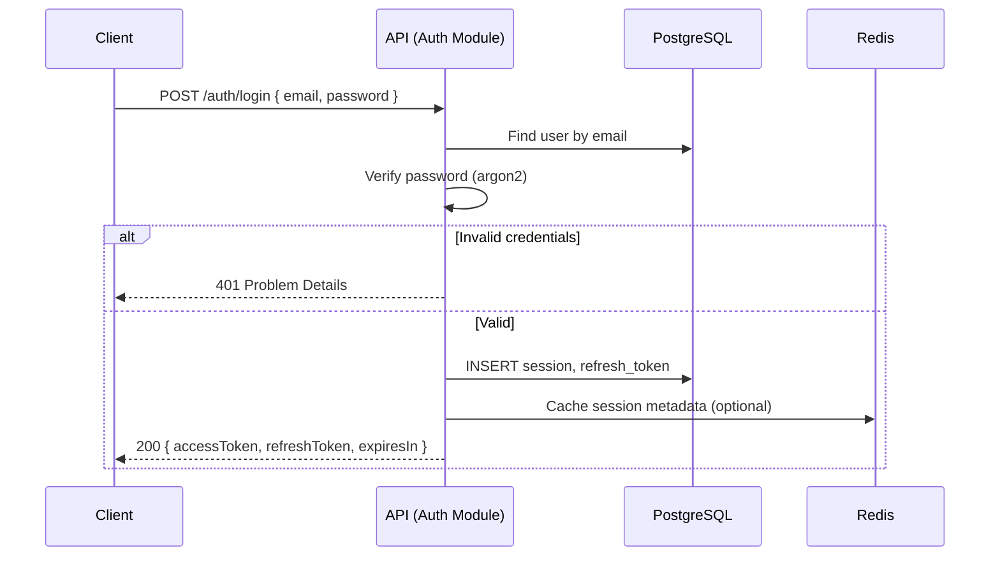
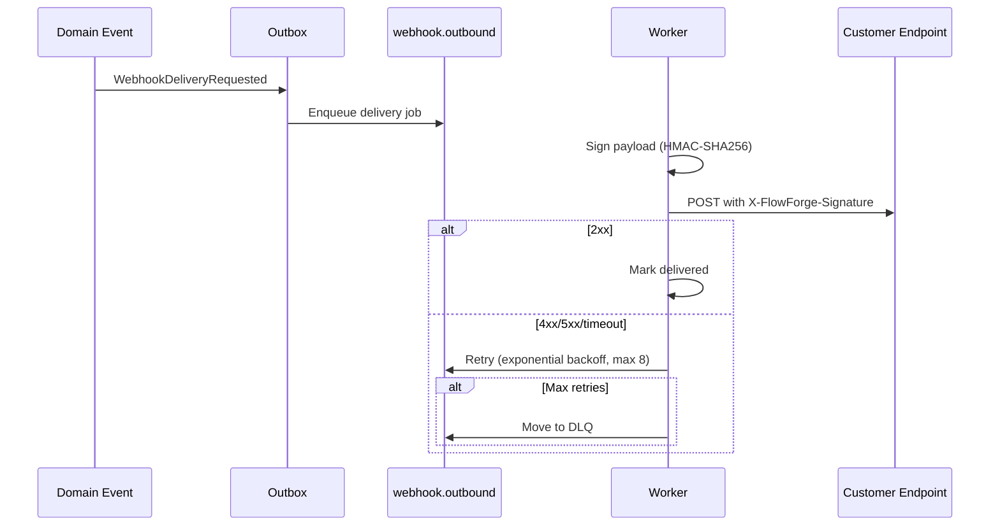

# API Catalog — REST v1

> **Status:** Active · **Version:** 1.0 · **Base path:** `/api/v1` · **Last updated:** 2026-07-14

FlowForge exposes a versioned REST API. All endpoints return JSON. Errors conform to [RFC 7807 Problem Details](https://datatracker.ietf.org/doc/html/rfc7807). List endpoints use **cursor-based pagination**.

OpenAPI specification is served at `/docs` (Swagger UI) when the API is running.

---

## Table of Contents

1. [Cross-Cutting Concerns](#cross-cutting-concerns)
2. [Authentication](#authentication)
3. [Pagination](#pagination)
4. [Error Handling (RFC 7807)](#error-handling-rfc-7807)
5. [Common Headers](#common-headers)
6. [Endpoint Reference](#endpoint-reference)
7. [Sequence Diagrams](#sequence-diagrams)
8. [Rate Limiting](#rate-limiting)
9. [Idempotency](#idempotency)

---

## Cross-Cutting Concerns

| Concern         | Implementation                                                               |
| --------------- | ---------------------------------------------------------------------------- |
| Versioning      | URL prefix `/api/v1`; breaking changes → `/api/v2`                           |
| Content-Type    | `application/json` (request & response)                                      |
| Timestamps      | ISO 8601 UTC (`2026-07-14T13:26:00.000Z`)                                    |
| IDs             | UUID v7 strings                                                              |
| Soft deletes    | `deletedAt` field; excluded from default lists unless `?includeDeleted=true` |
| Field selection | `?fields=id,name,status` (sparse fieldsets)                                  |
| Filtering       | `?filter[status]=active&filter[createdAt][gte]=2026-01-01`                   |
| Sorting         | `?sort=createdAt&order=desc` (default order: `desc`)                         |
| Workspace scope | All tenant resources require `X-Workspace-Id` header or path param           |

---

## Authentication

### Methods

| Method        | Header                                 | Use Case                |
| ------------- | -------------------------------------- | ----------------------- |
| JWT Bearer    | `Authorization: Bearer <access_token>` | User sessions (UI, CLI) |
| API Key       | `Authorization: Bearer ff_live_<key>`  | Programmatic access     |
| Refresh Token | `POST /auth/token/refresh`             | Token rotation          |

### Token Lifecycle

- Access token TTL: 15 minutes (configurable via `JWT_ACCESS_EXPIRES_IN`)
- Refresh token TTL: 7 days with rotation on each refresh
- API keys: optional expiration, scoped permissions

### Unauthenticated Endpoints

- `POST /auth/register`
- `POST /auth/login`
- `POST /auth/token/refresh`
- `POST /auth/password/forgot`
- `POST /auth/password/reset`
- `GET /auth/oauth/:provider`
- `GET /auth/oauth/:provider/callback`
- `GET /health/*`

---

## Pagination

All list endpoints accept cursor pagination parameters defined in `@flowforge/contracts`:

```typescript
// Request query params
{
  cursor?: string;   // opaque cursor from previous response
  limit?: number;  // 1–100, default 20
  sort?: string;   // field name
  order?: 'asc' | 'desc';  // default 'desc'
}

// Response wrapper
{
  data: T[];
  meta: {
    nextCursor: string | null;
    prevCursor: string | null;
    hasMore: boolean;
    total?: number;  // included when cheap to compute
  };
}
```

### Cursor Encoding

Cursors are **opaque base64url-encoded** JSON:

```json
{ "id": "019082a1-...", "sortValue": "2026-07-14T13:00:00.000Z", "sortField": "createdAt" }
```

Clients must treat cursors as opaque strings and must not parse or construct them.

### Stable Sorting

When sorting by non-unique fields, a secondary sort on `id` ensures stable pagination.

---

## Error Handling (RFC 7807)

All error responses use `Content-Type: application/problem+json`.

### Schema

Aligned with `@flowforge/contracts` `ProblemDetails`:

```json
{
  "type": "https://flowforge.dev/errors/validation-failed",
  "title": "Validation Failed",
  "status": 422,
  "detail": "One or more fields failed validation.",
  "instance": "/api/v1/workflows",
  "errors": [
    { "field": "name", "message": "Name is required" },
    { "field": "nodes[2].type", "message": "Unknown node type: foo" }
  ]
}
```

### Standard Error Types

| HTTP Status | `type` URI suffix     | When                                                                           |
| ----------- | --------------------- | ------------------------------------------------------------------------------ |
| 400         | `bad-request`         | Malformed JSON, invalid cursor                                                 |
| 401         | `unauthorized`        | Missing or invalid credentials                                                 |
| 403         | `forbidden`           | Authenticated but insufficient permissions                                     |
| 404         | `not-found`           | Resource does not exist in workspace                                           |
| 409         | `conflict`            | Optimistic lock conflict, duplicate slug                                       |
| 422         | `validation-failed`   | Zod/business validation failure                                                |
| 429         | `rate-limit-exceeded` | Rate limit hit; includes `Retry-After` header                                  |
| 429         | `quota-exceeded`      | Workspace plan quota exceeded (executions/storage/API); includes `Retry-After` |
| 500         | `internal-error`      | Unexpected server error                                                        |
| 503         | `service-unavailable` | Dependency down; retry later                                                   |

### NestJS Implementation

Global `ProblemDetailsExceptionFilter` maps domain exceptions → RFC 7807. Validation errors from Zod pipe include field-level `errors[]`.

---

## Common Headers

### Request

| Header             | Required | Description                                 |
| ------------------ | -------- | ------------------------------------------- |
| `Authorization`    | Yes*     | Bearer token                                |
| `X-Workspace-Id`   | Yes**    | Target workspace UUID                       |
| `X-Correlation-Id` | No       | Client-supplied; server generates if absent |
| `X-Request-Id`     | No       | Alias; merged with correlation ID in logs   |
| `Idempotency-Key`  | No***    | UUID for safe POST retries                  |
| `If-Match`         | No****   | Optimistic concurrency (`version` ETag)     |
| `Accept`           | No       | `application/json` (default)                |

\* Except unauthenticated routes  
\** Except auth, org-level, and health routes  
\*** Recommended for all POST mutations  
\**** Required on PATCH/PUT when resource has `version` field

### Response

| Header                  | Description                             |
| ----------------------- | --------------------------------------- |
| `X-Request-Id`          | Echoed/generated request ID             |
| `X-Correlation-Id`      | Distributed tracing correlation         |
| `X-RateLimit-Limit`     | Rate limit ceiling                      |
| `X-RateLimit-Remaining` | Remaining requests in window            |
| `X-RateLimit-Reset`     | Unix timestamp of window reset          |
| `ETag`                  | Resource version for optimistic locking |
| `Retry-After`           | Seconds until retry (429, 503)          |

---

## Endpoint Reference

### Health

| Method | Path                | Auth | Description                                   |
| ------ | ------------------- | ---- | --------------------------------------------- |
| GET    | `/health/liveness`  | No   | Process alive                                 |
| GET    | `/health/readiness` | No   | Dependencies healthy (Postgres, Redis, MinIO) |
| GET    | `/health/startup`   | No   | Initialization complete                       |

### Authentication

| Method | Path                             | Description                   |
| ------ | -------------------------------- | ----------------------------- |
| POST   | `/auth/register`                 | Create user account           |
| POST   | `/auth/login`                    | Email/password login → tokens |
| POST   | `/auth/logout`                   | Revoke current session        |
| POST   | `/auth/token/refresh`            | Rotate refresh token          |
| POST   | `/auth/password/forgot`          | Send reset email              |
| POST   | `/auth/password/reset`           | Reset with token              |
| POST   | `/auth/email/verify`             | Verify email token            |
| POST   | `/auth/magic-link`               | Request magic link            |
| GET    | `/auth/oauth/:provider`          | OAuth redirect                |
| GET    | `/auth/oauth/:provider/callback` | OAuth callback                |
| GET    | `/auth/me`                       | Current user profile          |
| GET    | `/auth/sessions`                 | List active sessions          |
| DELETE | `/auth/sessions/:sessionId`      | Revoke session                |

### Organizations

| Method | Path                    | Description               |
| ------ | ----------------------- | ------------------------- |
| GET    | `/organizations`        | List user's organizations |
| POST   | `/organizations`        | Create organization       |
| GET    | `/organizations/:orgId` | Get organization          |
| PATCH  | `/organizations/:orgId` | Update organization       |
| DELETE | `/organizations/:orgId` | Soft delete organization  |

### Workspaces

| Method | Path                       | Description                            |
| ------ | -------------------------- | -------------------------------------- |
| GET    | `/workspaces`              | List workspaces (filterable by org)    |
| POST   | `/workspaces`              | Create workspace                       |
| GET    | `/workspaces/:workspaceId` | Get workspace                          |
| PATCH  | `/workspaces/:workspaceId` | Update settings                        |
| DELETE | `/workspaces/:workspaceId` | Soft delete                            |
| GET    | `/settings`                | Get tenant settings (`X-Workspace-Id`) |
| PATCH  | `/settings`                | Update tenant settings                 |
| GET    | `/quotas`                  | Current quota usage                    |

### Billing & Feature Flags

| Method | Path                           | Description                    |
| ------ | ------------------------------ | ------------------------------ |
| GET    | `/billing/plans`               | List available plans           |
| GET    | `/billing/subscription`        | Current workspace subscription |
| PATCH  | `/billing/subscription`        | Change plan (`billing:manage`) |
| GET    | `/billing/usage`               | Recent usage records           |
| GET    | `/feature-flags`               | List workspace feature flags   |
| GET    | `/feature-flags/evaluate?key=` | Evaluate a flag                |
| PUT    | `/feature-flags/:key`          | Upsert flag                    |
| DELETE | `/feature-flags/:key`          | Delete flag                    |

### Members & Invitations

| Method | Path                                                 | Description              |
| ------ | ---------------------------------------------------- | ------------------------ |
| GET    | `/workspaces/:workspaceId/members`                   | List members             |
| POST   | `/workspaces/:workspaceId/members`                   | Add member directly      |
| PATCH  | `/workspaces/:workspaceId/members/:userId`           | Change role              |
| DELETE | `/workspaces/:workspaceId/members/:userId`           | Remove member            |
| GET    | `/workspaces/:workspaceId/invitations`               | List pending invitations |
| POST   | `/workspaces/:workspaceId/invitations`               | Send invitation          |
| DELETE | `/workspaces/:workspaceId/invitations/:invitationId` | Cancel invitation        |
| POST   | `/invitations/:token/accept`                         | Accept invitation        |

### Roles & Permissions

| Method | Path                                     | Description                             |
| ------ | ---------------------------------------- | --------------------------------------- |
| GET    | `/workspaces/:workspaceId/roles`         | List workspace roles                    |
| POST   | `/workspaces/:workspaceId/roles`         | Create custom role                      |
| PATCH  | `/workspaces/:workspaceId/roles/:roleId` | Update role permissions                 |
| DELETE | `/workspaces/:workspaceId/roles/:roleId` | Delete custom role                      |
| GET    | `/permissions`                           | List all system permissions (reference) |

### API Keys

| Method | Path                                       | Description                       |
| ------ | ------------------------------------------ | --------------------------------- |
| GET    | `/workspaces/:workspaceId/api-keys`        | List API keys (masked)            |
| POST   | `/workspaces/:workspaceId/api-keys`        | Create key (plaintext shown once) |
| PATCH  | `/workspaces/:workspaceId/api-keys/:keyId` | Update scopes/expiry              |
| DELETE | `/workspaces/:workspaceId/api-keys/:keyId` | Revoke key                        |

### Workflows

| Method | Path                                                                 | Description                                                        |
| ------ | -------------------------------------------------------------------- | ------------------------------------------------------------------ |
| GET    | `/workspaces/:workspaceId/workflows`                                 | List workflows                                                     |
| POST   | `/workspaces/:workspaceId/workflows`                                 | Create draft workflow                                              |
| GET    | `/workspaces/:workspaceId/workflows/:workflowId`                     | Get workflow with graph                                            |
| PATCH  | `/workspaces/:workspaceId/workflows/:workflowId`                     | Update draft (`application/json` or `application/json-patch+json`) |
| DELETE | `/workspaces/:workspaceId/workflows/:workflowId`                     | Soft delete                                                        |
| POST   | `/workflows/bulk/archive`                                            | Bulk archive workflows                                             |
| POST   | `/workflows/bulk/delete`                                             | Bulk soft-delete workflows                                         |
| POST   | `/workspaces/:workspaceId/workflows/:workflowId/publish`             | Publish draft                                                      |
| POST   | `/workspaces/:workspaceId/workflows/:workflowId/unpublish`           | Disable workflow                                                   |
| POST   | `/workspaces/:workspaceId/workflows/:workflowId/rollback`            | Rollback to version                                                |
| GET    | `/workspaces/:workspaceId/workflows/:workflowId/versions`            | List versions                                                      |
| GET    | `/workspaces/:workspaceId/workflows/:workflowId/versions/:versionId` | Get specific version                                               |
| POST   | `/workspaces/:workspaceId/workflows/:workflowId/duplicate`           | Clone workflow                                                     |

### Executions

| Method | Path                                                        | Description                  |
| ------ | ----------------------------------------------------------- | ---------------------------- |
| GET    | `/workspaces/:workspaceId/executions`                       | List executions (filterable) |
| GET    | `/workspaces/:workspaceId/executions/:executionId`          | Get execution detail         |
| POST   | `/workspaces/:workspaceId/executions/:executionId/cancel`   | Cancel running execution     |
| POST   | `/workspaces/:workspaceId/executions/:executionId/replay`   | Replay failed execution      |
| GET    | `/workspaces/:workspaceId/executions/:executionId/logs`     | Node execution logs          |
| GET    | `/workspaces/:workspaceId/executions/:executionId/timeline` | Execution event timeline     |

### Triggers & Schedules

| Method | Path                                                      | Description         |
| ------ | --------------------------------------------------------- | ------------------- |
| GET    | `/workspaces/:workspaceId/workflows/:workflowId/triggers` | List triggers       |
| POST   | `/workspaces/:workspaceId/workflows/:workflowId/triggers` | Add trigger         |
| PATCH  | `/workspaces/:workspaceId/triggers/:triggerId`            | Update trigger      |
| DELETE | `/workspaces/:workspaceId/triggers/:triggerId`            | Remove trigger      |
| GET    | `/workspaces/:workspaceId/schedules`                      | List cron schedules |
| POST   | `/workspaces/:workspaceId/workflows/:workflowId/test`     | Sandbox test run    |

### Webhooks (Incoming)

| Method | Path                                                                | Description                      |
| ------ | ------------------------------------------------------------------- | -------------------------------- |
| POST   | `/hooks/:workspaceId/:endpointSlug`                                 | Receive webhook (public, signed) |
| GET    | `/workspaces/:workspaceId/webhook-endpoints`                        | List endpoints                   |
| POST   | `/workspaces/:workspaceId/webhook-endpoints`                        | Create endpoint                  |
| PATCH  | `/workspaces/:workspaceId/webhook-endpoints/:endpointId`            | Update endpoint                  |
| DELETE | `/workspaces/:workspaceId/webhook-endpoints/:endpointId`            | Delete endpoint                  |
| GET    | `/workspaces/:workspaceId/webhook-endpoints/:endpointId/deliveries` | Inbound history                  |

### Webhooks (Outgoing Subscriptions)

| Method | Path                                                            | Description                 |
| ------ | --------------------------------------------------------------- | --------------------------- |
| GET    | `/workspaces/:workspaceId/webhook-subscriptions`                | List outbound subscriptions |
| POST   | `/workspaces/:workspaceId/webhook-subscriptions`                | Subscribe to events         |
| PATCH  | `/workspaces/:workspaceId/webhook-subscriptions/:subId`         | Update subscription         |
| DELETE | `/workspaces/:workspaceId/webhook-subscriptions/:subId`         | Delete subscription         |
| GET    | `/workspaces/:workspaceId/webhook-deliveries`                   | Outbound delivery log       |
| POST   | `/workspaces/:workspaceId/webhook-deliveries/:deliveryId/retry` | Manual retry                |

### Secrets

| Method | Path                                         | Description               |
| ------ | -------------------------------------------- | ------------------------- |
| GET    | `/workspaces/:workspaceId/secrets`           | List secrets (names only) |
| POST   | `/workspaces/:workspaceId/secrets`           | Create secret             |
| PATCH  | `/workspaces/:workspaceId/secrets/:secretId` | Update/rotate             |
| DELETE | `/workspaces/:workspaceId/secrets/:secretId` | Delete secret             |

### Integrations

| Method | Path                                                      | Description                 |
| ------ | --------------------------------------------------------- | --------------------------- |
| GET    | `/integrations/providers`                                 | List available providers    |
| GET    | `/workspaces/:workspaceId/integrations`                   | List connected integrations |
| POST   | `/workspaces/:workspaceId/integrations/:provider/connect` | Start OAuth connect         |
| DELETE | `/workspaces/:workspaceId/integrations/:integrationId`    | Disconnect                  |

### Files

| Method | Path                                                  | Description                |
| ------ | ----------------------------------------------------- | -------------------------- |
| GET    | `/workspaces/:workspaceId/files`                      | List files                 |
| POST   | `/workspaces/:workspaceId/files/upload-url`           | Get presigned upload URL   |
| POST   | `/workspaces/:workspaceId/files/:fileId/confirm`      | Confirm upload complete    |
| GET    | `/workspaces/:workspaceId/files/:fileId/download-url` | Get presigned download URL |
| DELETE | `/workspaces/:workspaceId/files/:fileId`              | Delete file                |

### Audit & Activity

| Method | Path                                  | Description       |
| ------ | ------------------------------------- | ----------------- |
| GET    | `/workspaces/:workspaceId/audit-logs` | Query audit trail |
| GET    | `/workspaces/:workspaceId/timeline`   | Activity timeline |
| GET    | `/workspaces/:workspaceId/search`     | Full-text search  |

### Notifications

| Method | Path                                     | Description        |
| ------ | ---------------------------------------- | ------------------ |
| GET    | `/users/me/notification-preferences`     | Get preferences    |
| PATCH  | `/users/me/notification-preferences`     | Update preferences |
| GET    | `/workspaces/:workspaceId/notifications` | List notifications |

### Metrics & Admin

| Method | Path                              | Description                            |
| ------ | --------------------------------- | -------------------------------------- |
| GET    | `/metrics`                        | Prometheus scrape endpoint             |
| GET    | `/admin/dlq`                      | List failed jobs for managed queues    |
| POST   | `/admin/dlq/:queue/:jobId/replay` | Replay failed queue job                |
| DELETE | `/admin/dlq/:queue/:jobId`        | Discard failed queue job               |
| POST   | `/admin/maintenance/cleanup`      | Run workspace-scoped retention cleanup |
| GET    | `/admin/outbox`                   | List outbox events                     |
| POST   | `/admin/outbox/:eventId/replay`   | Re-queue outbox event for publish      |
| GET    | `/admin/metrics`                  | Workspace system metrics summary       |

---

## Sequence Diagrams

### User Login (JWT)



### Create & Publish Workflow

```mermaid
sequenceDiagram
    participant Client
    participant API
    participant DB as PostgreSQL
    participant Outbox as Outbox Relay
    participant Scheduler as Scheduler Worker

    Client->>API: POST /workspaces/:id/workflows
    Note over Client,API: Idempotency-Key: uuid
    API->>DB: BEGIN; INSERT workflow; INSERT outbox(WorkflowCreated); COMMIT
    API-->>Client: 201 { workflow }

    Client->>API: PATCH /workspaces/:id/workflows/:wfId
    API->>DB: UPDATE workflow graph (optimistic lock)
    API-->>Client: 200 { workflow, version }

    Client->>API: POST /workspaces/:id/workflows/:wfId/publish
    API->>DB: BEGIN; INSERT version; UPDATE status; INSERT outbox(WorkflowPublished); COMMIT
    API-->>Client: 200 { version }

    Outbox->>Scheduler: WorkflowPublished event
    Scheduler->>DB: Register cron/webhook triggers
```

### Workflow Execution (Trigger → Complete)

```mermaid
sequenceDiagram
    participant Trigger as Webhook / Schedule
    participant API
    participant DB as PostgreSQL
    participant Q as BullMQ
    participant Engine as Execution Worker
    participant External as External API

    Trigger->>API: POST /hooks/:ws/:slug (signed)
    API->>API: Verify signature, dedup
    API->>DB: INSERT execution (queued); outbox(WorkflowExecutionQueued)
    API-->>Trigger: 202 { executionId }

    Q->>Engine: Dequeue execution job
    Engine->>DB: UPDATE status=running; outbox(WorkflowExecutionStarted)
    loop Each node in DAG
        Engine->>DB: INSERT node_execution
        Engine->>External: Execute action (with circuit breaker)
        alt Success
            Engine->>DB: outbox(NodeExecutionCompleted)
        else Retryable failure
            Engine->>DB: outbox(NodeExecutionFailed, willRetry=true)
            Engine->>Q: Re-enqueue with backoff
        end
    end
    Engine->>DB: UPDATE status=completed; outbox(WorkflowExecutionCompleted)
```

### Outbound Webhook Delivery



---

## Rate Limiting

| Tier               | Limit    | Window | Scope      |
| ------------------ | -------- | ------ | ---------- |
| Anonymous          | 30 req   | 1 min  | IP         |
| Authenticated user | 300 req  | 1 min  | userId     |
| API key (standard) | 600 req  | 1 min  | apiKeyId   |
| API key (elevated) | 3000 req | 1 min  | apiKeyId   |
| Webhook ingress    | 1000 req | 1 min  | endpointId |

Exceeded limits return `429` with RFC 7807 body and `Retry-After` header.

---

## Idempotency

Supported on all `POST` mutation endpoints.

```
POST /workspaces/:id/workflows
Idempotency-Key: 550e8400-e29b-41d4-a716-446655440000
```

- Same key + same fingerprint within 24h → cached response replayed (same status code + body)
- Same key + different body → `422` conflict error
- Keys are scoped to `(workspaceId, actorId, endpoint)`

---

## Related Documents

- [EVENT-CATALOG.md](./EVENT-CATALOG.md) — Events emitted by mutations
- [SECURITY-MODEL.md](../security/SECURITY-MODEL.md) — Auth details
- [PERMISSION-MATRIX.md](../security/PERMISSION-MATRIX.md) — Endpoint authorization
- `@flowforge/contracts` — Shared Zod schemas for pagination and errors
