# FlowForge — Technical Architecture

**Version:** 0.1.0  
**Status:** Draft (implementation source of truth)  
**Last updated:** 2026-07-14

---

## 1. Overview

FlowForge is a **multi-tenant workflow automation platform** implemented as a **pnpm monorepo** with two deployable processes (API and Worker) and shared packages. The backend follows **Clean Architecture** with **CQRS** for read/write separation where beneficial, **event-driven** integration via the **Outbox/Inbox** patterns, and **workspace-based tenancy** enforced at every layer.

### Technology Stack

| Layer | Technology |
|-------|------------|
| Runtime | Node.js ≥ 20, TypeScript 5.x (strict) |
| API Framework | NestJS |
| ORM | Prisma |
| Database | PostgreSQL 16 |
| Cache / Locks | Redis 7 |
| Job Queue | BullMQ |
| Object Storage | MinIO (local) / S3-compatible (prod) |
| Validation | Zod |
| Auth | Passport, JWT |
| API Docs | Swagger / OpenAPI 3.1 |
| Logging | Pino (structured JSON) |
| Tracing | OpenTelemetry |
| Metrics | Prometheus |
| Dashboards | Grafana |
| Log Aggregation | Loki |
| Containers | Docker, Docker Compose |
| CI | GitHub Actions |
| Monorepo | pnpm workspaces + Turborepo |

---

## 2. Architectural Style

### Clean Architecture Layers

FlowForge enforces dependency direction: **outer layers depend on inner layers, never the reverse**.

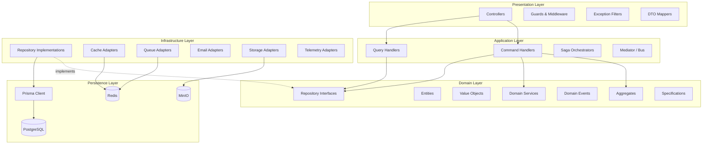

### Layer Responsibilities

| Layer | Responsibility | May Depend On |
|-------|----------------|---------------|
| **Presentation** | HTTP routing, auth guards, request validation, response mapping, RFC 7807 errors | Application, Domain (interfaces only) |
| **Application** | Use cases, orchestration, transaction boundaries, CQRS handlers, outbox dispatch | Domain |
| **Domain** | Business rules, invariants, aggregates, domain events, repository contracts | Nothing external |
| **Infrastructure** | Adapters implementing domain/application ports | Domain, Application, Persistence |
| **Persistence** | Prisma schema, migrations, raw queries | Database engines |

### Hard Rules

1. **No Prisma in controllers or domain** — Only infrastructure repository classes import `PrismaClient`.
2. **No business logic in controllers** — Controllers delegate to application services or mediator commands.
3. **Tenant context required** — Every workspace-scoped use case receives `TenantContext` from guards.
4. **Domain events collected on aggregates** — Persisted via outbox in the same transaction as state changes.
5. **Idempotency at boundaries** — HTTP POST, webhooks, and job consumers all use the idempotency framework.

---

## 3. C4 Model

### Level 1 — System Context

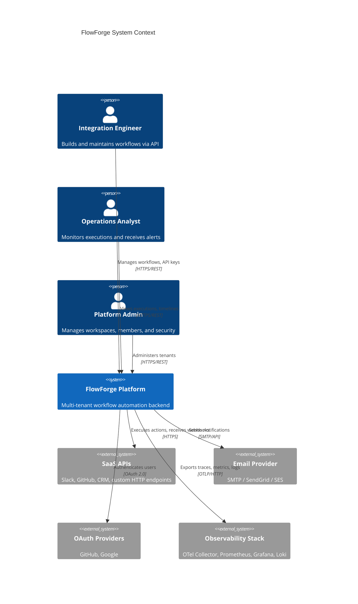

### Level 2 — Containers

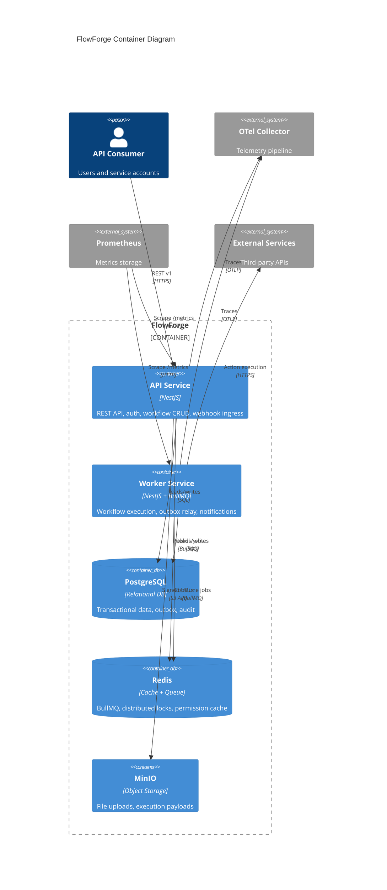

### Level 3 — API Service Components

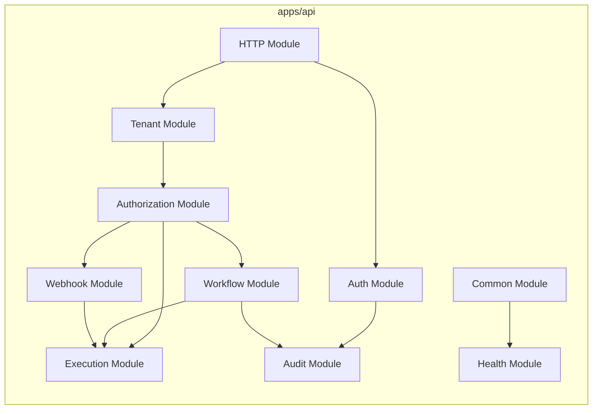

---

## 4. Repository Structure

```
flowforge/
├── apps/
│   ├── api/                    # NestJS HTTP API process
│   │   └── src/
│   │       ├── main.ts
│   │       ├── app.module.ts
│   │       └── modules/        # Presentation + module wiring
│   ├── worker/                 # BullMQ worker process
│   │   └── src/
│   │       ├── main.ts
│   │       ├── app.module.ts
│   │       └── processors/   # Job processors
│   └── docs/                   # Docusaurus site (wraps docs/)
├── packages/
│   ├── config/                 # Zod-validated environment config
│   ├── contracts/              # Shared API schemas (pagination, errors, health)
│   ├── domain/                 # Aggregates, VOs, domain events (future)
│   ├── application/            # Use cases, CQRS handlers (future)
│   └── tsconfig/               # Shared TypeScript configs
├── prisma/
│   ├── schema.prisma
│   └── migrations/
├── docker/
│   ├── docker-compose.yml
│   ├── Dockerfile.api
│   ├── Dockerfile.worker
│   └── monitoring/             # Prometheus, Grafana, Loki, OTel configs
├── docs/                       # Implementation documents (source of truth)
├── .github/workflows/          # CI/CD pipelines
├── turbo.json
├── pnpm-workspace.yaml
└── package.json
```

### Module Internal Structure (per bounded context)

Each NestJS feature module follows the same internal layout:

```
modules/workflow/
├── presentation/
│   ├── workflow.controller.ts
│   ├── workflow.dto.ts           # Zod schemas + mapping
│   └── workflow.mapper.ts
├── application/
│   ├── commands/
│   │   ├── create-workflow.handler.ts
│   │   └── publish-workflow.handler.ts
│   ├── queries/
│   │   └── list-workflows.handler.ts
│   └── workflow.application.module.ts
├── domain/
│   ├── workflow.aggregate.ts
│   ├── workflow-version.entity.ts
│   ├── workflow.repository.ts    # Interface (port)
│   └── events/
│       └── workflow-published.event.ts
└── infrastructure/
    ├── prisma-workflow.repository.ts
    └── workflow-cache.adapter.ts
```

---

## 5. Bounded Contexts & Module Breakdown

FlowForge is decomposed into **bounded contexts**. Each context maps to one or more NestJS modules.

| Bounded Context | NestJS Module(s) | Responsibility |
|-----------------|------------------|----------------|
| **Identity** | `AuthModule`, `SessionModule` | Registration, login, JWT, refresh rotation, OAuth |
| **Tenancy** | `TenantModule`, `OrganizationModule`, `WorkspaceModule` | Org/workspace CRUD, tenant context, settings |
| **Membership** | `MemberModule`, `InvitationModule` | Invitations, workspace membership |
| **Authorization** | `AuthorizationModule`, `RoleModule`, `PolicyModule` | RBAC, ABAC, permission cache |
| **Workflow Authoring** | `WorkflowModule`, `WorkflowVersionModule`, `WorkflowDraftModule` | CRUD, graph, publish, rollback |
| **Workflow Execution** | `ExecutionModule`, `SchedulerModule` | Engine orchestration, state, history |
| **Webhooks** | `WebhookIngressModule`, `WebhookEgressModule` | Incoming triggers, outgoing deliveries |
| **Integrations** | `IntegrationModule`, `ActionRegistryModule` | Connector catalog, action handlers |
| **Secrets** | `SecretModule` | Encrypted credential vault |
| **Notifications** | `NotificationModule` | Email, Slack, webhook notifications |
| **Files** | `FileModule` | Upload metadata, signed URLs |
| **Search** | `SearchModule` | Full-text search indexing and queries |
| **Audit** | `AuditModule`, `TimelineModule` | Audit log, activity feed |
| **Events** | `OutboxModule`, `InboxModule` | Transactional outbox relay, consumer inbox |
| **Idempotency** | `IdempotencyModule` | Request deduplication framework |
| **Platform** | `HealthModule`, `MetricsModule`, `FeatureFlagModule` | Ops endpoints, flags, quotas |
| **API Keys** | `ApiKeyModule` | Programmatic access credentials |

### Module Dependency Graph

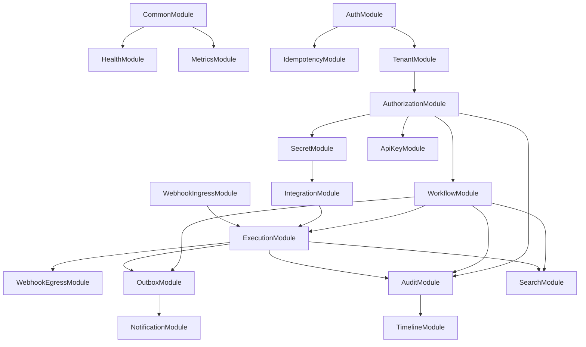

---

## 6. Key Architectural Patterns

### 6.1 CQRS

| Write Path | Read Path |
|------------|-----------|
| Commands mutate aggregates via repositories | Queries use read-optimized repositories or views |
| Domain events emitted on state change | DTOs tailored for API responses (no aggregate leakage) |
| Transactional consistency required | Eventual consistency acceptable for search indexes |

CQRS is applied **pragmatically** — not every entity gets separate read models. Execution history and audit logs benefit most from dedicated query handlers.

### 6.2 Outbox / Inbox

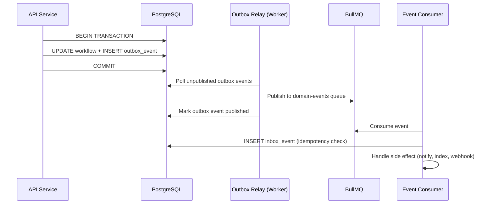

### 6.3 Repository + Unit of Work

- **Repository interfaces** live in domain layer (`IWorkflowRepository`).
- **Prisma implementations** live in infrastructure (`PrismaWorkflowRepository`).
- **Unit of Work** wraps Prisma `$transaction` and collects domain events for outbox insertion.

### 6.4 Specification Pattern

Complex queries (e.g., "list executions failed in last 24h for workflows tagged `critical`") are expressed as composable specifications rather than ad-hoc query string building in repositories.

### 6.5 Strategy Pattern

- **Action handlers** — Each integration action type implements a common `execute(context)` interface.
- **Trigger resolvers** — Webhook, schedule, and manual triggers implement `ITriggerResolver`.
- **Retry policies** — Configurable per node: fixed, exponential, none.

### 6.6 Saga Pattern (Limited Scope)

Long-running workflows with waits and compensations use a **process manager** style saga stored in execution state rather than a separate saga framework. Full compensating transactions are v2 scope.

---

## 7. Multi-Tenancy Architecture

### Tenant Model

```
Organization (1) ──< Workspace (N) ──< Project (N)
                         │
                         ├── Workflows, Executions, Secrets, Files, ...
                         └── Members, Roles, Settings, Quotas
```

### Tenant Context Flow

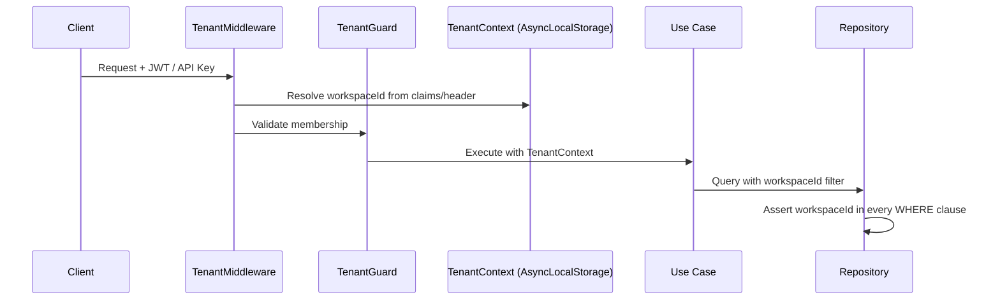

### Isolation Guarantees

| Layer | Mechanism |
|-------|-----------|
| API | `TenantGuard` rejects missing/invalid workspace context |
| Application | `TenantContext` passed explicitly to commands/queries |
| Repository | Mandatory `workspaceId` predicate; specification enforcement |
| Cache | Keys prefixed `ws:{workspaceId}:...` |
| Queue | Job payload includes `workspaceId`; worker validates |
| Storage | Object keys namespaced by workspace |
| Logs/Traces | `tenant.id` attribute on every span and log line |

---

## 8. Workflow Execution Architecture

### Execution Pipeline

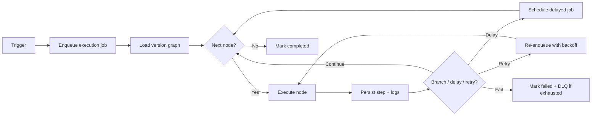

### Process Topology

| Process | Role |
|---------|------|
| `flowforge-api` | Synchronous HTTP, webhook ingress, enqueue executions, CRUD |
| `flowforge-worker` | BullMQ consumers: execution, outbox relay, notifications, search indexing |

Workers scale horizontally. BullMQ uses Redis for coordination. Execution state is authoritative in PostgreSQL.

### Queue Topology (Summary)

| Queue | Purpose | Priority |
|-------|---------|----------|
| `execution` | Workflow node processing | Normal |
| `execution:priority` | Manual replays, admin triggers | High |
| `execution:delayed` | Delay nodes, scheduled continuations | Time-based |
| `outbox-relay` | Publish domain events | High |
| `notifications` | Email, Slack, webhook notifications | Normal |
| `webhook-delivery` | Outgoing webhook HTTP calls | Normal |
| `search-index` | Async FTS index updates | Low |
| `dlq:*` | Dead letter queues per source | — |

See `docs/architecture/QUEUE-DESIGN.md` for full topology.

---

## 9. Data Architecture

### Database Strategy

- **PostgreSQL** as system of record
- **UUID v7** (or v4) primary keys for distributed-friendly IDs
- **Soft deletes** via `deletedAt` on user-facing entities
- **Optimistic locking** via `version` column on contested aggregates
- **Composite indexes** on `(workspaceId, ...)` for tenant-scoped queries
- **Partial indexes** for active-only rows (`WHERE deletedAt IS NULL`)

### Caching Strategy (Summary)

| Tier | Data | TTL |
|------|------|-----|
| L1 | Permission decisions | 60s |
| L1 | Feature flags | 120s |
| L2 | Published workflow versions | 300s |
| L2 | API key validation | 60s |
| L3 | Idempotency responses | 24h |

See `docs/architecture/CACHING-STRATEGY.md` for invalidation rules.

### File Storage

- Metadata in PostgreSQL (`files` table)
- Binary in MinIO/S3 at `workspaces/{workspaceId}/files/{fileId}`
- Pre-signed PUT/GET URLs; max size enforced at API

---

## 10. API Architecture

### Request Lifecycle

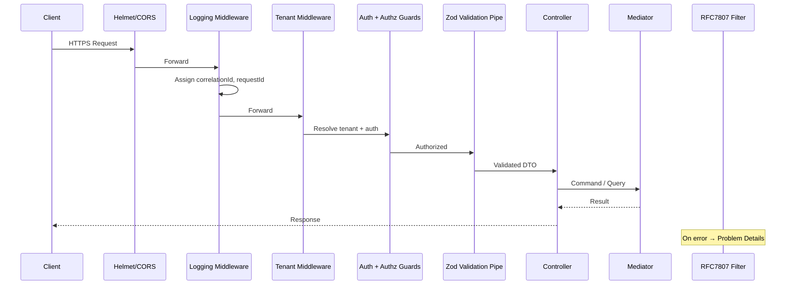

### API Conventions

- Base path: `/api/v1/`
- Pagination: cursor-based (`@flowforge/contracts`)
- Errors: RFC 7807 (`ProblemDetails`)
- Idempotency: `Idempotency-Key` header on POST
- Content negotiation: `application/json`, `application/json-patch+json`

See `docs/architecture/API-CATALOG.md` for endpoint inventory.

---

## 11. Security Architecture (Summary)

| Concern | Approach |
|---------|----------|
| Authentication | JWT access + refresh rotation; API keys; OAuth |
| Authorization | RBAC + ABAC; cached permission evaluation |
| Secrets | AES-256-GCM field encryption; DEK per workspace |
| Webhooks | HMAC signatures; timestamp tolerance; idempotency |
| Transport | TLS termination at ingress; HSTS |
| Headers | Helmet defaults; strict CORS in production |
| Rate limiting | Redis sliding window per IP, user, API key |
| Input validation | Zod at boundary; mass assignment protection |

Full detail: `docs/security/SECURITY-MODEL.md`.

---

## 12. Observability Architecture (Summary)

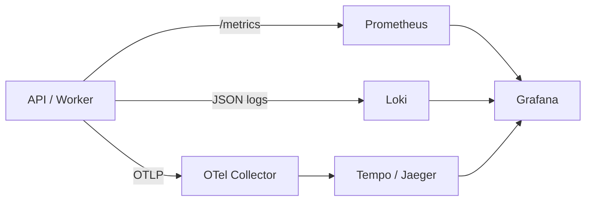

### Standard Attributes

| Attribute | Source |
|-----------|--------|
| `correlation.id` | `X-Correlation-Id` or generated |
| `tenant.id` | Workspace ID |
| `user.id` | Authenticated user |
| `workflow.id` | Execution context |
| `execution.id` | Execution context |

See `docs/architecture/OBSERVABILITY.md` for dashboard and alert definitions.

---

## 13. Deployment Architecture

### Local Development

```bash
docker compose -f docker/docker-compose.yml up
```

Services: `api`, `worker`, `postgres`, `redis`, `minio`, `otel-collector`, `prometheus`, `grafana`, `loki`.

### Production (Reference)

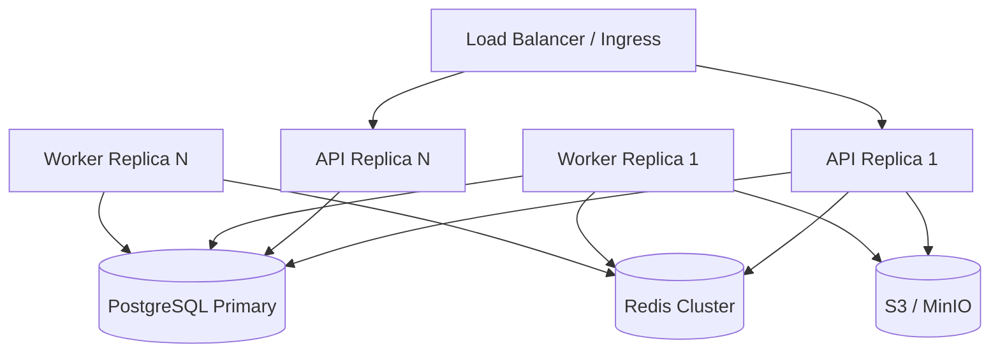

- API replicas: stateless, scale on CPU/request rate
- Worker replicas: scale on queue depth
- PostgreSQL: managed service with read replica for heavy queries (future)
- Redis: cluster mode for HA

See `docs/operations/DEPLOYMENT.md` and `docs/operations/SCALABILITY.md`.

---

## 14. Cross-Cutting Concerns

### Configuration

All configuration validated at startup via `@flowforge/config` (Zod). Fail fast on invalid env.

```typescript
// packages/config — API process
loadApiConfig(process.env);  // DATABASE_URL, REDIS_URL, JWT_SECRET, ...
```

### Graceful Shutdown

Both processes trap `SIGTERM`/`SIGINT`:

1. Stop accepting new HTTP connections / job polls
2. Drain in-flight requests (30s timeout)
3. Complete current BullMQ jobs
4. Flush telemetry exporters
5. Close DB/Redis connections

### Error Handling

- Domain exceptions → mapped to HTTP status in `ProblemDetailsExceptionFilter`
- Validation errors include `errors[]` with field paths
- Unexpected errors logged at `error` level; generic 500 to client

---

## 15. Testing Strategy

| Layer | Test Type | Tools |
|-------|-----------|-------|
| Domain | Unit tests | Jest |
| Application | Service tests with in-memory repos | Jest |
| Infrastructure | Integration tests with Testcontainers | Jest + PostgreSQL/Redis containers |
| API | E2E tests | Supertest |
| Worker | Processor tests | Jest + BullMQ test utilities |
| Contracts | Schema snapshot tests | Zod |

---

## 16. Architecture Decision Records

| ADR | Decision |
|-----|----------|
| [0001](../adr/0001-monorepo-structure.md) | pnpm monorepo with `apps/` + `packages/` |
| [0002](../adr/0002-prisma-repository-boundary.md) | Clean Architecture with Prisma behind repositories |
| [0003](../adr/0003-outbox-first-events.md) | Transactional outbox for all domain events |
| [0004](../adr/0004-workspace-tenancy.md) | Workspace as tenant isolation boundary |
| [0005](../adr/0005-cqrs-scope.md) | Pragmatic CQRS — not full event sourcing |

---

## 17. Related Documents

| Document | Description |
|----------|-------------|
| [PRD](../product/PRD.md) | Product requirements and feature specs |
| [DOMAIN-MODEL.md](./DOMAIN-MODEL.md) | Aggregates, entities, value objects |
| [ERD.md](./ERD.md) | Entity-relationship diagram (~45 tables) |
| [EVENT-CATALOG.md](./EVENT-CATALOG.md) | Domain events and messaging |
| [API-CATALOG.md](./API-CATALOG.md) | REST endpoint inventory |
| [QUEUE-DESIGN.md](./QUEUE-DESIGN.md) | BullMQ topology |
| [CACHING-STRATEGY.md](./CACHING-STRATEGY.md) | Redis caching |
| [OBSERVABILITY.md](./OBSERVABILITY.md) | Telemetry design |

---

## 18. Document History

| Version | Date | Changes |
|---------|------|---------|
| 0.1.0 | 2026-07-14 | Initial architecture document |
