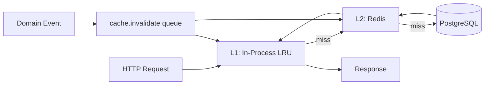
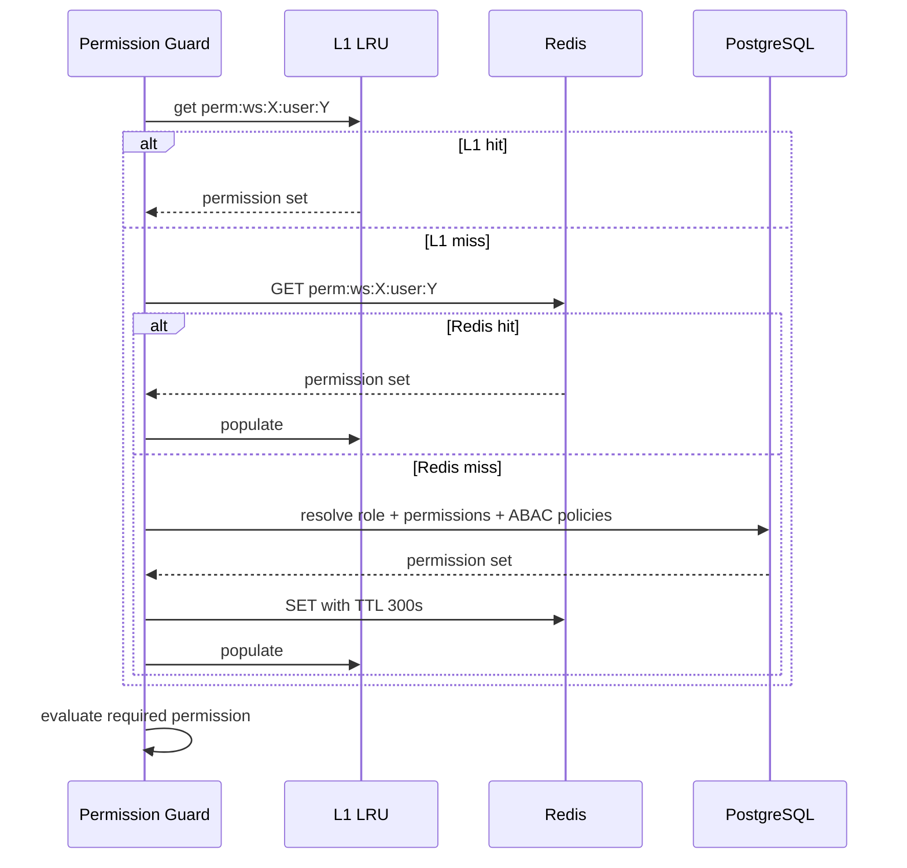

# Caching Strategy

> **Status:** Active · **Version:** 1.0 · **Last updated:** 2026-07-14

FlowForge uses a multi-tier Redis caching strategy to reduce database load, latency, and authorization overhead while maintaining strong consistency for security-sensitive data.

---

## Table of Contents

1. [Overview](#overview)
2. [Cache Tiers](#cache-tiers)
3. [Key Naming Convention](#key-naming-convention)
4. [Cache Catalog](#cache-catalog)
5. [Read Patterns](#read-patterns)
6. [Invalidation Strategy](#invalidation-strategy)
7. [Consistency Model](#consistency-model)
8. [Failure Modes](#failure-modes)
9. [Implementation Guidelines](#implementation-guidelines)

---

## Overview



### Goals

| Goal | Approach |
|------|----------|
| Reduce DB reads for hot paths | Read-through cache for permissions, workflows, API keys |
| Sub-10ms authz checks | Permission bitmap cache per `(userId, workspaceId)` |
| Tenant isolation | All keys prefixed with `ws:{workspaceId}:` |
| Safe invalidation | Event-driven invalidation via outbox consumers |
| Graceful degradation | Cache miss → DB; Redis down → bypass cache |

### Non-Goals

- Caching execution state (always read from DB for correctness)
- Caching audit logs (immutable, query from DB/FTS)
- Write-through for workflow mutations (invalidate-on-write instead)

---

## Cache Tiers

### L1 — In-Process (Request-Scoped / Short LRU)

| Property | Value |
|----------|-------|
| Store | Node.js `lru-cache` per worker/API instance |
| Max entries | 1,000 per cache namespace |
| Default TTL | 30 seconds |
| Use cases | Repeated reads within same request; config snapshots |

L1 is **never authoritative**. Always fall through to L2 on miss.

### L2 — Redis (Distributed)

| Property | Value |
|----------|-------|
| Store | Redis 7+ (single primary + replicas in production) |
| Connection | `REDIS_URL` from `@flowforge/config` |
| Serialization | JSON for objects; raw strings for simple values |
| Default TTL | Varies by entity (see catalog) |
| Max memory policy | `allkeys-lru` with 80% memory alert |

### L3 — PostgreSQL (Source of Truth)

Not a cache layer, but referenced for cache-aside reads and materialized views (future: execution metrics rollups).

---

## Key Naming Convention

```
flowforge:{namespace}:ws:{workspaceId}:{entity}:{id}[:{variant}]
```

Examples:

```
flowforge:perm:ws:019082a1-...:user:019082b2-...
flowforge:workflow:ws:019082a1-...:published:019082c3-...
flowforge:apikey:hash:a1b2c3d4...
flowforge:ratelimit:ws:019082a1-...:apikey:019082d4-...
flowforge:session:019082e5-...
flowforge:feature:ws:019082a1-...:flags
```

Global keys (no workspace prefix):

```
flowforge:config:providers
flowforge:oauth:state:{stateToken}
```

---

## Cache Catalog

| Namespace | Key Pattern | TTL | Size Est. | Cached Data |
|-----------|-------------|-----|-----------|-------------|
| `perm` | `perm:ws:{wsId}:user:{userId}` | 5 min | ~2 KB | Resolved permission set (flattened strings) |
| `perm` | `perm:ws:{wsId}:role:{roleId}` | 10 min | ~1 KB | Role → permissions mapping |
| `workflow` | `workflow:ws:{wsId}:published:{wfId}` | 15 min | 10–500 KB | Published workflow graph + version metadata |
| `workflow` | `workflow:ws:{wsId}:meta:{wfId}` | 5 min | ~1 KB | Workflow list card metadata |
| `apikey` | `apikey:hash:{sha256Prefix}` | 10 min | ~500 B | `{ apiKeyId, workspaceId, scopes, expiresAt }` |
| `session` | `session:{sessionId}` | 15 min | ~500 B | Session validity + userId |
| `workspace` | `workspace:{wsId}` | 10 min | ~2 KB | Workspace settings, plan, feature flags |
| `secret` | `secret:ws:{wsId}:ref:{secretId}` | 5 min | ~200 B | Secret existence check (never cache plaintext) |
| `integration` | `integration:ws:{wsId}:{provider}` | 10 min | ~1 KB | OAuth token metadata (not access token) |
| `ratelimit` | `ratelimit:ws:{wsId}:{actor}:{window}` | window size | ~100 B | Sliding window counter |
| `idempotency` | `idempotency:{key}:{fingerprint}` | 24 h | variable | Cached HTTP response |
| `oauth` | `oauth:state:{token}` | 10 min | ~200 B | OAuth CSRF state |
| `webhook` | `webhook:ws:{wsId}:endpoint:{slug}` | 5 min | ~1 KB | Endpoint config for ingress routing |
| `lock` | `lock:{resource}` | 30 sec | ~50 B | Distributed lock (Redlock) |

---

## Read Patterns

### Read-Through (Default)

```typescript
async getPublishedWorkflow(workspaceId: string, workflowId: string): Promise<WorkflowGraph> {
  const cacheKey = `workflow:ws:${workspaceId}:published:${workflowId}`;

  const cached = await this.cache.get<WorkflowGraph>(cacheKey);
  if (cached) return cached;

  const workflow = await this.workflowRepo.findPublishedVersion(workspaceId, workflowId);
  if (workflow) {
    await this.cache.set(cacheKey, workflow, { ttl: 900 });
  }
  return workflow;
}
```

### Cache-Aside with Negative Caching

For API key lookups and permission checks:

- Cache **miss on non-existent** API key for 60 seconds (prevent brute-force DB hammering)
- Never negative-cache permission grants (security: fail open to DB, not to deny)

### Permission Resolution Flow



---

## Invalidation Strategy

### Event-Driven Invalidation (Primary)

The `cache-invalidator` consumer subscribes to domain events and performs targeted invalidation:

| Event | Invalidated Keys |
|-------|------------------|
| `MemberAdded`, `MemberRemoved`, `MemberRoleChanged` | `perm:ws:{wsId}:user:{userId}`, all `perm:ws:{wsId}:user:*` if role changed |
| `WorkflowPublished`, `WorkflowUnpublished`, `WorkflowUpdated`, `WorkflowDeleted` | `workflow:ws:{wsId}:published:{wfId}`, `workflow:ws:{wsId}:meta:{wfId}` |
| `ApiKeyCreated`, `ApiKeyRevoked` | `apikey:hash:{hash}` |
| `WorkspaceUpdated` | `workspace:{wsId}`, `feature:ws:{wsId}:flags` |
| `SecretUpdated`, `SecretDeleted` | `secret:ws:{wsId}:ref:{secretId}` |
| `IntegrationConnected`, `IntegrationDisconnected` | `integration:ws:{wsId}:{provider}` |
| `WebhookEndpointUpdated` | `webhook:ws:{wsId}:endpoint:{slug}` |

Invalidation jobs are enqueued to `cache.invalidate` queue (low priority, high throughput).

### Invalidation Operations

```typescript
// Single key
await cache.del(key);

// Pattern (use sparingly — SCAN under the hood)
await cache.delByPattern(`perm:ws:${workspaceId}:user:*`);

// Broadcast L1 invalidation via Redis pub/sub
await cache.publishInvalidation({ pattern: `workflow:ws:${workspaceId}:*` });
```

### TTL as Safety Net

Even without explicit invalidation, TTL ensures stale data expires. Maximum staleness = TTL of the entity (5–15 min for most entities).

### Write Path

Mutations **never** update cache directly. Flow:

1. Write to DB (transaction)
2. Emit domain event (outbox)
3. Cache invalidator deletes stale keys
4. Next read populates fresh data

---

## Consistency Model

| Data Type | Consistency | Rationale |
|-----------|-------------|-----------|
| Permissions | Eventual (~seconds) | Invalidated on role change; TTL 5 min max staleness |
| Published workflows | Eventual (~seconds) | Invalidated on publish; execution engine re-fetches at start |
| API keys | Eventual (~seconds) | Revocation must propagate quickly; TTL 10 min backup |
| Rate limits | Strong (Redis atomic) | `INCR` + `EXPIRE` in Lua script |
| Idempotency | Strong | Must prevent duplicate mutations |
| Sessions | Eventual | Revocation deletes key; TTL backup |

### Security-Sensitive Rules

1. **Permission revocation** — eagerly invalidate; do not rely on TTL alone
2. **API key revocation** — delete cache key synchronously in the revocation transaction handler (before outbox commit is acceptable since key hash is in same TX)
3. **Never cache** secret plaintext, OAuth access tokens, or refresh tokens

---

## Failure Modes

| Failure | Behavior |
|---------|----------|
| Redis unavailable | Bypass cache; serve from DB; emit `cache_bypass_total` metric; alert |
| Redis slow (>50ms p99) | Circuit breaker opens after 5 failures; bypass for 30s |
| Invalidation job fails | TTL ensures eventual consistency; retry via BullMQ |
| L1 stale after invalidation | Pub/sub `cache:invalidate` channel clears L1 across instances |

---

## Implementation Guidelines

### Cache Service Interface

```typescript
interface CacheService {
  get<T>(key: string): Promise<T | null>;
  set<T>(key: string, value: T, options?: { ttl?: number }): Promise<void>;
  del(key: string): Promise<void>;
  delByPattern(pattern: string): Promise<number>;
  incr(key: string, windowSeconds: number): Promise<number>;
}
```

Located in `packages/cache` (future package), injected via NestJS DI.

### Testing

- Unit tests: mock `CacheService`
- Integration tests: use Redis test container; verify invalidation on event processing
- Load tests: measure cache hit ratio target **> 85%** for permission and workflow reads

### Metrics

```
flowforge_cache_hits_total{namespace="perm"}
flowforge_cache_misses_total{namespace="perm"}
flowforge_cache_invalidations_total{namespace="workflow"}
flowforge_cache_bypass_total{reason="redis_unavailable"}
flowforge_cache_operation_duration_seconds{operation="get"}
```

---

## Related Documents

- [EVENT-CATALOG.md](./EVENT-CATALOG.md) — Events triggering invalidation
- [QUEUE-DESIGN.md](./QUEUE-DESIGN.md) — `cache.invalidate` queue
- [SECURITY-MODEL.md](../security/SECURITY-MODEL.md) — Permission cache security
- [PERMISSION-MATRIX.md](../security/PERMISSION-MATRIX.md) — Cached permission strings
