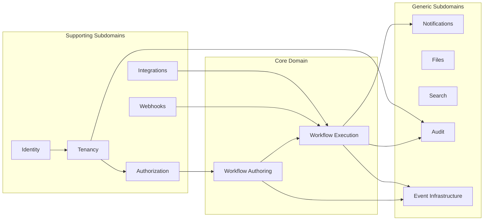
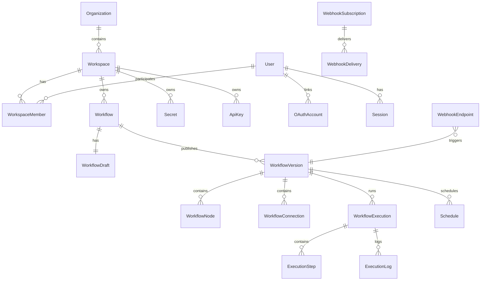
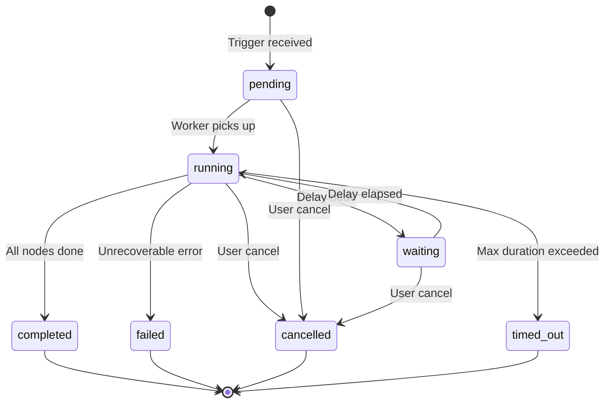
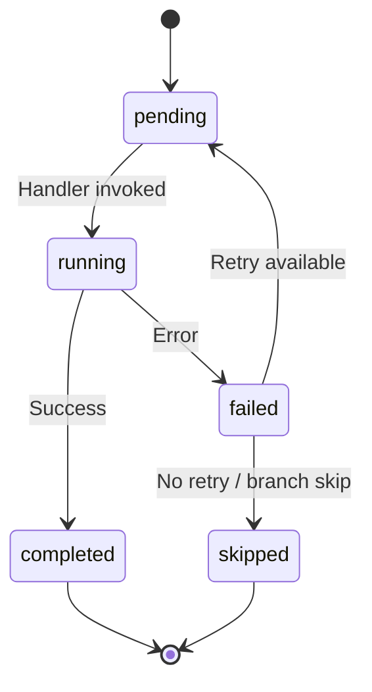
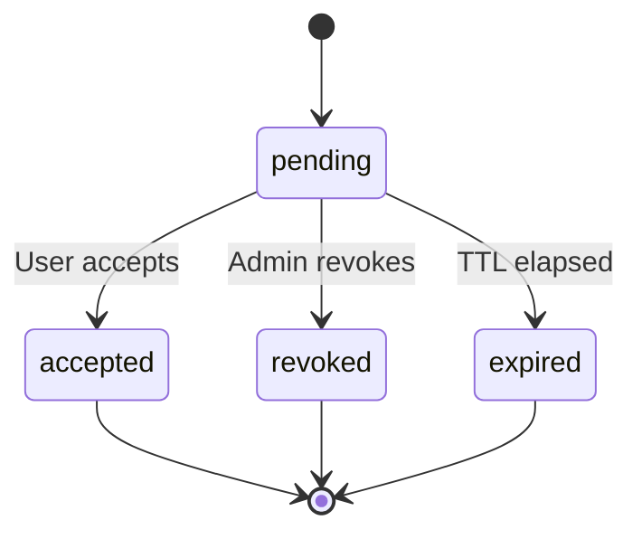

# FlowForge — Domain Model

**Version:** 0.1.0  
**Status:** Draft (implementation source of truth)  
**Last updated:** 2026-07-14

---

## 1. Introduction

This document defines the **domain model** for FlowForge using Domain-Driven Design (DDD) terminology. It describes bounded contexts, aggregates, entities, value objects, domain events, and invariants. Persistence mapping is defined in [ERD.md](./ERD.md); behavioral contracts are implemented in the `packages/domain` package (future) and enforced via application services.

### Conventions

| Symbol             | Meaning                                                                  |
| ------------------ | ------------------------------------------------------------------------ |
| **Aggregate Root** | Entry point for consistency boundary; only root is referenced externally |
| **Entity**         | Object with identity; lifecycle tracked                                  |
| **Value Object**   | Immutable; equality by value                                             |
| **Domain Event**   | Past-tense fact emitted after state change                               |
| **Invariant**      | Rule that must always hold within aggregate boundary                     |

---

## 2. Bounded Context Map

### Context Relationships

| Upstream           | Downstream           | Relationship                               |
| ------------------ | -------------------- | ------------------------------------------ |
| Identity           | Tenancy              | User ID referenced by membership           |
| Tenancy            | All contexts         | `WorkspaceId` required on resources        |
| Workflow Authoring | Execution            | Published versions consumed read-only      |
| Execution          | Webhooks             | Triggers ingress; actions may fire egress  |
| Execution          | Integrations         | Action handlers invoked at runtime         |
| All contexts       | Event Infrastructure | Domain events via outbox                   |
| All contexts       | Audit                | Sensitive mutations generate audit entries |

---

## 3. Ubiquitous Language

| Term                     | Definition                                                         |
| ------------------------ | ------------------------------------------------------------------ |
| **Organization**         | Top-level account; owns billing relationship (future)              |
| **Workspace**            | Isolated tenant environment; all automation resources live here    |
| **Project**              | Optional grouping of workflows within a workspace                  |
| **Workflow**             | Named automation definition with draft and version history         |
| **Workflow Version**     | Immutable published graph snapshot                                 |
| **Node**                 | Single step in a workflow graph (trigger, action, condition, etc.) |
| **Connection**           | Directed edge between node ports                                   |
| **Execution**            | One run of a workflow version from trigger to completion           |
| **Execution Step**       | Single node invocation within an execution                         |
| **Trigger**              | Entry node that starts an execution                                |
| **Action**               | Node performing external side effects                              |
| **Secret**               | Encrypted credential referenced by workflows                       |
| **Integration**          | Catalog entry describing an external service connector             |
| **Webhook Endpoint**     | URL accepting inbound HTTP to trigger workflows                    |
| **Webhook Subscription** | Registration for outbound event delivery                           |
| **Outbox Event**         | Persisted domain event awaiting relay                              |
| **Inbox Event**          | Consumer-side deduplication record                                 |
| **Idempotency Key**      | Client-supplied token ensuring at-most-once semantics              |
| **Timeline Event**       | Human-readable activity feed entry                                 |
| **Quota**                | Limit on resource usage per workspace                              |

---

## 4. Aggregates

### 4.1 User (Identity Context)

**Aggregate Root:** `User`

| Type         | Name           | Description                                 |
| ------------ | -------------- | ------------------------------------------- |
| Entity       | `User`         | Platform account                            |
| Entity       | `OAuthAccount` | Linked OAuth provider identity              |
| Entity       | `Session`      | Active login session                        |
| Entity       | `RefreshToken` | Rotating refresh token with family tracking |
| Value Object | `Email`        | Validated, normalized email                 |
| Value Object | `PasswordHash` | Bcrypt hash; never exposed                  |
| Value Object | `UserId`       | UUID branded type                           |

**Invariants:**

- Email unique across platform (case-insensitive)
- User must have password OR at least one OAuth account
- Refresh token reuse revokes entire token family
- Unverified users cannot access workspace resources (configurable)

**Domain Events:**

- `UserRegistered`
- `UserEmailVerified`
- `UserPasswordChanged`
- `UserLoggedIn`
- `UserLoggedOut`
- `OAuthAccountLinked`

---

### 4.2 Organization (Tenancy Context)

**Aggregate Root:** `Organization`

| Type         | Name             | Description                |
| ------------ | ---------------- | -------------------------- |
| Entity       | `Organization`   | Top-level org              |
| Value Object | `OrganizationId` | UUID                       |
| Value Object | `Slug`           | URL-safe unique identifier |

**Invariants:**

- Slug unique globally
- Organization must have at least one owner membership (via workspace or org-level role)

**Domain Events:**

- `OrganizationCreated`
- `OrganizationUpdated`

---

### 4.3 Workspace (Tenancy Context)

**Aggregate Root:** `Workspace`

| Type         | Name              | Description                        |
| ------------ | ----------------- | ---------------------------------- |
| Entity       | `Workspace`       | Tenant boundary                    |
| Entity       | `WorkspaceMember` | User membership in workspace       |
| Entity       | `Invitation`      | Pending email invitation           |
| Entity       | `TenantSettings`  | Key-value configuration            |
| Entity       | `QuotaUsage`      | Metered usage counters             |
| Value Object | `WorkspaceId`     | UUID                               |
| Value Object | `MemberRole`      | Enum: owner, admin, editor, viewer |

**Invariants:**

- Workspace belongs to exactly one organization
- At least one member with `owner` role at all times
- Invitation email unique per workspace while pending
- `workspaceId` immutable on all child resources

**Domain Events:**

- `WorkspaceCreated`
- `WorkspaceUpdated`
- `MemberAdded`
- `MemberRemoved`
- `MemberRoleChanged`
- `UserInvited`
- `InvitationAccepted`
- `InvitationRevoked`
- `QuotaExceeded`
- `TenantSettingsUpdated`

---

### 4.4 Role & Permission (Authorization Context)

**Aggregate Root:** `Role` (workspace-scoped custom roles; system roles are read-only)

| Type         | Name              | Description                                            |
| ------------ | ----------------- | ------------------------------------------------------ |
| Entity       | `Role`            | Named permission bundle                                |
| Entity       | `ResourcePolicy`  | ABAC policy on specific resource                       |
| Value Object | `Permission`      | String slug: `workflow:read`, `execution:cancel`, etc. |
| Value Object | `PolicyEffect`    | `allow` \| `deny`                                      |
| Value Object | `PolicyCondition` | JSON predicate on subject/resource                     |

**Invariants:**

- System roles cannot be deleted or renamed
- Deny policy overrides allow for same action
- Permission slugs must exist in permission registry

**Domain Events:**

- `RoleCreated`
- `RoleUpdated`
- `ResourcePolicyCreated`
- `ResourcePolicyDeleted`

---

### 4.5 ApiKey (Identity Context)

**Aggregate Root:** `ApiKey`

| Type         | Name          | Description                      |
| ------------ | ------------- | -------------------------------- |
| Entity       | `ApiKey`      | Programmatic credential          |
| Value Object | `ApiKeyHash`  | Stored hash of key material      |
| Value Object | `ApiKeyScope` | Subset of permissions            |
| Value Object | `KeyPrefix`   | First 8 chars for identification |

**Invariants:**

- Full key shown only at creation
- Expired keys reject authentication
- Scopes must be subset of creator's permissions
- Rotation creates new key; old key valid during grace period (optional)

**Domain Events:**

- `ApiKeyCreated`
- `ApiKeyRotated`
- `ApiKeyRevoked`

---

### 4.6 Workflow (Workflow Authoring Context)

**Aggregate Root:** `Workflow`

| Type         | Name                    | Description                                     |
| ------------ | ----------------------- | ----------------------------------------------- |
| Entity       | `Workflow`              | Automation definition metadata                  |
| Entity       | `WorkflowDraft`         | Mutable graph (nodes, connections, variables)   |
| Entity       | `WorkflowVersion`       | Immutable published snapshot                    |
| Entity       | `WorkflowNode`          | Node in graph                                   |
| Entity       | `WorkflowConnection`    | Edge between nodes                              |
| Entity       | `WorkflowVariable`      | Named variable with default                     |
| Entity       | `Tag`                   | Workspace-scoped label                          |
| Entity       | `Comment`               | Discussion thread on workflow                   |
| Value Object | `WorkflowId`            | UUID                                            |
| Value Object | `VersionNumber`         | Positive integer, monotonic                     |
| Value Object | `NodeType`              | trigger, action, condition, branch, loop, delay |
| Value Object | `NodeConfig`            | Type-specific JSON config (validated per type)  |
| Value Object | `GraphValidationResult` | Errors/warnings from graph validator            |

**Invariants:**

- Workflow belongs to one workspace and optionally one project
- Draft is singleton per workflow
- Published versions are immutable
- Version numbers strictly increasing
- Graph must have exactly one trigger node per version
- No orphan nodes in published version
- Loops must be explicitly marked; cycles outside loops forbidden
- Soft-deleted workflows cannot be published

**Domain Events:**

- `WorkflowCreated`
- `WorkflowUpdated`
- `WorkflowDeleted`
- `WorkflowDraftSaved`
- `WorkflowPublished`
- `WorkflowRolledBack`
- `WorkflowTagged`

---

### 4.7 WorkflowExecution (Execution Context)

**Aggregate Root:** `WorkflowExecution`

| Type         | Name                | Description                                                        |
| ------------ | ------------------- | ------------------------------------------------------------------ |
| Entity       | `WorkflowExecution` | Single run                                                         |
| Entity       | `ExecutionStep`     | Per-node invocation record                                         |
| Entity       | `ExecutionLog`      | Structured log entry                                               |
| Entity       | `ExecutionMetric`   | Timing/size measurements                                           |
| Value Object | `ExecutionId`       | UUID                                                               |
| Value Object | `ExecutionStatus`   | pending, running, waiting, completed, failed, cancelled, timed_out |
| Value Object | `TriggerContext`    | Payload, source, idempotency key                                   |
| Value Object | `StepStatus`        | pending, running, completed, failed, skipped                       |
| Value Object | `Payload`           | JSON with size limit enforcement                                   |
| Value Object | `RetryPolicy`       | maxAttempts, backoff, retryableErrors                              |

**Invariants:**

- Execution references immutable `WorkflowVersionId`
- State transitions follow defined machine (no `completed` → `running`)
- Steps ordered by `sequenceNumber`
- Failed step with retries remaining re-enters `pending` via job queue
- Cancelled executions do not schedule new steps
- Sandbox executions flagged; action side effects suppressed per handler

**Domain Events:**

- `WorkflowExecutionStarted`
- `WorkflowExecutionCompleted`
- `WorkflowExecutionFailed`
- `WorkflowExecutionCancelled`
- `NodeExecutionStarted`
- `NodeExecutionCompleted`
- `NodeExecutionFailed`
- `ExecutionDelayed`

---

### 4.8 Schedule (Execution Context)

**Aggregate Root:** `Schedule`

| Type         | Name             | Description                  |
| ------------ | ---------------- | ---------------------------- |
| Entity       | `Schedule`       | Cron-based trigger           |
| Value Object | `CronExpression` | Validated cron with timezone |
| Value Object | `ScheduleStatus` | active, paused               |

**Invariants:**

- Schedule references published workflow version with cron trigger node
- Paused schedules do not enqueue executions
- Next run time computed and persisted

**Domain Events:**

- `ScheduleCreated`
- `SchedulePaused`
- `ScheduleResumed`
- `ScheduleTriggered`

---

### 4.9 Secret (Secrets Context)

**Aggregate Root:** `Secret`

| Type         | Name             | Description                   |
| ------------ | ---------------- | ----------------------------- |
| Entity       | `Secret`         | Encrypted credential          |
| Entity       | `SecretVersion`  | Versioned secret material     |
| Value Object | `SecretId`       | UUID                          |
| Value Object | `EncryptedValue` | Ciphertext + IV + auth tag    |
| Value Object | `SecretType`     | api_key, oauth_token, generic |

**Invariants:**

- Plaintext never persisted after initial write
- Decryption only in worker/API secure context; never returned via list APIs
- Active version pointer; old versions retained for rollback window
- Secret names unique per workspace

**Domain Events:**

- `SecretCreated`
- `SecretUpdated`
- `SecretRotated`
- `SecretDeleted`

---

### 4.10 WebhookEndpoint (Webhooks Context)

**Aggregate Root:** `WebhookEndpoint` (incoming)

| Type         | Name              | Description                    |
| ------------ | ----------------- | ------------------------------ |
| Entity       | `WebhookEndpoint` | Inbound URL mapping            |
| Entity       | `WebhookPayload`  | Stored inbound payload (debug) |
| Value Object | `WebhookPath`     | Unique token path segment      |
| Value Object | `SignatureSecret` | HMAC signing secret            |
| Value Object | `PayloadHash`     | SHA-256 for idempotency        |

**Invariants:**

- Endpoint maps to exactly one workflow version trigger
- Signature verification required when secret configured
- Duplicate payload hash within TTL window does not re-trigger

**Domain Events:**

- `WebhookReceived`
- `WebhookRejected`
- `WebhookEndpointCreated`

---

### 4.11 WebhookSubscription (Webhooks Context)

**Aggregate Root:** `WebhookSubscription` (outgoing)

| Type         | Name                  | Description                               |
| ------------ | --------------------- | ----------------------------------------- |
| Entity       | `WebhookSubscription` | Outbound registration                     |
| Entity       | `WebhookDelivery`     | Single delivery attempt record            |
| Value Object | `DeliveryStatus`      | pending, delivered, failed, dead_lettered |
| Value Object | `EventFilter`         | Domain event types to forward             |

**Invariants:**

- Target URL must be HTTPS in production
- Max retry attempts before DLQ
- Delivery payload signed with subscription secret

**Domain Events:**

- `WebhookSubscriptionCreated`
- `WebhookDeliveryAttempted`
- `WebhookDeliverySucceeded`
- `WebhookDeliveryFailed`

---

### 4.12 Integration (Integrations Context)

**Aggregate Root:** `Integration` (catalog entry — largely read-only)

| Type         | Name                    | Description                               |
| ------------ | ----------------------- | ----------------------------------------- |
| Entity       | `Integration`           | Connector definition                      |
| Entity       | `IntegrationCredential` | Workspace-bound connection to integration |
| Value Object | `IntegrationSlug`       | e.g., `http`, `slack`, `email`            |
| Value Object | `AuthType`              | none, api_key, oauth2                     |
| Value Object | `ActionDefinition`      | Metadata for available actions            |

**Invariants:**

- Credentials reference secrets; never store tokens inline
- OAuth credentials require refresh flow handling in worker

**Domain Events:**

- `IntegrationConnected`
- `IntegrationDisconnected`

---

### 4.13 Notification (Notifications Context)

**Aggregate Root:** `Notification`

| Type         | Name                     | Description                    |
| ------------ | ------------------------ | ------------------------------ |
| Entity       | `Notification`           | Outbound notification instance |
| Entity       | `NotificationTemplate`   | Reusable template              |
| Entity       | `NotificationPreference` | User channel preferences       |
| Value Object | `NotificationChannel`    | email, slack, webhook          |
| Value Object | `NotificationStatus`     | pending, sent, failed          |

**Domain Events:**

- `NotificationQueued`
- `NotificationSent`
- `NotificationFailed`

---

### 4.14 AuditEntry (Audit Context)

**Aggregate Root:** `AuditEntry` (append-only)

| Type         | Name          | Description                               |
| ------------ | ------------- | ----------------------------------------- |
| Entity       | `AuditEntry`  | Immutable audit record                    |
| Value Object | `AuditAction` | created, updated, deleted, executed, etc. |
| Value Object | `ActorRef`    | user, api_key, system                     |
| Value Object | `JsonPatch`   | RFC 6902 diff of before/after             |

**Invariants:**

- Entries never updated or deleted
- Every sensitive mutation produces an audit entry
- `correlationId` required when available

**Domain Events:**

- (Audit does not emit events — it consumes them)

---

### 4.15 TimelineEvent (Audit Context)

**Aggregate Root:** `TimelineEvent`

| Type         | Name               | Description                           |
| ------------ | ------------------ | ------------------------------------- |
| Entity       | `TimelineEvent`    | Human-readable feed item              |
| Value Object | `TimelineCategory` | workflow, member, security, execution |
| Value Object | `TimelineSummary`  | Rendered message template             |

**Invariants:**

- Generated from domain events or audit entries
- Workspace-scoped; ordered by `occurredAt`

---

### 4.16 File (Files Context)

**Aggregate Root:** `File`

| Type         | Name         | Description                       |
| ------------ | ------------ | --------------------------------- |
| Entity       | `File`       | Uploaded file metadata            |
| Value Object | `FileId`     | UUID                              |
| Value Object | `StorageKey` | Object storage path               |
| Value Object | `Checksum`   | SHA-256                           |
| Value Object | `MimeType`   | Validated MIME                    |
| Value Object | `ScanStatus` | pending, clean, infected, skipped |

**Domain Events:**

- `FileUploaded`
- `FileDeleted`

---

### 4.17 OutboxEvent / InboxEvent (Event Infrastructure)

**Aggregate Root:** `OutboxEvent`

| Type         | Name            | Description                                 |
| ------------ | --------------- | ------------------------------------------- |
| Entity       | `OutboxEvent`   | Pending publication                         |
| Entity       | `InboxEvent`    | Consumer dedup record                       |
| Value Object | `EventType`     | Namespaced string: `workflow.published`     |
| Value Object | `EventPayload`  | JSON serialized domain event                |
| Value Object | `EventMetadata` | correlationId, tenantId, userId, occurredAt |

**Invariants:**

- Outbox insert in same DB transaction as aggregate mutation
- Inbox `(consumerId, eventId)` unique
- Published outbox events not re-published

---

### 4.18 IdempotencyRecord (Platform Context)

**Aggregate Root:** `IdempotencyRecord`

| Type         | Name                 | Description                  |
| ------------ | -------------------- | ---------------------------- |
| Entity       | `IdempotencyRecord`  | Cached mutation result       |
| Value Object | `IdempotencyKey`     | Client-provided key          |
| Value Object | `RequestFingerprint` | Hash of method + path + body |
| Value Object | `CachedResponse`     | Status + body + headers      |

**Invariants:**

- Same key + different fingerprint → 409 Conflict
- TTL enforced; expired records purged
- Scoped to workspace + actor

---

## 5. Value Objects (Shared Catalog)

| Value Object     | Fields                                                | Validation                   |
| ---------------- | ----------------------------------------------------- | ---------------------------- |
| `Email`          | `value: string`                                       | RFC 5322 subset; lowercase   |
| `Slug`           | `value: string`                                       | `^[a-z0-9-]{3,64}$`          |
| `UUID`           | Branded string types per entity                       | UUID v4/v7 format            |
| `CronExpression` | `expression, timezone`                                | Valid cron; IANA timezone    |
| `Payload`        | `data: JsonValue, byteSize`                           | Max 1MB default              |
| `RetryPolicy`    | `maxAttempts, initialDelayMs, multiplier, maxDelayMs` | maxAttempts 0–10             |
| `TenantContext`  | `workspaceId, userId?, apiKeyId?`                     | workspaceId required         |
| `CorrelationId`  | `value: string`                                       | UUID or ULID                 |
| `ProblemDetail`  | RFC 7807 fields                                       | Used at boundary, not domain |
| `Cursor`         | Opaque base64                                         | Encode sort key + id         |
| `EncryptedValue` | `ciphertext, iv, tag, keyVersion`                     | AES-256-GCM                  |
| `HmacSignature`  | `algorithm, value`                                    | timing-safe comparison       |
| `DateRange`      | `from, to`                                            | from ≤ to                    |

---

## 6. Domain Services

Domain services encapsulate logic spanning multiple aggregates or requiring external pure computation.

| Service                    | Responsibility                                                        |
| -------------------------- | --------------------------------------------------------------------- |
| `WorkflowGraphValidator`   | Validates DAG structure, node configs, connection compatibility       |
| `WorkflowVersionPublisher` | Copies draft → immutable version; assigns version number              |
| `ExecutionPlanner`         | Topological sort of nodes; determines next step given branch outcomes |
| `ConditionEvaluator`       | Safe JSONPath/expression evaluation without side effects              |
| `InterpolationService`     | Resolves `{{ }}` variable references in configs                       |
| `PermissionEvaluator`      | Combines RBAC roles + ABAC policies → allow/deny                      |
| `QuotaEnforcer`            | Checks usage counters against limits                                  |
| `SecretEncryptionService`  | Encrypt/decrypt with workspace DEK                                    |
| `WebhookSignatureService`  | Sign and verify HMAC payloads                                         |
| `IdempotencyMatcher`       | Fingerprint comparison and response replay                            |

---

## 7. Domain Events Catalog (Summary)

| Event                        | Aggregate         | Consumers                                     |
| ---------------------------- | ----------------- | --------------------------------------------- |
| `WorkflowPublished`          | Workflow          | Search indexer, timeline, webhook subscribers |
| `WorkflowExecutionStarted`   | WorkflowExecution | Metrics, timeline, quota                      |
| `WorkflowExecutionCompleted` | WorkflowExecution | Notifications, webhook egress, metrics        |
| `WorkflowExecutionFailed`    | WorkflowExecution | Notifications, alerts                         |
| `WebhookReceived`            | WebhookEndpoint   | Execution enqueue                             |
| `MemberAdded`                | Workspace         | Notifications, timeline                       |
| `SecretRotated`              | Secret            | Audit, integration refresh                    |
| `ApiKeyCreated`              | ApiKey            | Audit, timeline                               |

Full catalog: [EVENT-CATALOG.md](./EVENT-CATALOG.md).

---

## 8. Aggregate Relationship Diagram

---

## 9. State Machines

### 9.1 Workflow Execution Status

### 9.2 Execution Step Status

### 9.3 Invitation Status

---

## 10. Invariant Enforcement Matrix

| Invariant                       | Enforced In                                       |
| ------------------------------- | ------------------------------------------------- |
| Workspace isolation             | `TenantGuard`, repository specs, cache key prefix |
| Published version immutability  | `WorkflowVersion` entity (no mutators)            |
| Execution state transitions     | `WorkflowExecution` aggregate methods             |
| Secret plaintext non-exposure   | `Secret` repository DTO mapping                   |
| Permission deny overrides allow | `PermissionEvaluator` domain service              |
| Outbox atomicity                | Unit of Work / Prisma transaction                 |
| Idempotency fingerprint match   | `IdempotencyRecord` aggregate                     |
| Graph validity on publish       | `WorkflowGraphValidator` domain service           |

---

## 11. Anti-Patterns (Forbidden)

| Anti-Pattern                                  | Correct Approach                                            |
| --------------------------------------------- | ----------------------------------------------------------- |
| Anemic domain model (all logic in services)   | Rich aggregates with behavior                               |
| Cross-aggregate direct reference mutation     | Reference by ID; orchestrate via application service        |
| Leaking Prisma types to domain                | Map to domain entities in repository                        |
| Generic `Record<string, any>` for node config | Typed config per `NodeType` with Zod validation at boundary |
| Implicit tenant from global context in domain | Explicit `TenantContext` parameter                          |
| Synchronous side effects in command handler   | Domain event → outbox → async consumer                      |

---

## 12. Mapping to Persistence

| Aggregate           | Primary Tables                                                                                                      |
| ------------------- | ------------------------------------------------------------------------------------------------------------------- |
| User                | `users`, `oauth_accounts`, `sessions`, `refresh_tokens`                                                             |
| Organization        | `organizations`                                                                                                     |
| Workspace           | `workspaces`, `workspace_members`, `invitations`, `tenant_settings`, `quota_usage`                                  |
| Role                | `roles`, `role_permissions`, `resource_policies`                                                                    |
| ApiKey              | `api_keys`                                                                                                          |
| Workflow            | `workflows`, `workflow_drafts`, `workflow_versions`, `workflow_nodes`, `workflow_connections`, `workflow_variables` |
| WorkflowExecution   | `workflow_executions`, `execution_steps`, `execution_logs`, `execution_metrics`                                     |
| Schedule            | `schedules`                                                                                                         |
| Secret              | `secrets`, `secret_versions`                                                                                        |
| WebhookEndpoint     | `webhook_endpoints`, `webhook_payloads`                                                                             |
| WebhookSubscription | `webhook_subscriptions`, `webhook_deliveries`                                                                       |
| Integration         | `integrations`, `integration_credentials`                                                                           |
| Notification        | `notifications`, `notification_templates`, `notification_preferences`                                               |
| AuditEntry          | `audit_logs`                                                                                                        |
| TimelineEvent       | `timeline_events`                                                                                                   |
| File                | `files`                                                                                                             |
| OutboxEvent         | `outbox_events`, `inbox_events`                                                                                     |
| IdempotencyRecord   | `idempotency_keys`                                                                                                  |

Full schema: [ERD.md](./ERD.md).

---

## 13. Document History

| Version | Date       | Changes              |
| ------- | ---------- | -------------------- |
| 0.1.0   | 2026-07-14 | Initial domain model |
