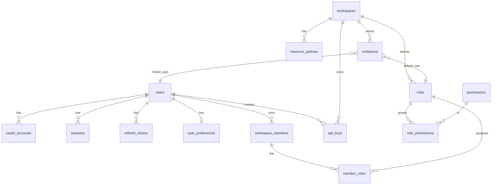
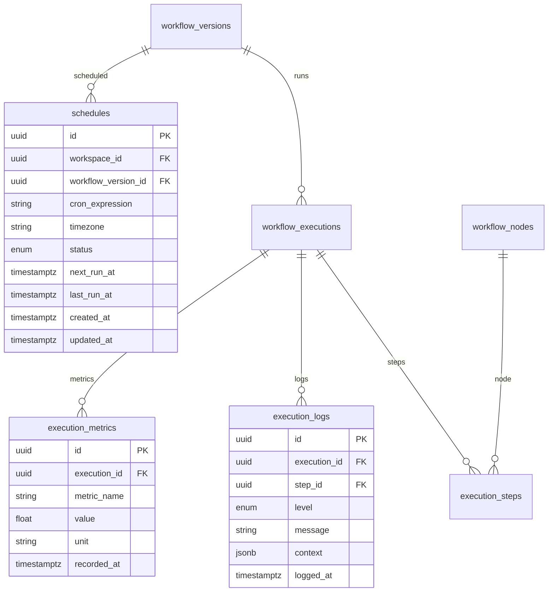
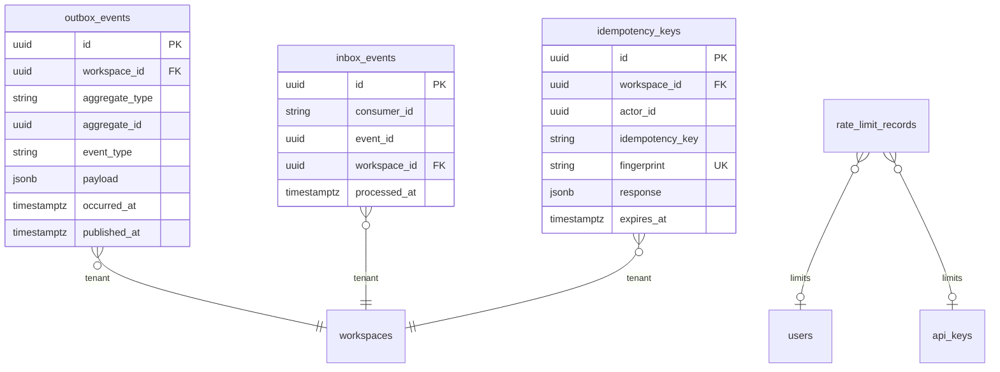
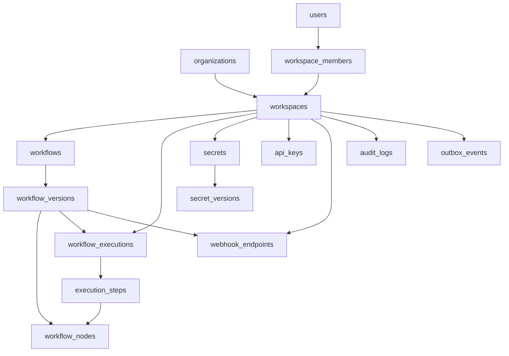

# FlowForge — Entity-Relationship Diagram

**Version:** 0.1.0  
**Status:** Draft (implementation source of truth)  
**Last updated:** 2026-07-14

---

## 1. Overview

This document defines the **persistence model** for FlowForge in PostgreSQL. The schema comprises **45 core entities** plus junction tables for many-to-many relationships. All tenant-scoped tables include `workspace_id` (except global catalog tables). Primary keys are **UUID** (v7 preferred for time-ordering). Timestamps use `timestamptz`.

### Design Principles

| Principle | Implementation |
|-----------|----------------|
| Tenant isolation | `workspace_id` FK on all workspace resources; composite indexes leading with `workspace_id` |
| Soft delete | `deleted_at` nullable on user-facing entities |
| Optimistic locking | `version` integer column on `workflows`, `workflow_executions`, `secrets` |
| Auditability | Append-only `audit_logs`; no UPDATE/DELETE |
| Event durability | `outbox_events` written in same transaction as mutations |
| Idempotency | `idempotency_keys` with TTL-based cleanup |

### Conventions

```
PK  = Primary Key
FK  = Foreign Key
UQ  = Unique Constraint
IDX = Index
NN  = NOT NULL
```

**Standard columns** on most tables:
- `id` UUID PK
- `created_at` timestamptz NN
- `updated_at` timestamptz NN
- `deleted_at` timestamptz (nullable, soft delete where applicable)

---

## 2. Entity Inventory (45 Core Entities)

| # | Entity | Table | Scope | Description |
|---|--------|-------|-------|-------------|
| 1 | User | `users` | Global | Platform user account |
| 2 | OAuthAccount | `oauth_accounts` | Global | Linked OAuth identity |
| 3 | Session | `sessions` | Global | Login session metadata |
| 4 | RefreshToken | `refresh_tokens` | Global | JWT refresh token family |
| 5 | UserPreference | `user_preferences` | Global | Per-user notification/UI prefs |
| 6 | Organization | `organizations` | Global | Top-level org container |
| 7 | Workspace | `workspaces` | Org | Tenant isolation boundary |
| 8 | Project | `projects` | Workspace | Workflow grouping |
| 9 | WorkspaceMember | `workspace_members` | Workspace | User ↔ workspace membership |
| 10 | Invitation | `invitations` | Workspace | Pending email invite |
| 11 | Role | `roles` | Workspace/System | Named permission bundle |
| 12 | Permission | `permissions` | Global | Permission catalog (read-only seed) |
| 13 | RolePermission | `role_permissions` | — | Role ↔ permission junction |
| 14 | MemberRole | `member_roles` | — | Member ↔ role junction |
| 15 | ResourcePolicy | `resource_policies` | Workspace | ABAC policy per resource |
| 16 | TenantSetting | `tenant_settings` | Workspace | Key-value tenant config |
| 17 | QuotaUsage | `quota_usage` | Workspace | Metered usage counters |
| 18 | FeatureFlag | `feature_flags` | Workspace/Global | Feature toggle state |
| 19 | ApiKey | `api_keys` | Workspace | Programmatic API credential |
| 20 | Secret | `secrets` | Workspace | Encrypted credential metadata |
| 21 | SecretVersion | `secret_versions` | Workspace | Versioned encrypted value |
| 22 | Workflow | `workflows` | Workspace | Automation definition |
| 23 | WorkflowDraft | `workflow_drafts` | Workspace | Mutable graph JSON |
| 24 | WorkflowVersion | `workflow_versions` | Workspace | Immutable published snapshot |
| 25 | WorkflowNode | `workflow_nodes` | Workspace | Node in version graph |
| 26 | WorkflowConnection | `workflow_connections` | Workspace | Edge between nodes |
| 27 | WorkflowVariable | `workflow_variables` | Workspace | Named workflow variable |
| 28 | Tag | `tags` | Workspace | Label for organization |
| 29 | WorkflowTag | `workflow_tags` | — | Workflow ↔ tag junction |
| 30 | Comment | `comments` | Workspace | Threaded discussion |
| 31 | WorkflowExecution | `workflow_executions` | Workspace | Single workflow run |
| 32 | ExecutionStep | `execution_steps` | Workspace | Per-node invocation |
| 33 | ExecutionLog | `execution_logs` | Workspace | Structured log line |
| 34 | ExecutionMetric | `execution_metrics` | Workspace | Timing/size metric |
| 35 | Schedule | `schedules` | Workspace | Cron trigger schedule |
| 36 | Integration | `integrations` | Global | Connector catalog |
| 37 | IntegrationCredential | `integration_credentials` | Workspace | Workspace integration connection |
| 38 | WebhookEndpoint | `webhook_endpoints` | Workspace | Inbound webhook URL |
| 39 | WebhookPayload | `webhook_payloads` | Workspace | Stored inbound payload |
| 40 | WebhookSubscription | `webhook_subscriptions` | Workspace | Outbound event subscription |
| 41 | WebhookDelivery | `webhook_deliveries` | Workspace | Outbound delivery attempt |
| 42 | Notification | `notifications` | Workspace | Outbound notification |
| 43 | NotificationTemplate | `notification_templates` | Global/Workspace | Message template |
| 44 | NotificationPreference | `notification_preferences` | User/Workspace | Channel preferences |
| 45 | File | `files` | Workspace | Uploaded file metadata |

### Infrastructure Entities (Supporting — not counted in 45)

| Entity | Table | Description |
|--------|-------|-------------|
| AuditLog | `audit_logs` | Immutable audit trail |
| TimelineEvent | `timeline_events` | Activity feed |
| SecurityEvent | `security_events` | Auth failure, lockout events |
| OutboxEvent | `outbox_events` | Transactional outbox |
| InboxEvent | `inbox_events` | Consumer deduplication |
| IdempotencyKey | `idempotency_keys` | HTTP idempotency cache |
| RateLimitRecord | `rate_limit_records` | Rate limit sliding window state |
| SearchIndex | `search_indexes` | FTS index metadata (optional denorm) |

---

## 3. Complete ER Diagram

```mermaid
erDiagram
    users ||--o{ oauth_accounts : links
    users ||--o{ sessions : has
    users ||--o{ refresh_tokens : has
    users ||--o| user_preferences : has
    users ||--o{ workspace_members : member_of
    users ||--o{ api_keys : creates
    users ||--o{ audit_logs : performs
    users ||--o{ notification_preferences : configures

    organizations ||--o{ workspaces : contains
    workspaces ||--o{ projects : contains
    workspaces ||--o{ workspace_members : has
    workspaces ||--o{ invitations : sends
    workspaces ||--o{ tenant_settings : configures
    workspaces ||--o{ quota_usage : tracks
    workspaces ||--o{ feature_flags : toggles
    workspaces ||--o{ roles : defines
    workspaces ||--o{ resource_policies : policies
    workspaces ||--o{ secrets : owns
    workspaces ||--o{ workflows : owns
    workspaces ||--o{ api_keys : owns
    workspaces ||--o{ files : stores
    workspaces ||--o{ integration_credentials : connects
    workspaces ||--o{ webhook_endpoints : exposes
    workspaces ||--o{ webhook_subscriptions : subscribes
    workspaces ||--o{ notifications : receives
    workspaces ||--o{ timeline_events : generates
    workspaces ||--o{ idempotency_keys : scopes

    workspace_members ||--o{ member_roles : assigned
    roles ||--o{ role_permissions : grants
    permissions ||--o{ role_permissions : included_in
    roles ||--o{ member_roles : assigned_to
    invitations }o--|| roles : default_role

    projects ||--o{ workflows : groups

    workflows ||--|| workflow_drafts : has
    workflows ||--o{ workflow_versions : publishes
    workflows ||--o{ workflow_tags : tagged
    workflows ||--o{ comments : discussed
    tags ||--o{ workflow_tags : applied

    workflow_versions ||--o{ workflow_nodes : contains
    workflow_versions ||--o{ workflow_connections : contains
    workflow_versions ||--o{ workflow_variables : defines
    workflow_versions ||--o{ workflow_executions : executed_as
    workflow_versions ||--o{ webhook_endpoints : triggered_by
    workflow_versions ||--o{ schedules : scheduled

    workflow_executions ||--o{ execution_steps : contains
    workflow_executions ||--o{ execution_logs : logs
    workflow_executions ||--o{ execution_metrics : measures
    workflow_nodes ||--o{ execution_steps : executes

    secrets ||--o{ secret_versions : versions
    secrets ||--o{ integration_credentials : secures

    integrations ||--o{ integration_credentials : instantiated

    webhook_endpoints ||--o{ webhook_payloads : receives
    webhook_subscriptions ||--o{ webhook_deliveries : delivers

    notification_templates ||--o{ notifications : renders

    outbox_events }o--|| workspaces : tenant
    inbox_events }o--|| workspaces : tenant
    audit_logs }o--|| workspaces : tenant
    security_events }o--|| users : targets

    users {
        uuid id PK
        string email UK
        string password_hash
        string name
        boolean email_verified
        timestamptz email_verified_at
        timestamptz last_login_at
        timestamptz deleted_at
        timestamptz created_at
        timestamptz updated_at
    }

    oauth_accounts {
        uuid id PK
        uuid user_id FK
        string provider
        string provider_user_id
        string access_token_enc
        string refresh_token_enc
        timestamptz expires_at
        timestamptz created_at
    }

    sessions {
        uuid id PK
        uuid user_id FK
        string ip_address
        string user_agent
        timestamptz last_active_at
        timestamptz expires_at
        timestamptz created_at
    }

    refresh_tokens {
        uuid id PK
        uuid user_id FK
        uuid session_id FK
        string token_hash UK
        uuid family_id
        boolean revoked
        timestamptz expires_at
        timestamptz created_at
    }

    organizations {
        uuid id PK
        string name
        string slug UK
        uuid owner_user_id FK
        timestamptz deleted_at
        timestamptz created_at
        timestamptz updated_at
    }

    workspaces {
        uuid id PK
        uuid organization_id FK
        string name
        string slug
        string description
        enum status
        timestamptz deleted_at
        timestamptz created_at
        timestamptz updated_at
    }

    workspace_members {
        uuid id PK
        uuid workspace_id FK
        uuid user_id FK
        enum status
        timestamptz joined_at
        timestamptz created_at
        timestamptz updated_at
    }

    workflows {
        uuid id PK
        uuid workspace_id FK
        uuid project_id FK
        string name
        string description
        boolean is_template
        int version
        uuid created_by FK
        timestamptz deleted_at
        timestamptz created_at
        timestamptz updated_at
    }

    workflow_versions {
        uuid id PK
        uuid workspace_id FK
        uuid workflow_id FK
        int version_number
        string changelog
        uuid published_by FK
        timestamptz published_at
        jsonb snapshot_hash
        timestamptz created_at
    }

    workflow_executions {
        uuid id PK
        uuid workspace_id FK
        uuid workflow_version_id FK
        enum status
        enum trigger_type
        jsonb trigger_payload
        string idempotency_key
        boolean sandbox
        uuid started_by FK
        timestamptz started_at
        timestamptz completed_at
        int version
        timestamptz created_at
        timestamptz updated_at
    }

    execution_steps {
        uuid id PK
        uuid workspace_id FK
        uuid execution_id FK
        uuid node_id FK
        int sequence_number
        enum status
        jsonb input_payload
        jsonb output_payload
        string error_code
        string error_message
        int attempt_number
        timestamptz started_at
        timestamptz completed_at
        timestamptz created_at
    }

    secrets {
        uuid id PK
        uuid workspace_id FK
        string name
        enum secret_type
        uuid active_version_id FK
        int version
        uuid created_by FK
        timestamptz deleted_at
        timestamptz created_at
        timestamptz updated_at
    }

    secret_versions {
        uuid id PK
        uuid secret_id FK
        int version_number
        bytea ciphertext
        bytea iv
        bytea auth_tag
        int key_version
        timestamptz created_at
    }

    webhook_endpoints {
        uuid id PK
        uuid workspace_id FK
        uuid workflow_version_id FK
        string path_token UK
        string signing_secret_enc
        boolean enabled
        timestamptz created_at
        timestamptz updated_at
    }

    webhook_subscriptions {
        uuid id PK
        uuid workspace_id FK
        string target_url
        string signing_secret_enc
        string[] event_types
        boolean enabled
        timestamptz created_at
        timestamptz updated_at
    }

    webhook_deliveries {
        uuid id PK
        uuid subscription_id FK
        uuid workspace_id FK
        string event_type
        jsonb payload
        enum status
        int attempt_count
        int http_status
        string response_body
        timestamptz next_retry_at
        timestamptz delivered_at
        timestamptz created_at
    }

    outbox_events {
        uuid id PK
        uuid workspace_id FK
        string event_type
        jsonb payload
        jsonb metadata
        timestamptz occurred_at
        timestamptz published_at
        int publish_attempts
        timestamptz created_at
    }

    inbox_events {
        uuid id PK
        uuid workspace_id FK
        string consumer_id
        uuid event_id
        timestamptz processed_at
        timestamptz created_at
    }

    idempotency_keys {
        uuid id PK
        uuid workspace_id FK
        string key
        string request_fingerprint
        int response_status
        jsonb response_body
        timestamptz expires_at
        timestamptz created_at
    }

    audit_logs {
        uuid id PK
        uuid workspace_id FK
        uuid actor_user_id FK
        enum actor_type
        string resource_type
        uuid resource_id
        string action
        jsonb before_value
        jsonb after_value
        string ip_address
        string user_agent
        string correlation_id
        timestamptz occurred_at
        timestamptz created_at
    }

    api_keys {
        uuid id PK
        uuid workspace_id FK
        uuid created_by FK
        string name
        string key_prefix
        string key_hash
        string[] scopes
        timestamptz expires_at
        timestamptz last_used_at
        timestamptz revoked_at
        timestamptz created_at
    }
```



---

## 4. Domain-Grouped Diagrams

### 4.1 Identity & Access



### 4.2 Workflow Authoring

```mermaid
erDiagram
    workflows ||--|| workflow_drafts : has
    workflows ||--o{ workflow_versions : versions
    workflow_versions ||--o{ workflow_nodes : nodes
    workflow_versions ||--o{ workflow_connections : edges
    workflow_versions ||--o{ workflow_variables : vars
    workflows ||--o{ workflow_tags : tags
    tags ||--o{ workflow_tags : on
    workflows ||--o{ comments : comments

    workflow_nodes ||--o{ workflow_connections : source
    workflow_nodes ||--o{ workflow_connections : target

    workflow_drafts {
        uuid id PK
        uuid workflow_id FK_UK
        jsonb graph_json
        timestamptz saved_at
        uuid saved_by FK
    }

    workflow_nodes {
        uuid id PK
        uuid version_id FK
        string node_key UK
        enum node_type
        string label
        jsonb config
        jsonb position
        timestamptz created_at
    }

    workflow_connections {
        uuid id PK
        uuid version_id FK
        uuid source_node_id FK
        string source_port
        uuid target_node_id FK
        string target_port
        timestamptz created_at
    }
```

### 4.3 Execution & Scheduling



### 4.4 Events & Reliability



---

## 5. Table Definitions

### 5.1 Global Tables

#### `users`

| Column | Type | Constraints |
|--------|------|-------------|
| id | UUID | PK |
| email | VARCHAR(320) | UQ, NN |
| password_hash | VARCHAR(255) | nullable (OAuth-only users) |
| name | VARCHAR(255) | NN |
| email_verified | BOOLEAN | default false |
| email_verified_at | TIMESTAMPTZ | |
| last_login_at | TIMESTAMPTZ | |
| deleted_at | TIMESTAMPTZ | |
| created_at | TIMESTAMPTZ | NN |
| updated_at | TIMESTAMPTZ | NN |

**Indexes:** `UQ(email) WHERE deleted_at IS NULL`, `IDX(users.created_at)`

#### `permissions` (seed catalog)

| Column | Type | Constraints |
|--------|------|-------------|
| id | UUID | PK |
| slug | VARCHAR(128) | UQ, NN |
| description | TEXT | |
| category | VARCHAR(64) | NN |

---

### 5.2 Tenancy Tables

#### `workspaces`

| Column | Type | Constraints |
|--------|------|-------------|
| id | UUID | PK |
| organization_id | UUID | FK → organizations, NN |
| name | VARCHAR(255) | NN |
| slug | VARCHAR(64) | NN |
| description | TEXT | |
| status | ENUM | active, suspended |
| deleted_at | TIMESTAMPTZ | |
| created_at | TIMESTAMPTZ | NN |
| updated_at | TIMESTAMPTZ | NN |

**Indexes:** `UQ(organization_id, slug) WHERE deleted_at IS NULL`

#### `workspace_members`

| Column | Type | Constraints |
|--------|------|-------------|
| id | UUID | PK |
| workspace_id | UUID | FK, NN |
| user_id | UUID | FK, NN |
| status | ENUM | active, suspended |
| joined_at | TIMESTAMPTZ | NN |
| created_at | TIMESTAMPTZ | NN |
| updated_at | TIMESTAMPTZ | NN |

**Indexes:** `UQ(workspace_id, user_id)`

#### `tenant_settings`

| Column | Type | Constraints |
|--------|------|-------------|
| id | UUID | PK |
| workspace_id | UUID | FK, NN |
| key | VARCHAR(128) | NN |
| value | JSONB | NN |
| created_at | TIMESTAMPTZ | NN |
| updated_at | TIMESTAMPTZ | NN |

**Indexes:** `UQ(workspace_id, key)`

#### `quota_usage`

| Column | Type | Constraints |
|--------|------|-------------|
| id | UUID | PK |
| workspace_id | UUID | FK, NN |
| metric | VARCHAR(64) | NN |
| period_start | DATE | NN |
| period_end | DATE | NN |
| current_value | BIGINT | NN, default 0 |
| limit_value | BIGINT | |
| updated_at | TIMESTAMPTZ | NN |

**Indexes:** `UQ(workspace_id, metric, period_start)`

---

### 5.3 Workflow Tables

#### `workflows`

| Column | Type | Constraints |
|--------|------|-------------|
| id | UUID | PK |
| workspace_id | UUID | FK, NN |
| project_id | UUID | FK, nullable |
| name | VARCHAR(255) | NN |
| description | TEXT | |
| is_template | BOOLEAN | default false |
| version | INT | NN, default 1 (optimistic lock) |
| created_by | UUID | FK → users |
| deleted_at | TIMESTAMPTZ | |
| created_at | TIMESTAMPTZ | NN |
| updated_at | TIMESTAMPTZ | NN |

**Indexes:** `IDX(workspace_id, deleted_at, updated_at DESC)`, GIN full-text on `name || description`

#### `workflow_versions`

| Column | Type | Constraints |
|--------|------|-------------|
| id | UUID | PK |
| workspace_id | UUID | FK, NN |
| workflow_id | UUID | FK, NN |
| version_number | INT | NN |
| changelog | TEXT | |
| published_by | UUID | FK → users |
| published_at | TIMESTAMPTZ | NN |
| snapshot_hash | VARCHAR(64) | SHA-256 of canonical graph |
| created_at | TIMESTAMPTZ | NN |

**Indexes:** `UQ(workflow_id, version_number)`, `IDX(workspace_id, workflow_id)`

---

### 5.4 Execution Tables

#### `workflow_executions`

| Column | Type | Constraints |
|--------|------|-------------|
| id | UUID | PK |
| workspace_id | UUID | FK, NN |
| workflow_version_id | UUID | FK, NN |
| status | ENUM | NN |
| trigger_type | ENUM | webhook, schedule, manual, api |
| trigger_payload | JSONB | |
| idempotency_key | VARCHAR(255) | |
| sandbox | BOOLEAN | default false |
| started_by | UUID | FK, nullable |
| started_at | TIMESTAMPTZ | |
| completed_at | TIMESTAMPTZ | |
| version | INT | NN (optimistic lock) |
| created_at | TIMESTAMPTZ | NN |
| updated_at | TIMESTAMPTZ | NN |

**Indexes:** `IDX(workspace_id, status, created_at DESC)`, `IDX(workspace_id, workflow_version_id)`, `UQ(workspace_id, idempotency_key) WHERE idempotency_key IS NOT NULL`

#### `execution_steps`

| Column | Type | Constraints |
|--------|------|-------------|
| id | UUID | PK |
| workspace_id | UUID | FK, NN |
| execution_id | UUID | FK, NN |
| node_id | UUID | FK → workflow_nodes |
| sequence_number | INT | NN |
| status | ENUM | NN |
| input_payload | JSONB | |
| output_payload | JSONB | |
| error_code | VARCHAR(64) | |
| error_message | TEXT | |
| attempt_number | INT | default 1 |
| started_at | TIMESTAMPTZ | |
| completed_at | TIMESTAMPTZ | |
| created_at | TIMESTAMPTZ | NN |

**Indexes:** `UQ(execution_id, sequence_number, attempt_number)`, `IDX(execution_id, status)`

---

### 5.5 Webhook Tables

#### `webhook_endpoints`

| Column | Type | Constraints |
|--------|------|-------------|
| id | UUID | PK |
| workspace_id | UUID | FK, NN |
| workflow_version_id | UUID | FK, NN |
| path_token | VARCHAR(64) | UQ, NN |
| signing_secret_enc | BYTEA | |
| enabled | BOOLEAN | default true |
| created_at | TIMESTAMPTZ | NN |
| updated_at | TIMESTAMPTZ | NN |

#### `webhook_deliveries`

| Column | Type | Constraints |
|--------|------|-------------|
| id | UUID | PK |
| subscription_id | UUID | FK, NN |
| workspace_id | UUID | FK, NN |
| event_type | VARCHAR(128) | NN |
| payload | JSONB | NN |
| status | ENUM | pending, delivered, failed, dead_lettered |
| attempt_count | INT | default 0 |
| http_status | INT | |
| response_body | TEXT | truncated |
| next_retry_at | TIMESTAMPTZ | |
| delivered_at | TIMESTAMPTZ | |
| created_at | TIMESTAMPTZ | NN |

**Indexes:** `IDX(status, next_retry_at) WHERE status = 'pending'`, `IDX(workspace_id, created_at DESC)`

---

### 5.6 Infrastructure Tables

#### `outbox_events`

| Column | Type | Constraints |
|--------|------|-------------|
| id | UUID | PK |
| workspace_id | UUID | FK, nullable (system events) |
| aggregate_type | VARCHAR(64) | NN |
| aggregate_id | UUID | NN |
| event_type | VARCHAR(128) | NN |
| payload | JSONB | NN |
| metadata | JSONB | |
| occurred_at | TIMESTAMPTZ | NN |
| published_at | TIMESTAMPTZ | nullable |
| publish_attempts | INT | default 0 |
| created_at | TIMESTAMPTZ | NN |

**Indexes:** `IDX(published_at, created_at) WHERE published_at IS NULL` (relay poll)

#### `inbox_events`

| Column | Type | Constraints |
|--------|------|-------------|
| id | UUID | PK |
| consumer_id | VARCHAR(128) | NN |
| event_id | UUID | NN |
| workspace_id | UUID | FK |
| processed_at | TIMESTAMPTZ | NN |
| created_at | TIMESTAMPTZ | NN |

**Indexes:** `UQ(consumer_id, event_id)`

#### `audit_logs`

| Column | Type | Constraints |
|--------|------|-------------|
| id | UUID | PK |
| workspace_id | UUID | FK |
| actor_user_id | UUID | FK, nullable |
| actor_type | ENUM | user, api_key, system |
| actor_api_key_id | UUID | FK, nullable |
| resource_type | VARCHAR(64) | NN |
| resource_id | UUID | NN |
| action | VARCHAR(64) | NN |
| before_value | JSONB | |
| after_value | JSONB | |
| ip_address | INET | |
| user_agent | TEXT | |
| correlation_id | VARCHAR(64) | |
| occurred_at | TIMESTAMPTZ | NN |
| created_at | TIMESTAMPTZ | NN |

**Indexes:** `IDX(workspace_id, occurred_at DESC)`, `IDX(workspace_id, resource_type, resource_id)`, GIN on `before_value`, `after_value`

#### `idempotency_keys`

| Column | Type | Constraints |
|--------|------|-------------|
| id | UUID | PK |
| workspace_id | UUID | FK, NN |
| actor_id | UUID | NN |
| idempotency_key | VARCHAR(255) | NN |
| request_fingerprint | VARCHAR(64) | NN |
| response_status | INT | |
| response_body | JSONB | |
| expires_at | TIMESTAMPTZ | NN |
| created_at | TIMESTAMPTZ | NN |

**Indexes:** `UQ(workspace_id, actor_id, idempotency_key)`, `IDX(expires_at)` (TTL cleanup job)

---

## 6. Foreign Key Summary



**Cascade rules:**
- `workspaces` delete → soft delete; hard delete prohibited with children (application enforced)
- `workflows` soft delete → versions/executions retained
- `users` delete → soft delete; anonymize PII in audit references
- `outbox_events`, `audit_logs`, `inbox_events` → never deleted (retention job archives to cold storage)

---

## 7. Index Strategy

| Pattern | Example | Rationale |
|---------|---------|-----------|
| Tenant-leading composite | `(workspace_id, status, created_at DESC)` | All list queries are workspace-scoped |
| Partial unique | `UQ(email) WHERE deleted_at IS NULL` | Soft delete compatibility |
| Partial index | `IDX(...) WHERE published_at IS NULL` | Outbox relay hot path |
| GIN full-text | `to_tsvector(name \|\| description)` | Workflow/audit search |
| Covering | `(workspace_id, id) INCLUDE (name, status)` | List endpoint optimization (future) |

---

## 8. Enum Definitions

```sql
-- Workflow execution
CREATE TYPE execution_status AS ENUM (
  'pending', 'running', 'waiting', 'completed',
  'failed', 'cancelled', 'timed_out'
);

CREATE TYPE step_status AS ENUM (
  'pending', 'running', 'completed', 'failed', 'skipped'
);

CREATE TYPE trigger_type AS ENUM (
  'webhook', 'schedule', 'manual', 'api'
);

CREATE TYPE node_type AS ENUM (
  'trigger', 'action', 'condition', 'branch', 'loop', 'delay'
);

-- Webhooks
CREATE TYPE delivery_status AS ENUM (
  'pending', 'delivered', 'failed', 'dead_lettered'
);

-- Membership
CREATE TYPE member_status AS ENUM ('active', 'suspended');
CREATE TYPE invitation_status AS ENUM ('pending', 'accepted', 'revoked', 'expired');

-- Secrets
CREATE TYPE secret_type AS ENUM ('api_key', 'oauth_token', 'generic');

-- Audit
CREATE TYPE actor_type AS ENUM ('user', 'api_key', 'system');
```

---

## 9. Prisma Schema Alignment

The Prisma schema in `prisma/schema.prisma` will implement this ERD incrementally by milestone:

| Milestone | Tables Introduced |
|-----------|-------------------|
| M0 | (baseline — extensions, enums only) |
| M1 | users, oauth_accounts, sessions, refresh_tokens, organizations, workspaces, workspace_members, api_keys |
| M2 | roles, permissions, role_permissions, member_roles, resource_policies, invitations, audit_logs |
| M3 | workflows, workflow_drafts, workflow_versions, workflow_nodes, workflow_connections, workflow_variables, tags |
| M4 | workflow_executions, execution_steps, execution_logs, execution_metrics, schedules, idempotency_keys |
| M5 | webhook_endpoints, webhook_payloads, webhook_subscriptions, webhook_deliveries |
| M6 | secrets, secret_versions, integrations, integration_credentials, files, notifications, search |
| M7+ | outbox_events, inbox_events, timeline_events, security_events, quota_usage, feature_flags |

---

## 10. Data Retention

| Table | Default Retention | Mechanism |
|-------|-------------------|-----------|
| execution_logs | 90 days | Partition by month; drop old partitions |
| webhook_payloads | 30 days | Scheduled cleanup job |
| webhook_deliveries | 90 days | Archive then delete |
| idempotency_keys | 24 hours | TTL index + cleanup job |
| outbox_events | 7 days after publish | Cleanup job |
| inbox_events | 30 days | Cleanup job |
| rate_limit_records | 1 hour | Redis primary; PG backup TTL |
| audit_logs | Indefinite | Archive to cold storage after 2 years |

---

## 11. Related Documents

| Document | Description |
|----------|-------------|
| [DOMAIN-MODEL.md](./DOMAIN-MODEL.md) | Aggregates and domain invariants |
| [ARCHITECTURE.md](./ARCHITECTURE.md) | System architecture and patterns |
| [EVENT-CATALOG.md](./EVENT-CATALOG.md) | Outbox/inbox event types |

---

## 12. Document History

| Version | Date | Changes |
|---------|------|---------|
| 0.1.0 | 2026-07-14 | Initial ERD with 45 core entities |
