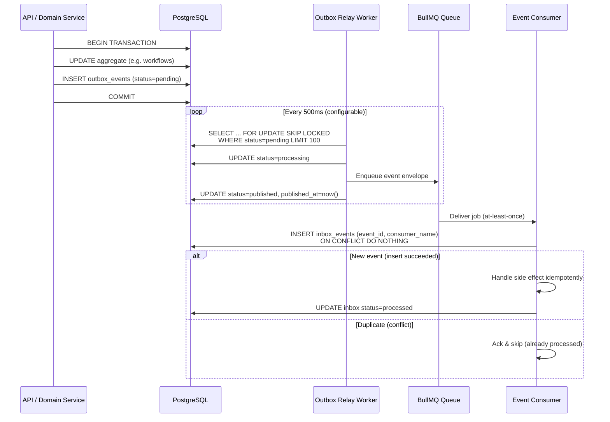

# Event Catalog

> **Status:** Active · **Version:** 1.0 · **Last updated:** 2026-07-14

This document is the authoritative catalog of domain events in FlowForge. All events listed here are persisted via the **Outbox Pattern** before any side effect is emitted to external systems. Consumers use the **Inbox Pattern** for at-least-once delivery with idempotent processing.

---

## Table of Contents

1. [Conventions](#conventions)
2. [Event Envelope](#event-envelope)
3. [Outbox / Inbox Flow](#outbox--inbox-flow)
4. [Idempotency Rules](#idempotency-rules)
5. [Event Catalog by Aggregate](#event-catalog-by-aggregate)
6. [Consumer Mapping](#consumer-mapping)
7. [Versioning & Migration](#versioning--migration)
8. [Operational Runbook](#operational-runbook)

---

## Conventions

### Naming

| Element | Convention | Example |
|---------|------------|---------|
| Event type | `{Aggregate}{PastTenseVerb}` PascalCase | `WorkflowPublished` |
| Topic / routing key | `flowforge.{aggregate}.{verb}` kebab-case | `flowforge.workflow.published` |
| Aggregate ID field | `{aggregate}Id` UUID v7 | `workflowId` |
| Correlation | `correlationId` UUID | propagated from HTTP `X-Correlation-Id` |
| Causation | `causationId` UUID | ID of the event/command that caused this event |

### Classification

| Category | Description | Examples |
|----------|-------------|----------|
| **Domain** | State change within a bounded context | `WorkflowCreated`, `MemberAdded` |
| **Integration** | Cross-context or external side effect trigger | `WebhookDeliveryRequested`, `EmailSendRequested` |
| **Audit** | Immutable audit trail (also written to `audit_logs`) | `PermissionChanged`, `SecretRotated` |

### Delivery Guarantees

- **Within a transaction:** domain events are written to `outbox_events` in the same DB transaction as the aggregate mutation.
- **Between services/processes:** at-least-once delivery via BullMQ relay workers.
- **Processing:** exactly-once *effect* via inbox deduplication + idempotency keys.

---

## Event Envelope

Every event, whether in the outbox table or on the wire, uses this envelope:

```typescript
interface EventEnvelope<TPayload = unknown> {
  /** Globally unique event ID (UUID v7). Used as idempotency key for consumers. */
  eventId: string;

  /** Semantic event type, e.g. "WorkflowPublished" */
  eventType: string;

  /** Schema version for payload evolution */
  schemaVersion: number;

  /** ISO 8601 UTC timestamp of occurrence (not relay time) */
  occurredAt: string;

  /** Workspace tenant scope — required for all tenant-scoped events */
  workspaceId: string;

  /** Actor who caused the event (userId, apiKeyId, or "system") */
  actorId: string;
  actorType: 'user' | 'api_key' | 'system' | 'webhook';

  /** Distributed tracing */
  correlationId: string;
  causationId?: string;
  traceId?: string;

  /** Domain payload */
  payload: TPayload;

  /** Optional metadata (non-domain, operational) */
  metadata?: {
    ipAddress?: string;
    userAgent?: string;
    source?: 'api' | 'worker' | 'webhook' | 'scheduler';
  };
}
```

### Outbox Row Schema

```sql
-- prisma model: OutboxEvent
id            UUID PRIMARY KEY      -- same as eventId
event_type    VARCHAR NOT NULL
schema_version INT NOT NULL
workspace_id  UUID NOT NULL
aggregate_type VARCHAR NOT NULL
aggregate_id  UUID NOT NULL
payload       JSONB NOT NULL
metadata      JSONB
status        ENUM('pending','processing','published','failed')
attempts      INT DEFAULT 0
created_at    TIMESTAMPTZ NOT NULL
published_at  TIMESTAMPTZ
next_retry_at TIMESTAMPTZ
```

### Inbox Row Schema

```sql
-- prisma model: InboxEvent
id              UUID PRIMARY KEY
event_id        UUID NOT NULL UNIQUE  -- dedup key
consumer_name   VARCHAR NOT NULL
workspace_id    UUID NOT NULL
event_type      VARCHAR NOT NULL
payload         JSONB NOT NULL
status          ENUM('pending','processing','processed','failed')
processed_at    TIMESTAMPTZ
error_message   TEXT
created_at      TIMESTAMPTZ NOT NULL

UNIQUE (event_id, consumer_name)
```

---

## Outbox / Inbox Flow

### Outbox Relay (Transactional → Async)



### Failure Handling

| Stage | Failure | Behavior |
|-------|---------|----------|
| Outbox relay | BullMQ enqueue fails | Row stays `processing`; watchdog resets to `pending` after 5 min |
| Outbox relay | Max attempts (10) | Row → `failed`; alert fires; manual replay via admin API |
| Consumer | Handler throws | Job retries with exponential backoff; after max → DLQ |
| Consumer | Poison message | DLQ + `inbox_events.status=failed`; ops dashboard |

---

## Idempotency Rules

### Rule 1: Event ID is the Primary Dedup Key

Every consumer **must** record `(eventId, consumerName)` in `inbox_events` before performing side effects. If the insert conflicts, the handler must not re-execute.

### Rule 2: Natural Keys for Domain Idempotency

Some handlers additionally guard on business keys:

| Event | Natural Key | Guard |
|-------|-------------|-------|
| `WorkflowExecutionStarted` | `executionId` | Skip if execution status ≠ `queued` |
| `WebhookDeliveryRequested` | `deliveryId` | Skip if delivery status = `delivered` |
| `EmailSendRequested` | `notificationId` | Skip if notification status = `sent` |
| `MemberAdded` | `(workspaceId, userId)` | Skip if membership already exists |

### Rule 3: HTTP Idempotency Keys (Command Side)

API mutations that emit events accept `Idempotency-Key` header. The key is stored in `idempotency_keys` with:

- TTL: 24 hours (configurable per endpoint)
- Fingerprint: hash of `(method, path, body, workspaceId, actorId)`
- Cached response replayed on duplicate within TTL

Events emitted from idempotent commands reuse the same `correlationId` and link `causationId` to the idempotency record.

### Rule 4: Webhook Ingestion

Incoming webhooks deduplicate on `(workspaceId, endpointId, externalEventId)` or `(workspaceId, endpointId, payloadHash, receivedWithinWindow)`.

### Rule 5: Scheduled / Cron Triggers

Scheduler emits `WorkflowTriggerFired` with deterministic `eventId = hash(scheduleId + fireTimeBucket)` to prevent double-fire across leader election failovers.

---

## Event Catalog by Aggregate

### Identity & Access

| Event Type | Trigger | Payload | Consumers |
|------------|---------|---------|-----------|
| `UserRegistered` | User completes signup | `{ userId, email, displayName }` | Audit, Timeline, Email |
| `UserEmailVerified` | Email verification confirmed | `{ userId, email, verifiedAt }` | Audit, Timeline |
| `UserPasswordChanged` | Password reset or change | `{ userId, changedAt }` | Audit, Session (revoke others) |
| `SessionCreated` | Login success | `{ sessionId, userId, deviceInfo }` | Audit |
| `SessionRevoked` | Logout or admin revoke | `{ sessionId, userId, reason }` | Audit |
| `ApiKeyCreated` | API key issued | `{ apiKeyId, workspaceId, scopes[], prefix, expiresAt }` | Audit, Timeline, Cache (invalidate) |
| `ApiKeyRevoked` | Key revoked | `{ apiKeyId, workspaceId, revokedAt, reason }` | Audit, Cache (invalidate) |
| `OAuthAccountLinked` | OAuth provider linked | `{ userId, provider, providerAccountId }` | Audit, Timeline |

### Organization & Workspace

| Event Type | Trigger | Payload | Consumers |
|------------|---------|---------|-----------|
| `OrganizationCreated` | Org created | `{ organizationId, name, slug, ownerId }` | Audit, Timeline |
| `WorkspaceCreated` | Workspace provisioned | `{ workspaceId, organizationId, name, slug, plan }` | Audit, Timeline, Quota |
| `WorkspaceUpdated` | Settings changed | `{ workspaceId, changes: Record<string, unknown> }` | Cache (invalidate), Audit |
| `WorkspaceDeleted` | Soft delete | `{ workspaceId, deletedAt, deletedBy }` | Audit, Cleanup jobs |
| `MemberInvited` | Invitation sent | `{ invitationId, workspaceId, email, roleId, invitedBy }` | Email, Audit, Timeline |
| `MemberAdded` | Invitation accepted or direct add | `{ workspaceId, userId, roleId, addedBy }` | Audit, Timeline, Permission cache |
| `MemberRemoved` | Member removed | `{ workspaceId, userId, removedBy, reason }` | Audit, Timeline, Session revoke |
| `MemberRoleChanged` | Role updated | `{ workspaceId, userId, previousRoleId, newRoleId, changedBy }` | Audit, Permission cache |

### Workflow

| Event Type | Trigger | Payload | Consumers |
|------------|---------|---------|-----------|
| `WorkflowCreated` | New workflow draft | `{ workflowId, workspaceId, name, createdBy }` | Audit, Timeline, Search index |
| `WorkflowUpdated` | Draft metadata/graph edit | `{ workflowId, workspaceId, version, changeSummary }` | Search index, Cache |
| `WorkflowPublished` | Draft → published | `{ workflowId, workspaceId, versionId, versionNumber, publishedBy }` | Scheduler, Cache, Audit, Timeline |
| `WorkflowUnpublished` | Active → draft/disabled | `{ workflowId, workspaceId, unpublishedBy, reason }` | Scheduler (cancel triggers), Cache |
| `WorkflowDeleted` | Soft delete | `{ workflowId, workspaceId, deletedBy }` | Scheduler, Search, Cache |
| `WorkflowRolledBack` | Revert to prior version | `{ workflowId, workspaceId, fromVersionId, toVersionId, rolledBackBy }` | Scheduler, Cache, Audit |

### Execution

| Event Type | Trigger | Payload | Consumers |
|------------|---------|---------|-----------|
| `WorkflowExecutionQueued` | Trigger fired, execution created | `{ executionId, workflowId, workspaceId, triggerType, triggerPayload }` | Metrics, Timeline |
| `WorkflowExecutionStarted` | Worker picks up execution | `{ executionId, workflowId, workspaceId, startedAt }` | Metrics, Audit |
| `WorkflowExecutionCompleted` | All nodes succeeded | `{ executionId, workflowId, workspaceId, durationMs, outputSummary }` | Metrics, Timeline, Billing usage |
| `WorkflowExecutionFailed` | Unrecoverable failure | `{ executionId, workflowId, workspaceId, errorCode, errorMessage, failedNodeId }` | Metrics, Timeline, Notification |
| `WorkflowExecutionCancelled` | User or system cancel | `{ executionId, workflowId, workspaceId, cancelledBy, reason }` | Metrics, Timeline |
| `NodeExecutionStarted` | Node begins | `{ nodeExecutionId, executionId, nodeId, nodeType }` | Metrics |
| `NodeExecutionCompleted` | Node succeeds | `{ nodeExecutionId, executionId, nodeId, durationMs, outputSizeBytes }` | Metrics |
| `NodeExecutionFailed` | Node fails (may retry) | `{ nodeExecutionId, executionId, nodeId, attempt, errorCode, willRetry }` | Metrics, Notification |
| `NodeExecutionSkipped` | Condition branch skipped | `{ nodeExecutionId, executionId, nodeId, reason }` | Metrics |

### Webhooks

| Event Type | Trigger | Payload | Consumers |
|------------|---------|---------|-----------|
| `WebhookReceived` | Incoming webhook hit | `{ webhookId, endpointId, workspaceId, payloadHash, receivedAt }` | Execution (trigger), Audit |
| `WebhookDeliveryRequested` | Outbound delivery scheduled | `{ deliveryId, endpointUrl, workspaceId, eventType, payload }` | Webhook worker |
| `WebhookDeliverySucceeded` | 2xx response | `{ deliveryId, workspaceId, statusCode, durationMs }` | Audit, Timeline, Metrics |
| `WebhookDeliveryFailed` | Non-2xx or timeout | `{ deliveryId, workspaceId, statusCode, attempt, willRetry }` | Audit, Metrics, DLQ (if exhausted) |

### Secrets & Integrations

| Event Type | Trigger | Payload | Consumers |
|------------|---------|---------|-----------|
| `SecretCreated` | Secret stored | `{ secretId, workspaceId, name, createdBy }` | Audit, Timeline |
| `SecretUpdated` | Secret rotated/updated | `{ secretId, workspaceId, updatedBy, version }` | Audit, Cache (invalidate connections) |
| `SecretDeleted` | Secret removed | `{ secretId, workspaceId, deletedBy }` | Audit, Cache |
| `IntegrationConnected` | OAuth integration linked | `{ integrationId, workspaceId, provider, connectedBy }` | Audit, Timeline |
| `IntegrationDisconnected` | Integration removed | `{ integrationId, workspaceId, disconnectedBy }` | Audit, Cache |

### Notifications

| Event Type | Trigger | Payload | Consumers |
|------------|---------|---------|-----------|
| `NotificationRequested` | Any notification trigger | `{ notificationId, workspaceId, channel, template, recipient, data }` | Notification worker |
| `NotificationSent` | Delivery confirmed | `{ notificationId, workspaceId, channel, sentAt }` | Audit, Timeline |
| `NotificationFailed` | Delivery failed | `{ notificationId, workspaceId, channel, error, attempt }` | Metrics, DLQ |

### Billing & Quotas (M8)

| Event Type | Trigger | Payload | Consumers |
|------------|---------|---------|-----------|
| `QuotaThresholdReached` | Usage hits threshold | `{ workspaceId, quotaType, current, limit, thresholdPercent }` | Notification, Audit |
| `QuotaExceeded` | Hard limit hit | `{ workspaceId, quotaType, action }` | API guard, Notification |

---

## Consumer Mapping

| Consumer | Subscribed Events | Queue | Concurrency |
|----------|-------------------|-------|-------------|
| `outbox-relay` | *(polls DB, not event-driven)* | `internal.outbox-relay` | 1 per instance |
| `execution-engine` | `WorkflowExecutionQueued`, `WebhookReceived` | `workflow.execution` | 10–50 |
| `scheduler` | `WorkflowPublished`, `WorkflowUnpublished`, `WorkflowDeleted` | `workflow.scheduler` | 2 |
| `webhook-delivery` | `WebhookDeliveryRequested` | `webhook.outbound` | 20 |
| `notification` | `NotificationRequested` | `notification.send` | 10 |
| `audit-writer` | All `Audit`-classified events | `audit.write` | 5 |
| `timeline-projector` | Domain events (allowlist) | `timeline.project` | 5 |
| `search-indexer` | Workflow/member events | `search.index` | 3 |
| `cache-invalidator` | Mutations affecting cached entities | `cache.invalidate` | 5 |
| `metrics-aggregator` | Execution/node events | `metrics.aggregate` | 3 |

---

## Versioning & Migration

### Schema Version Policy

- `schemaVersion` starts at `1` for each event type.
- **Additive changes** (new optional fields): bump not required; consumers ignore unknown fields.
- **Breaking changes** (rename/remove/retype): increment `schemaVersion`; run dual-write period; consumers handle both versions.
- Deprecated fields remain readable for 90 days minimum.

### Event Type Deprecation

1. Mark event as deprecated in this catalog.
2. Stop emitting from domain layer.
3. Consumer continues processing backlog for 30 days.
4. Archive outbox/inbox rows older than retention policy (default 90 days).

---

## Operational Runbook

### Replay Failed Outbox Events

```bash
# Admin CLI (future): replay by ID range or event type
flowforge admin outbox replay --status failed --limit 100
```

### Inspect Inbox Backlog

```sql
SELECT consumer_name, status, COUNT(*)
FROM inbox_events
WHERE created_at > NOW() - INTERVAL '1 hour'
GROUP BY 1, 2;
```

### Metrics to Alert On

| Metric | Threshold | Severity |
|--------|-----------|----------|
| `outbox_events_pending_count` | > 1000 for 5 min | Warning |
| `outbox_events_failed_count` | > 0 | Critical |
| `inbox_events_failed_count` | > 10 in 15 min | Warning |
| `outbox_relay_lag_seconds` | p99 > 30s | Warning |

---

## Related Documents

- [QUEUE-DESIGN.md](./QUEUE-DESIGN.md) — BullMQ topology and DLQ handling
- [API-CATALOG.md](./API-CATALOG.md) — REST endpoints that emit events
- [ADR 0003: Outbox-First Events](../adr/0003-outbox-first-events.md)
- [DOMAIN-MODEL.md](./DOMAIN-MODEL.md) — Aggregate boundaries
