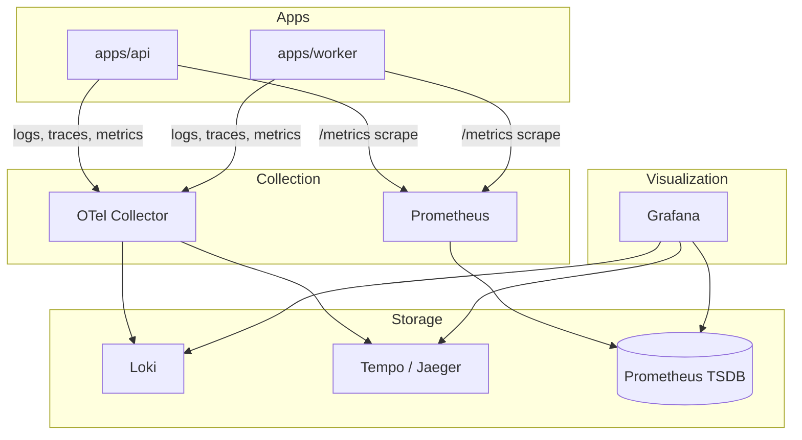

# Observability Design

> **Status:** Active · **Version:** 1.0 · **Last updated:** 2026-07-14

FlowForge implements enterprise-grade observability using **OpenTelemetry** for traces, **Prometheus** for metrics, **Grafana** for dashboards, **Loki** for logs, and **Pino** for structured logging in application code.

---

## Table of Contents

1. [Observability Pillars](#observability-pillars)
2. [Architecture](#architecture)
3. [Structured Logging (Pino)](#structured-logging-pino)
4. [Distributed Tracing (OpenTelemetry)](#distributed-tracing-opentelemetry)
5. [Metrics (Prometheus)](#metrics-prometheus)
6. [Log Aggregation (Loki)](#log-aggregation-loki)
7. [Grafana Dashboards](#grafana-dashboards)
8. [Health Checks](#health-checks)
9. [Alerting](#alerting)
10. [Local Development](#local-development)
11. [Production Configuration](#production-configuration)

---

## Observability Pillars

| Pillar | Tool | Purpose |
|--------|------|---------|
| **Logs** | Pino → OTel Collector → Loki | Debugging, audit correlation, incident investigation |
| **Metrics** | Prometheus | SLIs, SLOs, capacity planning, alerting |
| **Traces** | OpenTelemetry → Tempo/Jaeger (optional) | Latency analysis, dependency mapping |
| **Profiles** | (Future) Pyroscope | CPU/memory hot paths |

### Context Propagation

Every request and job carries:

| Field | Source | Propagation |
|-------|--------|-------------|
| `requestId` | Generated or `X-Request-Id` | HTTP header, log field, span attribute |
| `correlationId` | Generated or `X-Correlation-Id` | Cross-service, outbox events, BullMQ jobs |
| `traceId` | OpenTelemetry | W3C `traceparent` header |
| `spanId` | OpenTelemetry | Current span |
| `workspaceId` | Tenant context | Log field, span attribute, metric label |
| `userId` / `apiKeyId` | Auth context | Log field (never log PII beyond ID) |

---

## Architecture



### Docker Compose Stack (Local)

Services under `docker/monitoring/`:

| Service | Port | Role |
|---------|------|------|
| otel-collector | 4317 (gRPC), 4318 (HTTP) | Receives OTLP; routes to backends |
| prometheus | 9090 | Scrapes `/metrics` endpoints |
| grafana | 3001 | Dashboards (admin/admin dev only) |
| loki | 3100 | Log storage |
| (optional) tempo | 3200 | Trace storage |

---

## Structured Logging (Pino)

### Configuration

- **Production:** JSON to stdout; collected by OTel Collector or Promtail → Loki
- **Development:** `pino-pretty` for human-readable output
- **Log level:** `LOG_LEVEL` env (`info` default)

### Standard Log Fields

```json
{
  "level": "info",
  "time": 1720965960000,
  "msg": "Workflow execution completed",
  "service": "flowforge-api",
  "version": "0.1.0",
  "env": "production",
  "requestId": "req_abc123",
  "correlationId": "corr_xyz789",
  "traceId": "4bf92f3577b34da6a3ce929d0e0e4736",
  "spanId": "00f067aa0ba902b7",
  "workspaceId": "019082a1-...",
  "userId": "019082b2-...",
  "executionId": "019082c3-...",
  "durationMs": 1234
}
```

### Log Levels by Scenario

| Level | Use |
|-------|-----|
| `fatal` | Process cannot continue |
| `error` | Request/job failed; needs investigation |
| `warn` | Degraded behavior; retry succeeded; rate limit approached |
| `info` | Business events; request completed; job finished |
| `debug` | Query details; cache hits/misses |
| `trace` | Verbose internal state (dev only) |

### Redaction

Pino `redact` paths:

```
password, token, accessToken, refreshToken, secret, authorization,
*.password, *.token, *.secret, headers.authorization
```

---

## Distributed Tracing (OpenTelemetry)

### SDK Setup

Both `apps/api` and `apps/worker` initialize OTel SDK on bootstrap:

```typescript
// Config from @flowforge/config
OTEL_EXPORTER_OTLP_ENDPOINT=http://otel-collector:4318
OTEL_SERVICE_NAME=flowforge-api | flowforge-worker
```

Auto-instrumentation:

- `@opentelemetry/instrumentation-http`
- `@opentelemetry/instrumentation-nestjs-core`
- `@opentelemetry/instrumentation-pg` (Prisma uses pg driver)
- `@opentelemetry/instrumentation-ioredis`
- `@opentelemetry/instrumentation-bullmq` (custom span per job)

### Span Naming

```
HTTP:     {method} {route}           e.g. GET /api/v1/workflows
Service:  {Service}.{method}        e.g. WorkflowService.publish
Repo:     {Entity}Repository.{op}    e.g. WorkflowRepository.findById
Queue:    process {queueName}        e.g. process workflow.execution
External: HTTP {host}{path}          e.g. HTTP api.slack.com/post
```

### Custom Span Attributes

```typescript
span.setAttributes({
  'flowforge.workspace_id': workspaceId,
  'flowforge.workflow_id': workflowId,
  'flowforge.execution_id': executionId,
  'flowforge.node_type': nodeType,
});
```

### Trace Sampling

| Environment | Strategy |
|-------------|----------|
| Development | 100% sampling |
| Staging | 100% sampling |
| Production | ParentBased(TraceIdRatioBased(0.1)) — 10% root traces; always sample errors |

Error spans: always recorded via `recordException` + `setStatus(ERROR)`.

---

## Metrics (Prometheus)

### Exposition

- API and Worker expose `GET /metrics` (internal network only; not public)
- Default port: same as app port on path `/metrics`
- Uses `prom-client` with default Node.js metrics + custom business metrics

### Metric Categories

#### HTTP (API)

```
flowforge_http_requests_total{method, route, status_code}
flowforge_http_request_duration_seconds{method, route, quantile}
flowforge_http_requests_in_flight{method}
```

#### Database

```
flowforge_db_query_duration_seconds{operation, model}
flowforge_db_connection_pool_size{state="active|idle|waiting"}
flowforge_db_slow_queries_total{threshold="100ms|500ms|1s"}
```

#### Workflow Execution

```
flowforge_executions_total{status="completed|failed|cancelled", trigger_type}
flowforge_execution_duration_seconds{quantile}
flowforge_node_executions_total{node_type, status}
flowforge_node_execution_duration_seconds{node_type, quantile}
```

#### Queues (BullMQ)

```
flowforge_queue_waiting_jobs{queue}
flowforge_queue_active_jobs{queue}
flowforge_queue_completed_total{queue}
flowforge_queue_failed_total{queue}
flowforge_queue_dlq_size{queue}
flowforge_job_duration_seconds{queue, quantile}
```

#### Cache

```
flowforge_cache_hits_total{namespace}
flowforge_cache_misses_total{namespace}
flowforge_cache_bypass_total{reason}
```

#### Auth & Security

```
flowforge_auth_attempts_total{result="success|failure", method}
flowforge_rate_limit_exceeded_total{scope}
flowforge_api_key_validations_total{result}
```

### SLI / SLO Targets (Production)

| SLI | SLO | Measurement Window |
|-----|-----|-------------------|
| API availability | 99.9% | 30 days |
| API latency p99 | < 500ms (non-execution endpoints) | 30 days |
| Workflow execution success rate | 99.5% | 30 days |
| Webhook delivery success rate | 99% (after retries) | 30 days |
| Outbox relay lag p99 | < 5 seconds | 7 days |

---

## Log Aggregation (Loki)

### Ingestion Path

```
Pino (JSON stdout) → OTel Collector (filelog/stdout receiver) → Loki
```

Alternative: Promtail sidecar scraping container logs.

### Labels (Low Cardinality)

```
{service="flowforge-api", env="production", level="error"}
{service="flowforge-worker", queue="workflow.execution"}
```

**Never** use high-cardinality labels (userId, workspaceId, requestId) as Loki labels — use JSON parsing filters instead.

### Example LogQL Queries

```logql
# Error rate by service
sum(rate({service=~"flowforge-.*"} | json | level="error" [5m])) by (service)

# Slow requests
{service="flowforge-api"} | json | durationMs > 1000

# Failed executions for a workspace (filter in query, not label)
{service="flowforge-worker"} | json | workspaceId="019082a1-..." | msg=~"execution failed"

# Correlation ID trace-through
{service=~"flowforge-.*"} | json | correlationId="corr_xyz789"
```

### Retention

| Environment | Retention |
|-------------|-----------|
| Development | 7 days |
| Staging | 14 days |
| Production | 30 days (hot), 90 days (S3 archive via compactor) |

---

## Grafana Dashboards

Dashboards provisioned from `docker/monitoring/grafana/dashboards/`:

### 1. Platform Overview

- Request rate, error rate, latency (RED method)
- Active workspaces, executions/min
- Dependency health (Postgres, Redis, MinIO)

### 2. API Performance

- Endpoint-level latency heatmap
- 4xx/5xx breakdown
- Rate limit hits
- Top slow endpoints

### 3. Workflow Execution

- Executions by status (time series)
- Execution duration percentiles
- Node type performance
- Failure reasons (top 10 error codes)

### 4. Queue Health

- Queue depth per queue
- Job throughput (completed/failed)
- DLQ size and age
- Worker concurrency utilization

### 5. Database & Cache

- Query latency, connection pool
- Cache hit ratio by namespace
- Slow query log correlation

### 6. Security & Auth

- Failed login attempts
- API key validation failures
- Rate limit exceeded by scope

---

## Health Checks

Implemented per `@flowforge/contracts` `HealthCheck` schema:

### Endpoints

| Endpoint | Purpose | K8s Probe |
|----------|---------|-----------|
| `GET /health/liveness` | Process alive | `livenessProbe` |
| `GET /health/readiness` | Dependencies OK | `readinessProbe` |
| `GET /health/startup` | Init complete (migrations, cache warm) | `startupProbe` |

### Response Shape

```json
{
  "status": "ok",
  "timestamp": "2026-07-14T13:26:00.000Z",
  "version": "0.1.0",
  "uptime": 3600,
  "checks": {
    "postgres": { "status": "up", "latencyMs": 2 },
    "redis": { "status": "up", "latencyMs": 1 },
    "minio": { "status": "up", "latencyMs": 5 }
  }
}
```

Status values: `ok` (all up), `degraded` (non-critical down), `error` (critical down).

Worker health: `GET /health` on worker port reports queue connectivity and active job count.

---

## Alerting

### Alertmanager Rules (Production)

| Alert | Condition | Severity | Runbook |
|-------|-----------|----------|---------|
| HighErrorRate | 5xx rate > 1% for 5m | Critical | Check recent deploys, DB connectivity |
| HighLatency | p99 > 2s for 10m | Warning | Check slow queries, cache hit ratio |
| PostgresDown | readiness check fails | Critical | Failover to replica |
| RedisDown | readiness degraded | Warning | Cache bypass active; restore Redis |
| QueueBacklog | waiting > 5000 for 10m | Warning | Scale workers |
| DLQGrowing | dlq size increasing 15m | Warning | Inspect failure reasons |
| OutboxLag | relay lag p99 > 30s | Warning | Check relay worker, DB locks |
| DiskSpaceLow | < 15% free | Critical | Expand volume, run cleanup |

### Notification Channels

- PagerDuty (Critical)
- Slack `#flowforge-alerts` (Warning+)
- Email (daily digest for info-level trends)

---

## Local Development

```bash
# Start full stack including monitoring
docker compose up -d

# Access Grafana
open http://localhost:3001   # admin / admin

# Access Prometheus
open http://localhost:9090

# Tail API logs with correlation ID
docker compose logs -f api | jq 'select(.correlationId != null)'
```

Environment variables for local OTel:

```env
OTEL_EXPORTER_OTLP_ENDPOINT=http://localhost:4318
OTEL_SERVICE_NAME=flowforge-api
LOG_LEVEL=debug
```

---

## Production Configuration

### API (`@flowforge/config`)

```env
OTEL_EXPORTER_OTLP_ENDPOINT=https://otel.internal:4318
OTEL_SERVICE_NAME=flowforge-api
LOG_LEVEL=info
```

### Worker

```env
OTEL_EXPORTER_OTLP_ENDPOINT=https://otel.internal:4318
OTEL_SERVICE_NAME=flowforge-worker
LOG_LEVEL=info
```

### Security

- `/metrics` bound to internal network only (not exposed via ingress)
- Grafana authenticated via SSO
- Log exports exclude PII; workspace IDs are acceptable

---

## Related Documents

- [QUEUE-DESIGN.md](./QUEUE-DESIGN.md) — Queue metrics
- [DEPLOYMENT.md](../operations/DEPLOYMENT.md) — Monitoring stack deployment
- [CACHING-STRATEGY.md](./CACHING-STRATEGY.md) — Cache metrics
- `@flowforge/contracts` — HealthCheck schema
