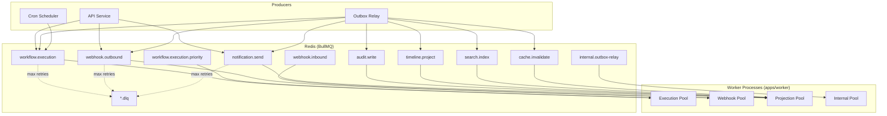

# Queue Design — BullMQ Topology

> **Status:** Active · **Version:** 1.0 · **Last updated:** 2026-07-14

FlowForge uses [BullMQ](https://docs.bullmq.io/) on Redis for all asynchronous work. This document defines queue topology, naming conventions, priority levels, retry policies, dead-letter handling, and worker deployment.

---

## Table of Contents

1. [Architecture Overview](#architecture-overview)
2. [Naming Conventions](#naming-conventions)
3. [Queue Inventory](#queue-inventory)
4. [Priority Model](#priority-model)
5. [Retry & Backoff](#retry--backoff)
6. [Dead Letter Queues](#dead-letter-queues)
7. [Worker Topology](#worker-topology)
8. [Job Payload Standards](#job-payload-standards)
9. [Scheduling & Cron](#scheduling--cron)
10. [Monitoring & Alerts](#monitoring--alerts)
11. [Graceful Shutdown](#graceful-shutdown)

---

## Architecture Overview



### Design Principles

1. **Queue per domain concern** — isolation prevents webhook retries from starving workflow execution.
2. **Bulkheads** — separate worker pools (processes) per queue group; configurable concurrency per queue.
3. **Priority lanes** — high-priority executions use dedicated queue with reserved worker capacity.
4. **DLQ everywhere side effects occur** — failed jobs land in `{queue}.dlq` for inspection and manual replay.
5. **Idempotent processors** — all job handlers safe under at-least-once delivery (see [EVENT-CATALOG.md](./EVENT-CATALOG.md)).

---

## Naming Conventions

```
{domain}.{action}[.{variant}]

Examples:
  workflow.execution
  workflow.execution.priority
  webhook.outbound
  webhook.outbound.dlq
  internal.outbox-relay
```

| Prefix | Meaning |
|--------|---------|
| `workflow.*` | Workflow lifecycle and execution |
| `webhook.*` | Inbound/outbound webhook processing |
| `notification.*` | Email, Slack, push notifications |
| `audit.*` | Audit log writes |
| `timeline.*` | Activity timeline projection |
| `search.*` | Search index updates |
| `cache.*` | Cache invalidation fan-out |
| `internal.*` | Platform infrastructure jobs |

Redis key prefix: `flowforge:bull:` (configured via BullMQ `prefix` option).

---

## Queue Inventory

| Queue | Producer | Consumer | Default Concurrency | Max Job Time | Description |
|-------|----------|----------|---------------------|--------------|-------------|
| `workflow.execution` | API, Scheduler, Outbox | Execution worker | 20 | 30 min | Standard workflow runs |
| `workflow.execution.priority` | API (manual replay, premium) | Execution worker | 10 | 30 min | High-priority executions |
| `workflow.scheduler` | Outbox | Scheduler worker | 2 | 5 min | Register/update cron triggers |
| `webhook.inbound` | API | Webhook worker | 30 | 30 sec | Parse & dedup incoming webhooks |
| `webhook.outbound` | Outbox | Webhook worker | 20 | 60 sec | Deliver outbound webhooks |
| `notification.send` | Outbox | Notification worker | 10 | 2 min | Send emails/Slack |
| `audit.write` | Outbox | Audit worker | 5 | 30 sec | Persist audit records |
| `timeline.project` | Outbox | Timeline worker | 5 | 30 sec | Project timeline events |
| `search.index` | Outbox | Search worker | 3 | 2 min | Update FTS indexes |
| `cache.invalidate` | Outbox | Cache worker | 5 | 10 sec | Redis cache invalidation |
| `metrics.aggregate` | Outbox | Metrics worker | 3 | 1 min | Roll up execution metrics |
| `file.process` | API | File worker | 3 | 5 min | Virus scan, thumbnail (future) |
| `internal.outbox-relay` | Cron (repeatable) | Relay worker | 1 | 30 sec | Poll outbox table |
| `internal.cleanup` | Cron | Cleanup worker | 1 | 10 min | Expire idempotency keys, old logs |

---

## Priority Model

BullMQ supports job priority (lower number = higher priority). FlowForge uses a hybrid approach:

### Tier 1: Dedicated Priority Queue

Premium workspaces and manual execution replays route to `workflow.execution.priority` with reserved worker capacity (40% of execution pool).

### Tier 2: In-Queue Priority

Within standard queue:

| Priority Value | Use Case |
|----------------|----------|
| 1 | User-initiated test runs |
| 5 | Real-time webhook triggers |
| 10 | Default scheduled/cron executions |
| 20 | Bulk replay / backfill jobs |

### Tier 3: Delayed Jobs

Node-level retries and webhook backoff use `delay` option rather than priority changes.

---

## Retry & Backoff

### Default Retry Policy

```typescript
const defaultJobOptions = {
  attempts: 5,
  backoff: {
    type: 'exponential',
    delay: 1000, // 1s base
  },
  removeOnComplete: { age: 86400, count: 10000 }, // 24h retention
  removeOnFail: false, // keep for DLQ inspection
};
```

### Per-Queue Overrides

| Queue | Attempts | Backoff | Notes |
|-------|----------|---------|-------|
| `workflow.execution` | 3 (job level) | exponential 5s | Node retries handled separately inside engine |
| `webhook.outbound` | 8 | exponential 30s, max 1h | Respect `Retry-After` from subscriber |
| `webhook.inbound` | 3 | fixed 1s | Fast fail; poison → DLQ |
| `notification.send` | 5 | exponential 10s | Provider rate limits → delay |
| `audit.write` | 10 | exponential 2s | Must not lose audit data |
| `internal.outbox-relay` | 1 | — | Repeatable job; next tick retries |

### Node-Level Retries (Execution Engine)

Individual workflow nodes have configurable retry policy in workflow definition:

```json
{
  "retryPolicy": {
    "maxAttempts": 3,
    "backoffType": "exponential",
    "initialDelayMs": 1000,
    "maxDelayMs": 60000,
    "retryOn": ["TIMEOUT", "RATE_LIMIT", "5XX"]
  }
}
```

---

## Dead Letter Queues

### DLQ Naming

Failed jobs move to `{sourceQueue}.dlq` after exhausting retries.

### DLQ Job Metadata

Each DLQ job retains:

- Original queue name and job ID
- Failure reason and stack trace
- Attempt count and timestamps
- Original payload (sanitized — secrets redacted)
- `workspaceId` for tenant-scoped filtering

### DLQ Processing

| Action | Method |
|--------|--------|
| Inspect | Admin API `GET /admin/dlq?queue=webhook.outbound` |
| Replay single | `POST /admin/dlq/:jobId/replay` |
| Replay batch | `POST /admin/dlq/replay` with filters |
| Discard | `DELETE /admin/dlq/:jobId` (requires `system:admin`) |
| Auto-expire | DLQ jobs expire after 30 days (configurable) |

### Alert Thresholds

| Queue DLQ | Alert Condition |
|-----------|-----------------|
| Any | > 0 jobs in 5 min window → Warning |
| `webhook.outbound.dlq` | > 50 jobs/hour → Critical |
| `workflow.execution.dlq` | > 10 jobs/hour → Critical |
| `audit.write.dlq` | > 0 → Critical (immediate) |

---

## Worker Topology

### Process Layout (`apps/worker`)

```
WorkerProcess
├── ExecutionWorkerModule     → workflow.execution[*]
├── WebhookWorkerModule       → webhook.inbound, webhook.outbound
├── ProjectionWorkerModule    → audit, timeline, search, cache, metrics
├── NotificationWorkerModule  → notification.send
└── InternalWorkerModule      → outbox-relay, cleanup
```

### Deployment Profiles

| Profile | Queues | Instances | Concurrency |
|---------|--------|-----------|-------------|
| `worker-execution` | execution, execution.priority | 2–N (auto-scale) | 20 each |
| `worker-webhook` | inbound, outbound | 2 | 20 each |
| `worker-projection` | audit, timeline, search, cache | 1–2 | 5 each |
| `worker-internal` | outbox-relay, cleanup, scheduler | 1 | 1–2 |

Environment variable `WORKER_PROFILES=execution,webhook` controls which modules boot in a given process.

### Configuration

From `@flowforge/config` `workerConfigSchema`:

```typescript
WORKER_CONCURRENCY=5        // default per queue override
REDIS_URL=redis://...
DATABASE_URL=postgres://...
```

---

## Job Payload Standards

All jobs include a standard envelope:

```typescript
interface JobEnvelope<T = unknown> {
  jobId: string;
  workspaceId: string;
  correlationId: string;
  traceId?: string;
  enqueuedAt: string;
  payload: T;
  metadata?: {
    source: 'api' | 'outbox' | 'scheduler' | 'retry';
    eventId?: string;       // link to outbox event
    executionId?: string;
    priority?: number;
  };
}
```

### Size Limits

| Queue | Max Payload | Oversize Handling |
|-------|-------------|-------------------|
| All | 256 KB default | Store payload in Postgres/MinIO; job carries reference ID |
| `workflow.execution` | 1 MB | Large trigger payloads stored in `execution_trigger_data` table |

---

## Scheduling & Cron

### Repeatable Jobs

| Job | Pattern | Queue |
|-----|---------|-------|
| Outbox relay poll | Every 500ms | `internal.outbox-relay` |
| Idempotency key cleanup | `0 */6 * * *` | `internal.cleanup` |
| Stale execution watchdog | `*/5 * * * *` | `internal.cleanup` |
| DLQ metrics emit | `* * * * *` | `internal.cleanup` |

### Workflow Cron Triggers

Workflow schedules are **not** BullMQ repeatable jobs directly. The scheduler worker maintains a registry mapping `scheduleId → nextFireAt` and enqueues to `workflow.execution` when due. Leader election (Redis lock) ensures single scheduler instance fires each cron.

---

## Monitoring & Alerts

### Prometheus Metrics

```
flowforge_queue_waiting_jobs{queue="workflow.execution"}
flowforge_queue_active_jobs{queue="..."}
flowforge_queue_completed_total{queue="..."}
flowforge_queue_failed_total{queue="..."}
flowforge_queue_dlq_size{queue="..."}
flowforge_job_duration_seconds{queue="...", quantile="0.99"}
flowforge_worker_concurrency{queue="...", worker_id="..."}
```

### Grafana Dashboards

- **Queue Overview** — depth, throughput, failure rate per queue
- **Execution Pipeline** — trigger → queue → start → complete latency
- **DLQ Monitor** — DLQ size, age, top failure reasons

---

## Graceful Shutdown

On `SIGTERM` / `SIGINT`:

1. Stop accepting new jobs (`worker.close()` pauses all queues)
2. Wait for in-flight jobs up to `GRACEFUL_SHUTDOWN_TIMEOUT_MS` (default 30s)
3. Execution jobs: checkpoint node state; re-queue if incomplete
4. Flush OpenTelemetry spans and Pino logs
5. Exit 0

Kubernetes: `terminationGracePeriodSeconds: 60` for execution workers.

---

## Related Documents

- [EVENT-CATALOG.md](./EVENT-CATALOG.md) — Outbox → queue relay flow
- [OBSERVABILITY.md](./OBSERVABILITY.md) — Queue metrics and dashboards
- [SCALABILITY.md](../operations/SCALABILITY.md) — Auto-scaling workers
- [ADR 0003: Outbox-First Events](../adr/0003-outbox-first-events.md)
