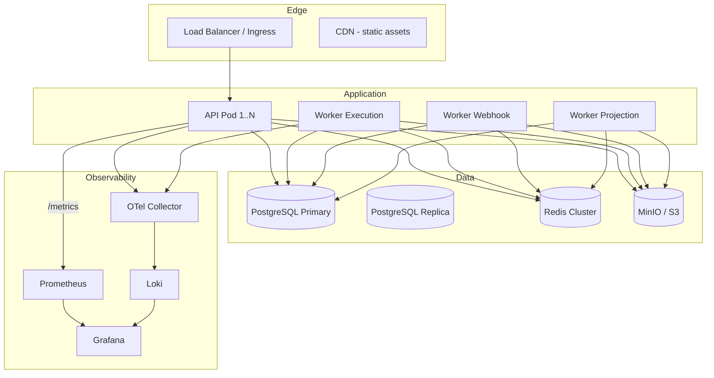

# Deployment Guide

> **Status:** Active · **Version:** 1.0 · **Last updated:** 2026-07-14

This document describes how to deploy FlowForge across environments: local development, staging, and production.

---

## Table of Contents

1. [Architecture Overview](#architecture-overview)
2. [Environments](#environments)
3. [Prerequisites](#prerequisites)
4. [Local Development](#local-development)
5. [Docker Compose (Dev/Staging)](#docker-compose-devstaging)
6. [Production Deployment](#production-deployment)
7. [Database Migrations](#database-migrations)
8. [Configuration Reference](#configuration-reference)
9. [Rollout Strategy](#rollout-strategy)
10. [Rollback Procedures](#rollback-procedures)

---

## Architecture Overview



### Services

| Service | Package | Process | Scaling |
|---------|---------|---------|---------|
| API | `apps/api` | NestJS HTTP server | Horizontal (stateless) |
| Worker | `apps/worker` | BullMQ consumers | Horizontal by profile |
| Docs | `apps/docs` | Docusaurus static site | CDN |

---

## Environments

| Environment | Purpose | URL Pattern | Data |
|-------------|---------|-------------|------|
| **local** | Developer machines | `localhost:3000` | Docker Compose |
| **staging** | Pre-production validation | `staging.flowforge.dev` | Isolated staging DB |
| **production** | Customer-facing | `api.flowforge.dev` | Production DB with replicas |

### Environment Parity

Staging mirrors production topology at reduced scale:
- 2 API instances, 1 worker each profile
- PostgreSQL primary + 1 read replica
- Redis single node (production: cluster)
- Same Docker images as production

---

## Prerequisites

| Tool | Version |
|------|---------|
| Node.js | ≥ 20.0.0 |
| pnpm | ≥ 9.0.0 |
| Docker | ≥ 24.0 |
| Docker Compose | ≥ 2.20 |
| PostgreSQL client | 16+ (for manual migrations) |

---

## Local Development

```bash
# Clone and install
git clone https://github.com/your-org/flowforge.git
cd flowforge
pnpm install

# Start infrastructure
docker compose up -d postgres redis minio otel-collector prometheus grafana loki

# Configure environment
cp .env.example .env.local
# Edit DATABASE_URL, REDIS_URL, etc.

# Run migrations
pnpm db:migrate

# Start API and worker in dev mode
pnpm dev
```

### Verify

```bash
curl http://localhost:3000/health/readiness
curl http://localhost:3000/docs          # Swagger UI
open http://localhost:3001                  # Grafana
```

---

## Docker Compose (Dev/Staging)

### File Layout

```
docker/
├── Dockerfile.api
├── Dockerfile.worker
├── Dockerfile.docs
├── compose.yml              # Full stack
├── compose.dev.yml          # Dev overrides (hot reload volumes)
└── monitoring/
    ├── otel-collector.yml
    ├── prometheus.yml
    ├── loki.yml
    └── grafana/
        ├── provisioning/
        └── dashboards/
```

### Services in `compose.yml`

| Service | Image | Port |
|---------|-------|------|
| postgres | postgres:16-alpine | 5432 |
| redis | redis:7-alpine | 6379 |
| minio | minio/minio | 9000, 9001 |
| api | flowforge-api:local | 3000 |
| worker | flowforge-worker:local | 3001 |
| otel-collector | otel/opentelemetry-collector | 4317, 4318 |
| prometheus | prom/prometheus | 9090 |
| grafana | grafana/grafana | 3001 |
| loki | grafana/loki | 3100 |

### Build Images

```bash
docker compose build api worker
docker compose up -d
```

---

## Production Deployment

### Recommended Platform

**Kubernetes** (EKS, GKE, or AKS) with the following resources:

| Resource | Replicas | Resources |
|----------|----------|-----------|
| `Deployment/flowforge-api` | 3–10 (HPA) | 512Mi–1Gi RAM, 0.5–1 CPU |
| `Deployment/flowforge-worker-execution` | 2–20 (HPA) | 1–2Gi RAM, 1–2 CPU |
| `Deployment/flowforge-worker-webhook` | 2–5 | 512Mi RAM, 0.5 CPU |
| `Deployment/flowforge-worker-projection` | 1–2 | 512Mi RAM, 0.5 CPU |
| `StatefulSet/postgresql` or managed RDS | 1 primary + 2 replicas | Per load |
| `StatefulSet/redis` or ElastiCache | 3 node cluster | Per load |

### Ingress

```yaml
# Simplified ingress rules
/api/*     → flowforge-api:3000
/hooks/*   → flowforge-api:3000  (webhook ingress, higher rate limit)
/docs/*    → flowforge-docs (CDN)
/health/*  → flowforge-api:3000
```

TLS termination at load balancer. HSTS enabled.

### Secrets Management

Production secrets via AWS Secrets Manager / GCP Secret Manager / HashiCorp Vault:

```
flowforge/production/database-url
flowforge/production/redis-url
flowforge/production/jwt-private-key
flowforge/production/encryption-kek
flowforge/production/minio-credentials
```

Injected as environment variables via Kubernetes External Secrets Operator.

### Health Probes

```yaml
livenessProbe:
  httpGet: { path: /health/liveness, port: 3000 }
  initialDelaySeconds: 10
  periodSeconds: 10

readinessProbe:
  httpGet: { path: /health/readiness, port: 3000 }
  initialDelaySeconds: 5
  periodSeconds: 5

startupProbe:
  httpGet: { path: /health/startup, port: 3000 }
  failureThreshold: 30
  periodSeconds: 5
```

Workers use similar probes on their health port.

---

## Database Migrations

### Strategy

- **Tool:** Prisma Migrate
- **Location:** `prisma/migrations/`
- **Production command:** `pnpm db:migrate:deploy` (non-interactive)

### Migration Workflow

1. Developer creates migration locally: `pnpm db:migrate`
2. Migration SQL reviewed in PR
3. CI validates migration against clean DB (`prisma migrate deploy`)
4. Deploy: run migration job **before** rolling out new app version
5. Migrations must be backward-compatible (expand-contract pattern)

### Expand-Contract Example

```
Phase 1: ADD COLUMN (nullable) → deploy app reading both
Phase 2: Backfill data → deploy app writing new column
Phase 3: ADD NOT NULL constraint → deploy app reading new only
Phase 4: DROP old column
```

### Migration Job (Kubernetes)

```yaml
apiVersion: batch/v1
kind: Job
metadata:
  name: flowforge-migrate-{version}
spec:
  template:
    spec:
      containers:
        - name: migrate
          image: flowforge-api:{version}
          command: ["pnpm", "db:migrate:deploy"]
          envFrom:
            - secretRef: { name: flowforge-secrets }
      restartPolicy: Never
```

---

## Configuration Reference

From `@flowforge/config`:

### API Service

| Variable | Required | Default | Description |
|----------|----------|---------|-------------|
| `NODE_ENV` | No | `development` | Environment |
| `DATABASE_URL` | Yes | — | PostgreSQL connection string |
| `REDIS_URL` | Yes | — | Redis connection string |
| `JWT_SECRET` | Prod | — | JWT signing secret (min 32 chars) |
| `API_PORT` | No | `3000` | HTTP port |
| `API_PREFIX` | No | `api` | Route prefix |
| `CORS_ORIGINS` | No | `*` | Comma-separated origins |
| `MINIO_*` | Yes | — | Object storage config |
| `OTEL_EXPORTER_OTLP_ENDPOINT` | No | — | OpenTelemetry collector |
| `LOG_LEVEL` | No | `info` | Pino log level |

### Worker Service

| Variable | Required | Default | Description |
|----------|----------|---------|-------------|
| `WORKER_CONCURRENCY` | No | `5` | Default queue concurrency |
| `WORKER_PROFILES` | No | `all` | Comma-separated worker modules |
| `DATABASE_URL` | Yes | — | PostgreSQL |
| `REDIS_URL` | Yes | — | Redis |

---

## Rollout Strategy

### Rolling Update (Default)

- Kubernetes `RollingUpdate` with `maxUnavailable: 0`, `maxSurge: 1`
- New pods must pass readiness before old pods terminate
- Worker graceful shutdown: 60s termination grace period

### Deployment Order

1. Run database migration job
2. Deploy worker projection (backward compatible)
3. Deploy API (rolling)
4. Deploy execution workers (rolling)
5. Deploy webhook workers (rolling)
6. Verify health checks and error rates

### Feature Flags

New features gated behind workspace feature flags (`tenant_settings.feature_flags`) for canary rollout per workspace.

---

## Rollback Procedures

### Application Rollback

```bash
kubectl rollout undo deployment/flowforge-api
kubectl rollout undo deployment/flowforge-worker-execution
```

### Migration Rollback

- Prisma does not support automatic down migrations in production
- **Prevention:** all migrations must be backward-compatible
- **Emergency:** restore database from backup (see DISASTER-RECOVERY.md)

### Rollback Decision Criteria

| Signal | Action |
|--------|--------|
| Error rate > 5% for 5 min post-deploy | Rollback API |
| Readiness failures > 50% | Rollback all services |
| Migration job failed | Stop deploy; do not roll out app |
| DLQ spike > 10x baseline | Investigate; rollback if new code caused |

---

## Related Documents

- [CICD.md](./CICD.md) — Pipeline automation
- [DISASTER-RECOVERY.md](./DISASTER-RECOVERY.md) — Backup and restore
- [SCALABILITY.md](./SCALABILITY.md) — Scaling guidelines
- [OBSERVABILITY.md](../architecture/OBSERVABILITY.md) — Monitoring setup
