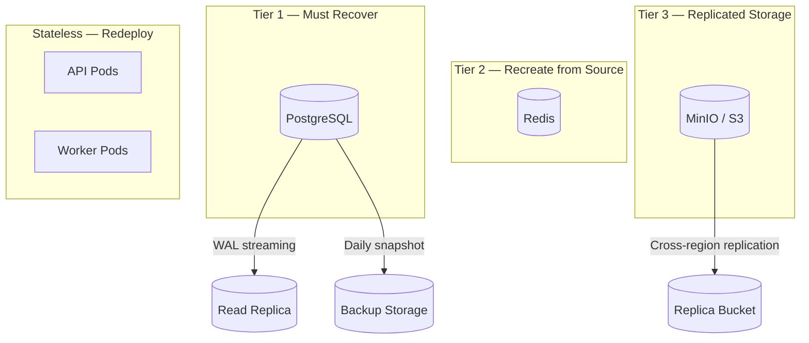
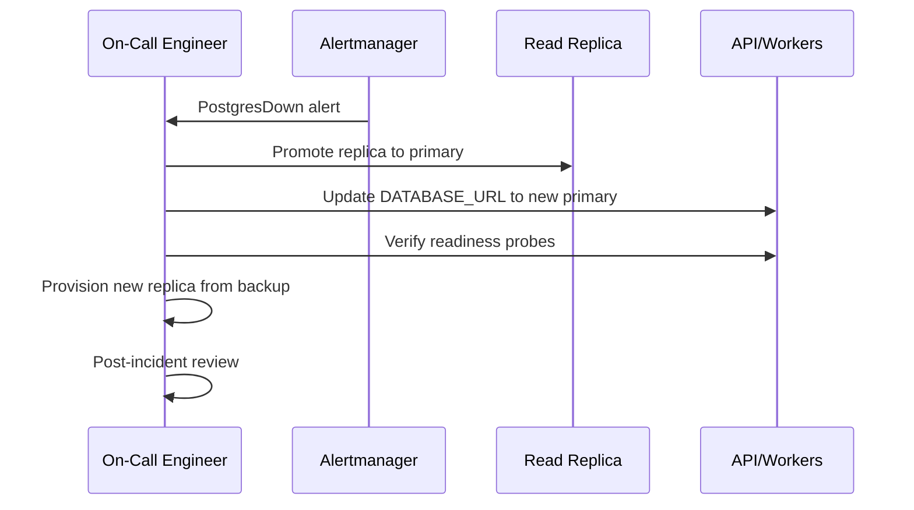

# Disaster Recovery

> **Status:** Active · **Version:** 1.0 · **Last updated:** 2026-07-14

This document defines FlowForge's disaster recovery (DR) strategy: backup procedures, recovery objectives, failover runbooks, and testing schedule.

---

## Table of Contents

1. [Recovery Objectives](#recovery-objectives)
2. [Critical Components](#critical-components)
3. [Backup Strategy](#backup-strategy)
4. [Recovery Procedures](#recovery-procedures)
5. [Failover Scenarios](#failover-scenarios)
6. [Data Integrity](#data-integrity)
7. [Communication Plan](#communication-plan)
8. [DR Testing Schedule](#dr-testing-schedule)

---

## Recovery Objectives

| Tier                     | Components                | RPO      | RTO     |
| ------------------------ | ------------------------- | -------- | ------- |
| **Tier 1 — Critical**    | PostgreSQL (primary data) | 5 min    | 1 hour  |
| **Tier 2 — Important**   | Redis (queues, cache)     | 15 min   | 30 min  |
| **Tier 3 — Important**   | MinIO/S3 (files)          | 1 hour   | 2 hours |
| **Tier 4 — Operational** | Prometheus, Loki, Grafana | 24 hours | 4 hours |

### Definitions

- **RPO (Recovery Point Objective):** Maximum acceptable data loss measured in time
- **RTO (Recovery Time Objective):** Maximum acceptable downtime to restore service

### Business Impact

| Downtime Duration | Impact                                                        |
| ----------------- | ------------------------------------------------------------- |
| < 15 min          | Minimal — queued webhooks retry, executions resume            |
| 15 min – 1 hour   | Moderate — customer-visible delays, SLA credit may apply      |
| 1 – 4 hours       | Significant — workflow executions fail, webhook DLQ grows     |
| > 4 hours         | Severe — data integrity review required, executive escalation |

---

## Critical Components



### Data Classification

| Data Store | Contents                     | Loss Impact     | Recovery Source                              |
| ---------- | ---------------------------- | --------------- | -------------------------------------------- |
| PostgreSQL | All application state        | **Critical**    | Backup + WAL                                 |
| Redis      | Cache, queues, rate limits   | **Recoverable** | Rebuild from DB + re-queue                   |
| MinIO/S3   | File uploads, large payloads | **Important**   | Cross-region replica                         |
| Loki       | Logs                         | **Low**         | Accept loss; extend retention after recovery |
| Prometheus | Metrics                      | **Low**         | Accept loss; historical gaps                 |

---

## Backup Strategy

### PostgreSQL

| Method                               | Frequency          | Retention | Storage                        |
| ------------------------------------ | ------------------ | --------- | ------------------------------ |
| Continuous WAL archiving             | Real-time          | 7 days    | S3 bucket `flowforge-wal/`     |
| Full snapshot (pg_dump / pgBackRest) | Daily at 02:00 UTC | 30 days   | S3 bucket `flowforge-backups/` |
| Weekly full backup                   | Sunday 02:00 UTC   | 90 days   | S3 Glacier                     |
| Cross-region copy                    | Daily              | 30 days   | S3 secondary region            |

#### Backup Verification

- Automated restore test to isolated instance: **weekly**
- Checksum validation after each daily backup
- Alert if backup job fails or exceeds expected duration

```bash
# Manual backup (emergency)
pg_dump -Fc -h $PGHOST -U flowforge flowforge > flowforge_$(date +%Y%m%d).dump

# Restore to new instance
pg_restore -h $NEW_PGHOST -U flowforge -d flowforge flowforge_20260714.dump
```

### Redis

| Method          | Frequency    | Retention |
| --------------- | ------------ | --------- |
| RDB snapshot    | Every 15 min | 24 hours  |
| AOF persistence | Enabled      | 24 hours  |

**Note:** Redis is treated as reconstructable. Primary recovery path is redeploy + warm cache from DB. Queue jobs in-flight at failure time may need DLQ replay.

### MinIO / S3

| Method                   | Frequency                |
| ------------------------ | ------------------------ |
| Server-side versioning   | Enabled                  |
| Cross-region replication | Continuous               |
| Lifecycle policy         | Move to IA after 90 days |

### Configuration & Secrets

| Item                 | Backup Method                      |
| -------------------- | ---------------------------------- |
| Kubernetes manifests | Git (source of truth)              |
| Secrets              | Secrets manager with versioning    |
| Environment configs  | Git (`docker/`, `.env.example`)    |
| Grafana dashboards   | Git (`docker/monitoring/grafana/`) |

---

## Recovery Procedures

### Procedure 1: PostgreSQL Primary Failure

**Trigger:** Primary DB unreachable, replication broken



**Steps:**

1. Confirm primary is unrecoverable (not transient network blip)
2. Promote most current read replica: `pg_ctl promote` or managed service failover
3. Update connection strings in secrets manager / K8s secrets
4. Rolling restart API and worker pods
5. Verify `/health/readiness` on all instances
6. Provision new replica from promoted primary
7. Re-enable WAL archiving to backup storage

**Estimated RTO:** 30–60 minutes

### Procedure 2: Complete Region Failure

**Trigger:** Entire cloud region unavailable

1. Activate DR region infrastructure (Terraform/CDK pre-provisioned)
2. Restore PostgreSQL from latest cross-region backup
3. Apply WAL logs to minimize RPO gap
4. Update DNS to DR region load balancer (TTL: 60s)
5. Deploy application from latest container images
6. Verify Redis (fresh cluster — cache cold start expected)
7. Verify MinIO cross-region bucket accessible
8. Run smoke tests
9. Monitor error rates and queue backlogs

**Estimated RTO:** 2–4 hours · **RPO:** Up to 1 hour (cross-region backup lag)

### Procedure 3: Data Corruption / Bad Migration

**Trigger:** Application bug or migration caused data corruption

1. **Stop writes immediately** — scale API to 0 or enable maintenance mode
2. Identify corruption scope (table, workspace, time range)
3. Restore affected data from point-in-time backup (PITR):
   ```bash
   # Restore to specific timestamp
   pg_restore --target-time="2026-07-14 10:00:00+00" ...
   ```
4. Extract clean data from restored instance
5. Merge into production (surgical fix) or full restore if widespread
6. Replay outbox events if needed
7. Resume traffic with enhanced monitoring

**Estimated RTO:** 1–3 hours depending on scope

### Procedure 4: Redis Complete Loss

**Trigger:** Redis cluster data lost

1. Provision new Redis cluster
2. Update `REDIS_URL` in secrets
3. Restart API and workers
4. Cache repopulates via read-through (expect elevated DB load for ~15 min)
5. In-flight queue jobs: check `outbox_events` for unpublished events; relay will re-enqueue
6. Failed in-flight executions: stale execution watchdog marks as failed; customers can replay

**Estimated RTO:** 15–30 minutes · **Data loss:** In-flight cache and queue jobs only

---

## Failover Scenarios

| Scenario                 | Automated? | Failover Method                                       |
| ------------------------ | ---------- | ----------------------------------------------------- |
| API pod crash            | Yes        | K8s restart + HPA                                     |
| Worker pod crash         | Yes        | K8s restart; job returns to queue                     |
| PostgreSQL primary crash | Partial    | Managed service auto-failover; manual for self-hosted |
| Redis node crash         | Yes        | Redis Sentinel / Cluster failover                     |
| AZ failure               | Partial    | Multi-AZ deployment; K8s reschedules pods             |
| Region failure           | No         | Manual DR region activation                           |

---

## Data Integrity

### Post-Recovery Validation

```sql
-- Row count sanity check
SELECT 'workspaces' AS tbl, COUNT(*) FROM workspaces
UNION ALL SELECT 'workflows', COUNT(*) FROM workflows
UNION ALL SELECT 'executions', COUNT(*) FROM workflow_executions;

-- Outbox consistency
SELECT status, COUNT(*) FROM outbox_events GROUP BY status;

-- Orphan check
SELECT COUNT(*) FROM workflow_executions e
LEFT JOIN workflows w ON e.workflow_id = w.id
WHERE w.id IS NULL;
```

### Application-Level Checks

- Health endpoints green on all services
- Execute test workflow end-to-end in staging/canary workspace
- Verify webhook delivery pipeline
- Compare execution count metrics pre/post incident

---

## Communication Plan

| Audience         | Channel            | Timing                 |
| ---------------- | ------------------ | ---------------------- |
| Engineering team | Slack `#incidents` | Immediate              |
| Leadership       | Email + Slack      | Within 30 min (SEV1/2) |
| Customers        | Status page        | Within 60 min (SEV1)   |
| Post-mortem      | Internal doc       | Within 5 business days |

### Status Page Updates

```
Investigating → Identified → Monitoring → Resolved
```

Include: impact scope, affected workspaces (if known), estimated recovery time.

---

## DR Testing Schedule

| Test                                  | Frequency          | Scope                          | Success Criteria               |
| ------------------------------------- | ------------------ | ------------------------------ | ------------------------------ |
| Backup restore (PostgreSQL)           | Weekly (automated) | Full restore to test instance  | Data integrity checks pass     |
| Failover drill (DB replica promotion) | Quarterly          | Staging environment            | RTO < 1 hour                   |
| Redis recovery                        | Quarterly          | Staging                        | Cache rebuild < 15 min         |
| Region failover simulation            | Annually           | DR region (tabletop + partial) | RTO < 4 hours                  |
| Migration rollback drill              | Per release        | Staging                        | App works with previous schema |

### Test Documentation

Each DR test produces:

- Test date and participants
- Steps executed vs. runbook
- Actual RTO/RPO achieved
- Gaps identified and remediation tickets

---

## Related Documents

- [DEPLOYMENT.md](./DEPLOYMENT.md) — Infrastructure topology
- [SCALABILITY.md](./SCALABILITY.md) — Multi-region considerations
- [OBSERVABILITY.md](../architecture/OBSERVABILITY.md) — Alerting for failures
- [RISKS.md](../planning/RISKS.md) — DR-related risks
