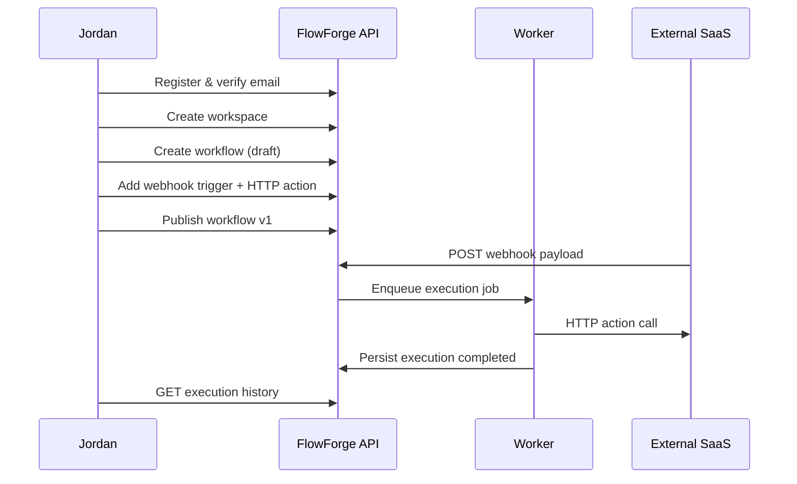
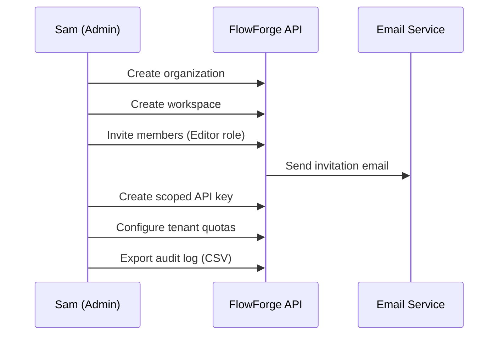

# FlowForge — Product Requirements Document

**Version:** 0.1.0  
**Status:** Draft (implementation source of truth)  
**Last updated:** 2026-07-14  
**Owner:** FlowForge Core Team

---

## 1. Executive Summary

FlowForge is a **multi-tenant workflow automation platform** that enables teams to design, publish, and operate event-driven automations connecting SaaS tools, internal APIs, and custom logic. It targets the same problem space as Zapier, n8n, and Make.com, but is engineered as a **production-grade, API-first backend** suitable for portfolio demonstration and real-world deployment.

The platform provides:

- A visual and API-driven **workflow builder** with versioning, drafts, and rollback
- A reliable **execution engine** with retries, branching, delays, and observability
- **Workspace-based multi-tenancy** with RBAC/ABAC authorization
- **Webhook ingress and egress** with signature verification and idempotency
- **Enterprise primitives**: audit trails, activity timelines, secrets management, quotas, and feature flags

FlowForge is intentionally backend-focused in v1. A separate UI may consume the REST API; the backend must stand alone as a reference implementation of clean architecture, event-driven design, and operational excellence.

---

## 2. Problem Statement

Teams automating business processes today face a trade-off:

| Approach | Strength | Weakness |
|----------|----------|----------|
| No-code platforms (Zapier, Make) | Fast time-to-value | Limited control, opaque execution, weak tenancy for B2B |
| Self-hosted tools (n8n) | Flexibility | Operational burden, inconsistent enterprise features |
| Custom scripts | Full control | No governance, no audit, fragile at scale |

FlowForge addresses the gap for engineering-led organizations that need **programmable automation with production-grade tenancy, security, and observability**—without building a workflow engine from scratch.

---

## 3. Vision & Product Principles

### Vision

Become the open-source reference backend for multi-tenant workflow automation: reliable enough for production, modular enough to extend, and documented enough to teach advanced backend engineering.

### Product Principles

1. **API-first** — Every capability exposed via versioned REST; UI is a client, not the source of truth.
2. **Tenant isolation by default** — Workspace boundaries are enforced at middleware, repository, and query layers.
3. **Durable execution** — Workflows survive process restarts; state is persisted; retries are explicit.
4. **Observable by design** — Correlation IDs, traces, metrics, and structured logs on every execution path.
5. **Safe by default** — Secrets encrypted, webhooks signed, idempotency enforced, audit on sensitive actions.
6. **Incremental complexity** — MVP features are shippable; advanced patterns (sagas, sandbox mode) layer on without rework.

---

## 4. Target Users & Personas

### Persona 1: Alex — Integration Engineer

| Attribute | Detail |
|-----------|--------|
| Role | Senior backend / integration engineer at a B2B SaaS company |
| Goals | Connect customer webhooks to internal services; reduce one-off scripts |
| Pain | Fragile cron jobs, no replay, no audit when automations fail |
| Success | Publishes versioned workflows via API; replays failed runs; traces end-to-end |

### Persona 2: Sam — Platform Administrator

| Attribute | Detail |
|-----------|--------|
| Role | IT / platform admin for a mid-size organization |
| Goals | Onboard teams, manage access, enforce quotas, review security events |
| Pain | Shadow IT automations, unclear permissions, credential sprawl |
| Success | Creates workspaces, assigns roles, rotates API keys, exports audit logs |

### Persona 3: Jordan — Operations Analyst

| Attribute | Detail |
|-----------|--------|
| Role | RevOps / ops analyst (less technical) |
| Goals | Automate lead routing, notifications, and reporting triggers |
| Pain | Complex tools require engineering for every change |
| Success | Uses templates and pre-built integrations; monitors execution history |

### Persona 4: Riley — Security & Compliance Reviewer

| Attribute | Detail |
|-----------|--------|
| Role | Security engineer or auditor |
| Goals | Verify tenant isolation, secret handling, and immutable audit trails |
| Pain | Platforms with weak RBAC and opaque data residency |
| Success | Reviews permission matrix, audit exports, and encryption documentation |

### Persona 5: Dev — FlowForge Contributor / Portfolio Builder

| Attribute | Detail |
|-----------|--------|
| Role | Open-source contributor or job seeker demonstrating backend skill |
| Goals | Study clean architecture, event patterns, and production ops in one repo |
| Pain | Tutorial repos that skip multi-tenancy, idempotency, and observability |
| Success | Reads docs, runs Docker Compose, extends modules with clear boundaries |

---

## 5. Goals & Success Metrics

### Business / Product Goals (v1)

| Goal | Metric | Target (6 months post-MVP) |
|------|--------|---------------------------|
| Reliable execution | Workflow success rate (excl. user misconfiguration) | ≥ 99.5% |
| Fast authoring loop | Time from draft save to published version | < 5 seconds (p95 API) |
| Tenant safety | Cross-tenant data leakage incidents | 0 |
| Operability | Mean time to diagnose failed execution (with traces) | < 10 minutes |
| Developer experience | Time to first successful local run (`docker compose up`) | < 15 minutes |

### Technical Goals

- Support **1,000+ workspaces** on a single-region deployment without architectural changes
- Handle **100 concurrent workflow executions** per worker replica with horizontal scaling
- Persist **90-day execution history** with cursor-paginated query APIs
- Achieve **< 200ms p95** for read-heavy list endpoints (with cache warm)

---

## 6. Scope

### In Scope (v1 — Milestones M0–M9)

- Workspace-based multi-tenancy (organizations → workspaces → projects)
- User authentication: email/password, OAuth (GitHub, Google), JWT + refresh rotation
- API keys with scopes, expiration, and rotation
- RBAC + ABAC authorization with permission caching
- Workflow CRUD, drafts, versioning, publish, rollback
- Node types: triggers, actions, conditions, branches, loops, delays
- Execution engine with BullMQ workers, retries, DLQ
- Incoming and outgoing webhooks with signatures and idempotency
- Outbox/inbox event processing
- Secrets vault (encrypted at rest)
- File storage abstraction (MinIO / S3-compatible)
- Notifications: email, webhook, Slack
- Audit logs and activity timeline
- Full-text search (PostgreSQL) for workflows, executions, audit
- Feature flags and tenant quotas (usage metering abstraction)
- OpenAPI-documented REST API v1
- Observability: OpenTelemetry, Prometheus, Grafana, Loki
- Docker Compose local stack and CI/CD pipeline

### Out of Scope (Non-Goals) — v1

| Non-Goal | Rationale | Future Consideration |
|----------|-----------|---------------------|
| Visual workflow canvas UI | Backend-first portfolio; API is the contract | Separate frontend repo or M10+ |
| Real-time collaborative editing | High complexity; CRDT/conflict resolution | v2 with WebSocket layer |
| Billing & payments (Stripe) | Abstraction only in v1; no charge flows | M10 billing integration |
| Mobile SDKs | REST API sufficient for v1 clients | Partner ecosystem |
| Multi-region active-active | Single-region HA first | DR doc covers failover path |
| Custom code nodes (arbitrary JS/Python) | Sandbox security is a major project | Plugin runtime in v2 |
| Marketplace for community integrations | Requires review pipeline and legal | Post-10 core integrations |
| GraphQL API | REST + OpenAPI is the v1 standard | Evaluate demand |
| SOC 2 / HIPAA certification | Document controls; certification is organizational | Compliance milestone |
| AI-assisted workflow generation | Not core to backend architecture demo | Experimental feature |

### Explicit Non-Goals (Permanent Constraints for v1)

- **No business logic in controllers** — Enforced by architecture, not optional.
- **No direct Prisma calls from presentation layer** — Repository abstractions only.
- **No tenant context bypass** — Even admin/system routes must declare scope explicitly.
- **No plaintext secret storage** — Field-level encryption required.

---

## 7. Feature Specifications

Features are grouped by domain. Each includes user story, acceptance criteria, and priority.

**Priority key:** P0 = MVP blocker, P1 = required for v1 GA, P2 = important but deferrable, P3 = nice-to-have.

---

### 7.1 Identity & Authentication

#### F-AUTH-01: Email registration and login (P0)

**User story:** As a user, I can register with email/password and log in to receive access and refresh tokens.

**Acceptance criteria:**
- Passwords hashed with bcrypt (cost factor ≥ 12)
- Email verification token issued; account inactive until verified (configurable bypass in dev)
- Login returns JWT access token (15m default) and refresh token (7d default)
- Failed login attempts rate-limited per IP and per email
- RFC 7807 error responses for invalid credentials (no user enumeration via timing)

#### F-AUTH-02: Refresh token rotation (P0)

**User story:** As a user, when I refresh my session, old refresh tokens are invalidated to reduce theft impact.

**Acceptance criteria:**
- Each refresh issues a new refresh token; previous token marked revoked
- Reuse of revoked refresh token revokes entire token family
- Sessions listable and revocable by user

#### F-AUTH-03: OAuth providers (P1)

**User story:** As a user, I can sign in with GitHub or Google and link OAuth to an existing account.

**Acceptance criteria:**
- OAuth account stored separately from credentials
- Account linking requires authenticated session
- Provider tokens never returned via API

#### F-AUTH-04: Password reset and magic links (P1)

**User story:** As a user, I can reset my password via email link or request a magic login link.

**Acceptance criteria:**
- Reset tokens single-use, time-limited (1 hour)
- Magic links expire in 15 minutes
- All auth events written to audit log

#### F-AUTH-05: API keys (P0)

**User story:** As a developer, I can create API keys with scopes for programmatic access.

**Acceptance criteria:**
- Keys stored as hashed prefix + HMAC; full key shown once at creation
- Support expiration date, last-used timestamp, and rotation (grace period optional)
- Scopes enforced via authorization guards
- Key usage attributed in audit and timeline

---

### 7.2 Multi-Tenancy & Organization

#### F-TENANT-01: Organization and workspace hierarchy (P0)

**User story:** As an admin, I create an organization containing multiple isolated workspaces.

**Acceptance criteria:**
- Organization is billing/ownership boundary (future); workspace is data isolation boundary
- Every resource (workflow, execution, secret) belongs to exactly one workspace
- Tenant context injected from JWT claim, API key metadata, or `X-Workspace-Id` header (validated)
- Cross-workspace queries return 404 (not 403) to prevent enumeration

#### F-TENANT-02: Member invitations (P1)

**User story:** As a workspace admin, I invite users by email with a predefined role.

**Acceptance criteria:**
- Invitation token expires in 7 days
- Accepting invitation creates workspace membership
- Pending invitations listable and revocable

#### F-TENANT-03: Tenant settings and feature flags (P1)

**User story:** As a platform operator, I enable features per workspace and set operational limits.

**Acceptance criteria:**
- Settings stored as typed key-value with schema validation
- Feature flags evaluated at application layer with cache (Redis)
- Changes audited

#### F-TENANT-04: Quotas and usage metering (P2)

**User story:** As an admin, I see workflow execution counts and enforce soft/hard limits.

**Acceptance criteria:**
- Usage counters incremented atomically per billing period
- Hard limit blocks new executions with 429 + Problem Details
- Soft limit emits notification event

---

### 7.3 Authorization

#### F-AUTHZ-01: RBAC with role hierarchy (P0)

**User story:** As a workspace owner, I assign roles (Owner, Admin, Editor, Viewer) to members.

**Acceptance criteria:**
- Roles map to permission sets defined in permission matrix (see `docs/security/PERMISSION-MATRIX.md`)
- Role changes take effect within permission cache TTL (≤ 60s) or on explicit invalidation
- System roles (platform admin) isolated from workspace roles

#### F-AUTHZ-02: ABAC resource policies (P1)

**User story:** As an admin, I restrict access to specific workflows or secrets by resource policy.

**Acceptance criteria:**
- Policies evaluated as: role permissions AND resource policies
- Deny overrides allow
- Policy evaluation logged at debug level with correlation ID

---

### 7.4 Workflow Authoring

#### F-WF-01: Workflow CRUD (P0)

**User story:** As an editor, I create workflows with name, description, tags, and project assignment.

**Acceptance criteria:**
- Workflows soft-deleted; deleted workflows excluded from default lists
- Cursor pagination on list endpoint
- Full-text search on name and description

#### F-WF-02: Draft and version management (P0)

**User story:** As an editor, I save drafts and publish immutable versions.

**Acceptance criteria:**
- Draft is mutable; published version is immutable snapshot of nodes, connections, variables
- Version numbers monotonic per workflow
- Publish emits `WorkflowPublished` domain event via outbox
- Rollback creates new version pointing to prior snapshot (not destructive)

#### F-WF-03: Node graph editor (API) (P0)

**User story:** As an editor, I define nodes and directed connections forming a DAG (with controlled cycles for loops).

**Acceptance criteria:**
- Node types: `trigger`, `action`, `condition`, `branch`, `loop`, `delay`, `subworkflow` (P2)
- Connections validate type compatibility
- Graph validation rejects unreachable nodes, missing triggers, and invalid cycles
- Variables support interpolation syntax `{{ nodeId.output.field }}`

#### F-WF-04: Workflow templates (P2)

**User story:** As an analyst, I start from a template for common patterns.

**Acceptance criteria:**
- Templates are workflows flagged `isTemplate`; cloning creates independent copy

#### F-WF-05: Labels, tags, and comments (P2)

**User story:** As a team member, I organize workflows and discuss changes.

**Acceptance criteria:**
- Tags workspace-scoped, many-to-many
- Comments threaded on workflow; soft-deletable by author or admin

---

### 7.5 Workflow Execution

#### F-EXEC-01: Trigger types (P0)

**User story:** As an editor, I start workflows via webhook, schedule, manual, or API trigger.

**Acceptance criteria:**
- Webhook trigger exposes unique URL per workflow version
- Schedule trigger uses cron expression with timezone
- Manual trigger via API requires `workflow:execute` permission

#### F-EXEC-02: Execution engine (P0)

**User story:** As the system, I execute published workflow versions reliably with persisted state.

**Acceptance criteria:**
- Execution states: `pending`, `running`, `waiting`, `completed`, `failed`, `cancelled`, `timed_out`
- Each node execution recorded as execution step with input/output payload (size limits apply)
- Retries configurable per node: max attempts, backoff strategy
- Delays schedule continuation via BullMQ delayed jobs
- Conditions and branches evaluate without side effects in condition nodes

#### F-EXEC-03: Execution history and logs (P0)

**User story:** As an operator, I inspect execution timeline, logs, and metrics.

**Acceptance criteria:**
- List executions with filters: status, workflow, date range, trigger type
- Execution detail includes steps, logs (structured), duration, error details
- Logs retained per workspace retention policy (default 90 days)

#### F-EXEC-04: Cancel and replay (P1)

**User story:** As an operator, I cancel a running execution or replay a failed one.

**Acceptance criteria:**
- Cancel sets cancellation flag; engine stops before next node
- Replay creates new execution with reference to original; idempotency respected

#### F-EXEC-05: Sandbox / dry-run mode (P2)

**User story:** As an editor, I test a workflow without side-effecting actions.

**Acceptance criteria:**
- Sandbox flag on execution; action nodes marked `supportsDryRun` skip external calls
- Sandbox executions not counted toward quota (configurable)

---

### 7.6 Webhooks

#### F-WH-01: Incoming webhooks (P0)

**User story:** As an integrator, I POST payloads to a FlowForge endpoint to trigger workflows.

**Acceptance criteria:**
- HMAC signature verification (configurable algorithm)
- Timestamp tolerance ± 5 minutes (replay protection)
- Idempotency via `Idempotency-Key` header or payload hash
- Payload stored for debugging (size cap, PII masking configurable)

#### F-WH-02: Outgoing webhooks (P1)

**User story:** As an editor, I configure FlowForge to deliver events to my endpoints.

**Acceptance criteria:**
- Subscriptions filter by event type
- Delivery retries with exponential backoff; DLQ after max attempts
- Delivery history with request/response bodies (truncated)
- Signing secret rotatable without downtime (dual-secret window)

---

### 7.7 Integrations & Actions

#### F-INT-01: Integration catalog (P1)

**User story:** As an editor, I connect to HTTP, email, Slack, and common SaaS patterns.

**Acceptance criteria:**
- Integration definition includes auth type (none, API key, OAuth2), required secrets
- HTTP action supports method, headers, body template, timeout, retry
- Credentials referenced by secret ID, never inlined in workflow definition

#### F-INT-02: Plugin architecture abstraction (P2)

**User story:** As a contributor, I register new action types without modifying core engine.

**Acceptance criteria:**
- Action handlers implement `ActionHandler` interface
- Registry populated via NestJS module discovery
- Handler metadata exposed via API for builder UI

---

### 7.8 Secrets & Configuration

#### F-SEC-01: Encrypted secrets vault (P0)

**User story:** As an editor, I store API tokens and credentials securely per workspace.

**Acceptance criteria:**
- AES-256-GCM field encryption with per-workspace data encryption key (DEK)
- Secrets never returned in plaintext after creation (masked preview only)
- Secret access audited; rotation creates new version, deprecates old

#### F-SEC-02: Environment variable overrides (P2)

**User story:** As an admin, I override integration defaults per workspace.

**Acceptance criteria:**
- Overrides merged at execution time; changes audited

---

### 7.9 Notifications

#### F-NOTIF-01: Multi-channel notifications (P1)

**User story:** As a user, I receive alerts when workflows fail or invitations arrive.

**Acceptance criteria:**
- Channels: email, webhook, Slack
- User preferences per channel and event type
- Templates with variable substitution
- Delivery status tracked; retries on transient failure

---

### 7.10 Audit & Activity

#### F-AUDIT-01: Immutable audit log (P0)

**User story:** As a compliance reviewer, I query who changed what and when.

**Acceptance criteria:**
- Captures actor, workspace, resource type/id, action, before/after diff (JSON patch), IP, user agent, correlation ID
- Append-only; no update/delete APIs
- Cursor-paginated export

#### F-AUDIT-02: Activity timeline (P1)

**User story:** As a team member, I see a human-readable feed of workspace activity.

**Acceptance criteria:**
- Timeline generated from domain events and audit entries
- Filterable by actor, resource, event category

---

### 7.11 Files & Search

#### F-FILE-01: File uploads (P1)

**User story:** As an editor, I attach files to workflows or use files in actions.

**Acceptance criteria:**
- Storage via S3-compatible API (MinIO locally)
- Signed upload/download URLs with expiration
- Metadata: size, mime, checksum, virus scan status (stub adapter)

#### F-SEARCH-01: Full-text search (P1)

**User story:** As a user, I search workflows, executions, and audit entries.

**Acceptance criteria:**
- PostgreSQL `tsvector` indexes maintained on write
- Search API returns highlighted snippets
- Workspace-scoped results only

---

### 7.12 Platform Operations

#### F-OPS-01: Health and readiness (P0)

**User story:** As an operator, I probe service health for orchestration.

**Acceptance criteria:**
- `/health/liveness`, `/health/readiness`, `/health/startup` per process
- Readiness checks Postgres, Redis, MinIO connectivity
- Response schema defined in `@flowforge/contracts`

#### F-OPS-02: Observability (P0)

**User story:** As an operator, I trace requests and executions across API and workers.

**Acceptance criteria:**
- OpenTelemetry traces exported to collector
- Prometheus metrics: latency histograms, queue depth, execution counts
- Structured JSON logs (Pino) with correlation, tenant, user IDs → Loki

#### F-OPS-03: Idempotency framework (P0)

**User story:** As an API consumer, I safely retry POST requests without duplicate side effects.

**Acceptance criteria:**
- `Idempotency-Key` header on supported endpoints
- Stored fingerprint + response cache with TTL (24h default)
- Conflicting payload with same key returns 409

---

## 8. User Journeys

### Journey 1: First automation (Jordan)

### Journey 2: Enterprise onboarding (Sam)

---

## 9. API & Contract Requirements

- REST API versioned under `/api/v1/`
- OpenAPI 3.1 spec generated from NestJS Swagger decorators + Zod schemas
- Cursor pagination per `@flowforge/contracts` (`cursor`, `limit`, `sort`, `order`)
- Errors conform to RFC 7807 Problem Details
- JSON Patch (`application/json-patch+json`) for partial updates where applicable
- All mutating tenant-scoped endpoints require workspace context
- Webhook endpoints exempt from JWT but require signature verification

---

## 10. Non-Functional Requirements

| Category | Requirement |
|----------|-------------|
| Availability | 99.9% API availability (single region, excluding planned maintenance) |
| Latency | p95 < 200ms reads, p95 < 500ms writes (excluding execution trigger) |
| Durability | Zero execution loss on worker crash after job acknowledgment policy |
| Scalability | Horizontal scaling of API and worker replicas; stateless API |
| Security | OWASP API Top 10 mitigations documented; dependency scanning in CI |
| Privacy | GDPR-ready data export/delete hooks for user and workspace |
| Maintainability | Module boundaries enforced; cyclomatic complexity limits in lint rules |
| Testability | ≥ 80% coverage on domain and application layers |

---

## 11. Release Phasing (Milestone Alignment)

| Milestone | Theme | Key PRD Features |
|-----------|-------|------------------|
| M0 | Infrastructure | F-OPS-01, F-OPS-02 (skeleton) |
| M1 | Auth & tenancy | F-AUTH-01–02, F-TENANT-01, F-AUTH-05 |
| M2 | Authz & audit | F-AUTHZ-01, F-AUDIT-01, F-AUTH-03–04 |
| M3 | Workflow authoring | F-WF-01–03 |
| M4 | Execution engine | F-EXEC-01–03, F-OPS-03 |
| M5 | Webhooks | F-WH-01–02 |
| M6 | Integrations, files, search | F-INT-01, F-FILE-01, F-SEARCH-01, F-NOTIF-01 |
| M7 | Observability hardening | F-OPS-02 (complete), dashboards |
| M8 | Quotas & extras | F-TENANT-03–04, F-EXEC-04–05, F-WF-04–05 |
| M9 | Hardening & GA | Performance, security review, documentation freeze |

---

## 12. Risks & Mitigations (Product-Level)

| Risk | Impact | Mitigation |
|------|--------|------------|
| Scope creep from UI expectations | Delays backend milestones | PRD non-goals enforced; API demos via OpenAPI |
| Workflow engine complexity | Execution bugs | Start with DAG + limited node types; property-based graph tests |
| Secret exposure | Critical security incident | Encryption, masking, audit; security review in M2 |
| Multi-tenant data leak | Trust destruction | Tenant guards + integration tests + query scoping lint |
| Operator burden | Poor adoption | Docker Compose one-command up; comprehensive docs |

---

## 13. Open Questions

| # | Question | Owner | Target Date |
|---|----------|-------|-------------|
| 1 | Default execution payload size limit (1MB vs 5MB)? | Engineering | M4 kickoff |
| 2 | Support organization-level SSO (SAML) in v1 or v2? | Product | M2 review |
| 3 | Maximum workflow graph size (nodes/connections)? | Engineering | M3 kickoff |
| 4 | Public vs private template gallery? | Product | M8 |

---

## 14. Appendix: Glossary

| Term | Definition |
|------|------------|
| Workspace | Primary tenant isolation boundary; all resources are workspace-scoped |
| Organization | Top-level account container; may own multiple workspaces |
| Workflow Version | Immutable published snapshot of a workflow graph |
| Draft | Mutable working copy of a workflow |
| Execution | A single run of a published workflow version |
| Execution Step | A single node invocation within an execution |
| Outbox | Transactional event table ensuring at-least-once delivery |
| Inbox | Consumer-side deduplication for exactly-once processing semantics |
| Action | Node that performs side effects (HTTP call, send email, etc.) |
| Trigger | Node that starts an execution (webhook, schedule, manual) |

---

## 15. Document History

| Version | Date | Author | Changes |
|---------|------|--------|---------|
| 0.1.0 | 2026-07-14 | FlowForge Team | Initial PRD from master specification |
