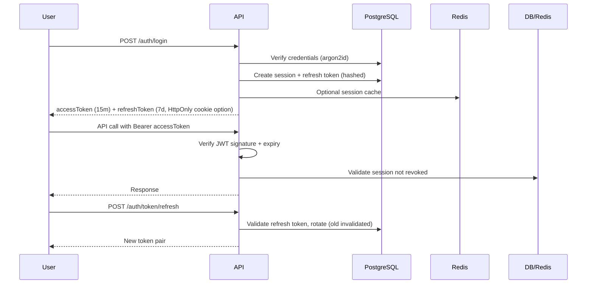
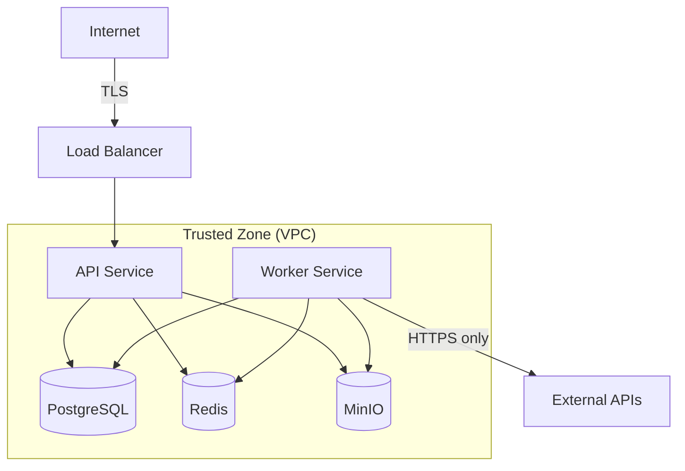

# Security Model

> **Status:** Active · **Version:** 1.0 · **Last updated:** 2026-07-14

This document defines FlowForge's security architecture: authentication, authorization, secrets management, encryption, and threat model. It is the reference for security reviews and compliance discussions.

---

## Table of Contents

1. [Security Principles](#security-principles)
2. [Authentication](#authentication)
3. [Authorization](#authorization)
4. [Multi-Tenant Isolation](#multi-tenant-isolation)
5. [Secrets Management](#secrets-management)
6. [Encryption](#encryption)
7. [API Security](#api-security)
8. [Threat Model (STRIDE)](#threat-model-stride)
9. [Security Event Audit](#security-event-audit)
10. [Incident Response](#incident-response)

---

## Security Principles

1. **Defense in depth** — Multiple layers: network, application, data, audit.
2. **Least privilege** — Default deny; grant minimum permissions required.
3. **Fail secure** — Auth failures deny access; cache miss falls through to DB, never to allow.
4. **Zero trust between services** — Internal APIs still authenticate; mTLS in production (future).
5. **Tenant isolation** — Every query scoped by `workspaceId`; cross-tenant access is impossible by design.
6. **Audit everything important** — Security events are immutable and queryable.

---

## Authentication

### User Authentication (JWT)



#### Token Details

| Token | Algorithm | Storage | TTL |
|-------|-----------|---------|-----|
| Access token | HS256 (dev) / RS256 (prod) | Client memory | 15 min |
| Refresh token | Opaque UUID | HttpOnly Secure cookie or client vault | 7 days |
| JWT secret | — | Env / secrets manager | Rotated quarterly |

Configuration from `@flowforge/config`:

```env
JWT_SECRET=<min 32 chars>
JWT_ACCESS_EXPIRES_IN=15m
JWT_REFRESH_EXPIRES_IN=7d
```

#### Password Policy

- Minimum 12 characters
- Hashed with **argon2id** (memory: 64MB, iterations: 3, parallelism: 4)
- Breach detection via Have I Been Pwned k-anonymity API (optional, M2)
- Password history: last 5 hashes stored (prevent reuse)

### OAuth 2.0 (GitHub, Google)

- Authorization Code flow with PKCE
- State parameter stored in Redis (`oauth:state:{token}`, 10 min TTL)
- OAuth tokens stored encrypted in `oauth_accounts` table
- Account linking requires authenticated session

### Magic Links

- Single-use token, 15 min expiry
- Hashed at rest (SHA-256)
- Rate limited: 3 requests/hour per email

### API Keys

| Property | Value |
|----------|-------|
| Format | `ff_live_{32 random bytes base62}` / `ff_test_{...}` |
| Storage | SHA-256 hash only; prefix stored for identification (`ff_live_abcd`) |
| Scopes | Subset of workspace permissions (see PERMISSION-MATRIX) |
| Expiration | Optional; enforced at validation |
| Rotation | Create new → migrate → revoke old (no gap) |

API key validation path:

1. Hash presented key
2. Redis cache lookup (`apikey:hash:{hash}`)
3. DB fallback
4. Check expiry, revocation, workspace status
5. Attach `apiKeyId`, `workspaceId`, `scopes` to request context

### Session Management

- Sessions stored in `sessions` table with device metadata
- User can view/revoke sessions via API
- Password change revokes all sessions except current
- Admin can force-revoke workspace member sessions

---

## Authorization

FlowForge uses **RBAC** (role-based) as the primary model with **ABAC** (attribute-based) extensions for resource-level policies.

### Evaluation Order

1. **System deny** — Suspended workspace/user → 403
2. **API key scope check** — Key scopes must include required permission
3. **RBAC** — User's role in workspace grants permissions
4. **ABAC policies** — Resource-level conditions (owner, team, label)
5. **Default deny**

See [PERMISSION-MATRIX.md](./PERMISSION-MATRIX.md) for the full matrix.

### NestJS Guards

```
Request → AuthGuard (JWT/API key) → TenantGuard (workspace context) → PermissionGuard → PolicyGuard (ABAC) → Controller
```

- Controllers declare required permissions via `@RequirePermission('workflow:write')`
- ABAC policies evaluated in `PolicyGuard` for resource routes

---

## Multi-Tenant Isolation

### Workspace Tenancy Model

- **Tenant boundary:** `workspaceId`
- All tenant-scoped tables include `workspace_id` column with NOT NULL constraint
- Every repository method accepts `workspaceId` as required parameter
- Prisma middleware enforces workspace filter on all queries

### Tenant Context

```typescript
interface TenantContext {
  workspaceId: string;
  organizationId: string;
  actorId: string;
  actorType: 'user' | 'api_key' | 'system';
  permissions: string[];
}
```

Set by `TenantMiddleware` from `X-Workspace-Id` header after membership validation.

### Isolation Guarantees

| Layer | Mechanism |
|-------|-----------|
| API | TenantGuard rejects requests without valid workspace membership |
| Application | Services receive TenantContext; cannot operate cross-tenant |
| Repository | All queries include `WHERE workspace_id = ?` |
| Cache | Keys prefixed with `ws:{workspaceId}:` |
| Queues | Job payloads include `workspaceId`; workers validate |
| Files (MinIO) | Object keys: `{workspaceId}/{fileId}`; presigned URLs scoped |
| Search | FTS queries filtered by workspace_id |

---

## Secrets Management

### User Secrets (Workflow Credentials)

- Stored in `secrets` table, encrypted at application level
- Encryption: **AES-256-GCM** with per-workspace data encryption key (DEK)
- DEK wrapped by master key (KEK) from environment/secrets manager
- Plaintext never logged; masked in API responses (`••••••••`)
- Rotation creates new version; old version retained for running executions

### Platform Secrets

| Secret | Storage |
|--------|---------|
| `JWT_SECRET` / JWT key pair | Env / AWS Secrets Manager / Vault |
| `DATABASE_URL` | Env / secrets manager |
| `REDIS_URL` | Env / secrets manager |
| MinIO credentials | Env / secrets manager |
| OAuth client secrets | Env / secrets manager |
| Encryption master key (KEK) | Env / KMS |

### Environment Overrides

- Development: `.env.local` (gitignored)
- CI: GitHub Actions secrets
- Production: Secrets manager with rotation alerts

---

## Encryption

| Data | At Rest | In Transit |
|------|---------|------------|
| Passwords | argon2id hash | TLS 1.2+ |
| User secrets | AES-256-GCM | TLS 1.2+ |
| OAuth tokens | AES-256-GCM | TLS 1.2+ |
| API key plaintext | Never stored | TLS 1.2+ |
| Database | PostgreSQL TDE / disk encryption (infra) | TLS |
| Redis | Disk encryption (infra); no app-level for cache | TLS (prod) |
| MinIO objects | Server-side encryption | TLS |

---

## API Security

### HTTP Hardening

- **Helmet** — Security headers (CSP, HSTS, X-Frame-Options, etc.)
- **CORS** — Configurable via `CORS_ORIGINS`; no wildcard in production
- **Compression** — gzip for responses > 1KB
- **Rate limiting** — Per IP, user, API key (see API-CATALOG)
- **Input validation** — Zod schemas on all DTOs; reject unknown fields
- **Mass assignment protection** — Explicit DTO mapping; no direct entity binding

### Webhook Security

**Incoming:**
- HMAC-SHA256 signature verification (`X-FlowForge-Signature`)
- Timestamp tolerance: 5 minutes (replay protection)
- Idempotency on `(endpointId, externalEventId)`
- IP allowlist (optional per endpoint)

**Outgoing:**
- HMAC-SHA256 signing with subscription secret
- TLS required for subscriber URLs (HTTPS only)
- SSRF protection: block private IP ranges in outbound URL validation

### Idempotency

`Idempotency-Key` header prevents duplicate mutations (see API-CATALOG). Keys scoped to actor + workspace + endpoint.

---

## Threat Model (STRIDE)

| Threat | Category | Mitigation |
|--------|----------|------------|
| Stolen JWT | Spoofing | Short TTL, refresh rotation, session revocation |
| API key leak | Spoofing | Scoped permissions, expiration, rotation, audit |
| Cross-tenant data access | Tampering/Elevation | workspace_id on all queries, TenantGuard, repo enforcement |
| SQL injection | Tampering | Prisma parameterized queries, input validation |
| XSS in workflow output | Tampering | Output sanitization, CSP headers |
| Webhook replay | Repudiation | Timestamp + signature, idempotency keys |
| Mass credential stuffing | Denial | Rate limiting, account lockout (5 failures → 15 min) |
| Worker resource exhaustion | Denial | Queue bulkheads, execution timeouts, tenant quotas |
| Secret exfiltration via logs | Info Disclosure | Pino redaction, secret masking |
| Audit log tampering | Repudiation | Append-only audit table, no DELETE permission |
| SSRF via webhook actions | Elevation | URL validation, block RFC1918 addresses |
| Privilege escalation via role edit | Elevation | `role:manage` permission, audit, cannot edit system roles |

### Trust Boundaries



---

## Security Event Audit

All security-relevant actions emit audit records:

| Event | Data Captured |
|-------|---------------|
| Login success/failure | userId, IP, userAgent, method |
| Password change | userId, IP |
| API key create/revoke | workspaceId, actorId, keyPrefix |
| Permission change | workspaceId, targetUserId, before/after roles |
| Secret access | workspaceId, secretId, actorId (metadata only) |
| Failed authorization | workspaceId, actorId, requiredPermission, resource |
| Rate limit exceeded | scope, identifier, endpoint |

Audit logs are immutable (`INSERT` only), retained 1 year minimum.

---

## Incident Response

### Severity Levels

| Level | Example | Response Time |
|-------|---------|---------------|
| SEV1 | Active data breach, cross-tenant leak | Immediate; revoke tokens, isolate |
| SEV2 | API key leak, OAuth compromise | < 1 hour; revoke affected credentials |
| SEV3 | Elevated failed auth rate | < 4 hours; investigate, rate limit |
| SEV4 | Single account compromise | < 24 hours; reset credentials |

### Token Revocation Procedures

1. **Single user:** Revoke sessions via `DELETE /auth/sessions/:id`
2. **Workspace breach:** Revoke all API keys + sessions for workspace
3. **Platform breach:** Rotate JWT signing key (invalidates all access tokens); force refresh

---

## Related Documents

- [PERMISSION-MATRIX.md](./PERMISSION-MATRIX.md) — RBAC/ABAC details
- [API-CATALOG.md](../architecture/API-CATALOG.md) — Auth headers and rate limits
- [ADR 0004: Workspace Tenancy](../adr/0004-workspace-tenancy.md)
- [DISASTER-RECOVERY.md](../operations/DISASTER-RECOVERY.md)
